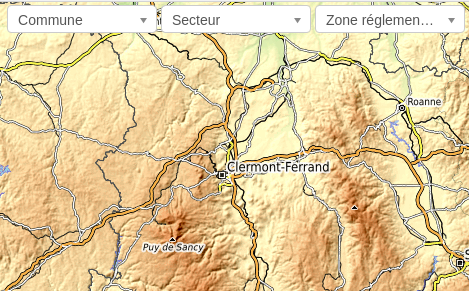

.. _advanced-configuration-section:

======================
ADVANCED CONFIGURATION
======================

Custom setting file
-------------------

Geotrek configuration is done in ``/opt/geotrek-admin/var/conf/custom.py`` file.
The list of all overridable setting and default values can be found
`there <https://github.com/GeotrekCE/Geotrek-admin/blob/master/geotrek/settings/base.py>`_.

After any change in ``custom.py``, run:

::

    sudo service geotrek restart

Disable modules and components
------------------------------

In order to disable a full set of features, in the custom settings file,
add the following code:

.. code-block :: python

    # Disable infrastructure and maintenance
    _INSTALLED_APPS = list(INSTALLED_APPS)
    _INSTALLED_APPS.remove('geotrek.infrastructure')
    _INSTALLED_APPS.remove('geotrek.maintenance')
    INSTALLED_APPS = _INSTALLED_APPS

In order to remove notion of trails:

.. code-block :: python

    TRAIL_MODEL_ENABLED = False

In order to remove zoning combo-boxes on list map:

.. code-block :: python

    LAND_BBOX_CITIES_ENABLED = True
    LAND_BBOX_DISTRICTS_ENABLED = True
    LAND_BBOX_AREAS_ENABLED = False

:notes:

    By doing so, some software upgrades may not be as smooth as usual.
    Never forget to mention this customization if you ask for community support.

Feedback settings
-----------------

Send acknowledge email
~~~~~~~~~~~~~~~~~~~~~~

::

    SEND_REPORT_ACK = True

If false, no mail will be sent to the sender of any feedback on Rando web site

Suricate support
~~~~~~~~~~~~~~~~~~~~~~

It is possible to send report saved to Suricate API (deactivated by default).

In order to activate suricate reports:

1. Set your account settings in `custom.py`:

    .. code-block :: python

        SURICATE_REPORT_ENABLED = True

        SURICATE_REPORT_SETTINGS = {
            'URL': '<Suricate API Url>',
            'ID_ORIGIN': '<Suricate origin ID>',
            'PRIVATE_KEY_CLIENT_SERVER': '<your private key client / server>',
            'PRIVATE_KEY_SERVER_CLIENT': '<your private key server / client>',
        }

2. Load lists for category, activity and problem magnitude :

    .. code-block :: python

        geotrek loaddata geotrek/feedback/fixtures/basic.json

3. To make these lists available for your Geotrek-rando, run `sync_rando` (see :ref:`synchronization <synchronization>`)

Anonymize feedback reports
---------------------------

To be compliant to GDPR, you cannot keep personnal data infinitely,
and should notice your users on how many time you keep their email.

A django command is available to anonymize reports, by default older
than 365 days.

.. code-block :: bash

    geotrek erase_emails

Or if you want to erase emails for reports older than 90 days

.. code-block :: bash

    geotrek erase_emails --days 90

Sensitive areas
----------------------

In order to enable sensitivity module, in the custom settings file,
add the following code:

.. code-block :: python

    # Enable sensitivity module
    INSTALLED_APPS += ('geotrek.sensitivity', )

The following settings are related to sensitive areas:

.. code-block :: python

    SHOW_SENSITIVE_AREAS_ON_MAP_SCREENSHOT = True
    
    # Default radius of sensitivity bubbles when not specified for species
    SENSITIVITY_DEFAULT_RADIUS = 100  # meters

    # Buffer around treks to intersects sensitive areas
    SENSITIVE_AREA_INTERSECTION_MARGIN = 500  # meters

Diving
------

In order to enable diving module, in the custom settings file,
add the following code:

.. code-block :: python

    # Enable diving module
    INSTALLED_APPS += ('geotrek.diving', )

Then run ``sudo geotrek migrate; sudo service geotrek restart``.

You can also insert diving minimal data (default practices, difficulties, levels and group permissions values):

::

    sudo geotrek loaddata geotrek/diving/fixtures/basic.json
    cp /opt/geotrek-admin/geotrek/diving/fixtures/upload/* /opt/geotrek-admin/var/media/upload/

WYSIWYG editor configuration
----------------------------

Text form fields are enhanced using `TinyMCE <http://tinymce.com>`_.

Its configuration can be customized using advanced settings (see above paragraph).

For example, in order to control which buttons are to be shown, and which tags
are to be kept when cleaning-up, add this bloc :

.. code-block :: python

    TINYMCE_DEFAULT_CONFIG = {
        'theme_advanced_buttons1': 'bold,italic,forecolor,separator,code',
        'valid_elements': "img,p,a,em/i,strong/b",
    }

This will apply to all text fields.

For more information on configuration entries available, please refer to the
official documentation of *TinyMCE version 3*.

View attachments in the browser
-------------------------------

Attached files are downloaded by default by browser, with the following line,
files will be opened in the browser :

.. code-block :: python

    MAPENTITY_CONFIG['SERVE_MEDIA_AS_ATTACHMENT'] = False

Change or add WMTS tiles layers (IGN, OSM, Mapbox...)
-----------------------------------------------------

By default, you have 2 basemaps layers in your Geotrek-admin (OSM and OSM black and white). 

You can change or add more basemaps layers.

Specify the tiles URLs this way in your custom Django setting file:

.. code-block :: python

    LEAFLET_CONFIG['TILES'] = [
        ('OSM', 'http://{s}.tile.openstreetmap.org/{z}/{x}/{y}.png', '© OpenStreetMap Contributors'),
        ('OpenTopoMap', 'http://a.tile.opentopomap.org/{z}/{x}/{y}.png', 'Map data: © OpenStreetMap contributors, SRTM | Map style: © OpenTopoMap (CC-BY-SA)'),
    ]

Example with IGN and OSM basemaps : 

.. code-block :: python

    LEAFLET_CONFIG['TILES'] = [
        ('IGN Scan', '//wxs.ign.fr/YOURAPIKEY/wmts?LAYER=GEOGRAPHICALGRIDSYSTEMS.MAPS&EXCEPTIONS=text/xml&FORMAT=image/jpeg&SERVICE=WMTS&VERSION=1.0.0&REQUEST=GetTile&STYLE=normal&TILEMATRIXSET=PM&TILEMATRIX={z}&TILEROW={y}&TILECOL={x}', '© IGN Geoportail'),
        ('IGN Scan Express', '//wxs.ign.fr/YOURAPIKEY/wmts?LAYER=GEOGRAPHICALGRIDSYSTEMS.MAPS.SCAN-EXPRESS.STANDARD&EXCEPTIONS=text/xml&FORMAT=image/jpeg&SERVICE=WMTS&VERSION=1.0.0&REQUEST=GetTile&STYLE=normal&TILEMATRIXSET=PM&TILEMATRIX={z}&TILEROW={y}&TILECOL={x}', '© IGN Geoportail'),
        ('IGN Ortho', '//wxs.ign.fr/YOURAPIKEY/wmts?LAYER=ORTHOIMAGERY.ORTHOPHOTOS&EXCEPTIONS=text/xml&FORMAT=image/jpeg&SERVICE=WMTS&VERSION=1.0.0&REQUEST=GetTile&STYLE=normal&TILEMATRIXSET=PM&TILEMATRIX={z}&TILEROW={y}&TILECOL={x}', '© IGN Geoportail'),
        ('IGN Cadastre', '//wxs.ign.fr/YOURAPIKEY/wmts?LAYER=CADASTRALPARCELS.PARCELS&EXCEPTIONS=text/xml&FORMAT=image/png&SERVICE=WMTS&VERSION=1.0.0&REQUEST=GetTile&STYLE=bdparcellaire_o&TILEMATRIXSET=PM&TILEMATRIX={z}&TILEROW={y}&TILECOL={x}', '© IGN Geoportail'),
        ('OSM', 'https//{s}.tile.openstreetmap.org/{z}/{x}/{y}.png', '© OpenStreetMap contributors'),
        ('OSM Stamen Terrain', '//tile.stamen.com/terrain/{z}/{x}/{y}.jpg', '© OpenStreetMap contributors / Stamen Design'),
        ('OpenTopoMap', 'https//a.tile.opentopomap.org/{z}/{x}/{y}.png', 'Map data: © OpenStreetMap contributors, SRTM | Map style: © OpenTopoMap (CC-BY-SA)')
    ]

To use IGN Geoportail WMTS tiles API, you need an API key with subscribing on http://professionnels.ign.fr/visualisation. Choose WebMercator WMTS tiles.

External authent
----------------

You can authenticate user against a remote database table or view. 

To enable this feature, fill these fields in ``/opt/geotrek-admin/var/conf/custom.py``:

::

    AUTHENT_DATABASE = 'authent'
    DATABASES['authent'] = {
        'ENGINE': 'django.contrib.gis.db.backends.postgis',
        'NAME': '<database name>',
        'USER': '<user name>',
        'PASSWORD': '<password>',
        'HOST': '<host>',
        'PORT': '<port>',
    }
    AUTHENT_TABLENAME = '<table name>'
    AUTHENTICATION_BACKENDS = ['geotrek.authent.backend.DatabaseBackend']

Expected columns in table/view are :

* username : string (*unique*)
* first_name : string
* last_name : string
* password : string (simple md5 encoded, or full hashed and salted password)
* email : string
* level : integer (1: readonly, 2: redactor, 3: path manager, 4: trekking manager, 6: administrator)
* structure : string
* lang : string (language code)

:notes:

    The schema used in ``AUTHENT_TABLENAME`` must be in the user search_path (``ALTER USER $geotrek_db_user SET search_path=public,userschema;``)
    
    User management will be disabled from Administration backoffice.

    In order to disable remote login, just comment *AUTHENTICATION_BACKENDS* line in settings
    file, and restart instance (see paragraph above).

    Geotrek can support many types of users authentication (LDAP, oauth, ...), contact us
    for more details.

Map layers colors and style
---------------------------

All layers colors can be customized from the settings.
See `Leaflet reference <http://leafletjs.com/reference.html#path>`_ for vectorial
layer style.

* To apply these style changes, re-run ``sudo systemctl restart geotrek``.

.. code-block :: python

    MAP_STYLES['path'] = {'color': 'red', 'weight': 5}

Or change just one parameter (the opacity for example) :

.. code-block :: python

    MAP_STYLES['city']['opacity'] = 0.8

Regarding colors that depend from database content, such as land layers
(physical types, work management...) or restricted areas. We use a specific
setting that receives a list of colors :

.. code-block :: python

    COLORS_POOL['restrictedarea'] = ['#ff00ff', 'red', '#ddddd'...]

See the default values in ``geotrek/settings/base.py`` for the complete list
of available styles.

**Restart** the application for changes to take effect.

External raster layers
----------------------

It is possible to add overlay tiles layer on maps. For example, it can be useful to:

* Get the cadastral parcels on top of satellite images
* Home made layers (*with Tilemill or QGisMapserver for example*).
  Like the park center borders, traffic maps, IGN BDTopo® or even the Geotrek paths
  that are marked as invisible in the database!

In ``custom.py``, just add the following lines:

.. code-block :: python

    LEAFLET_CONFIG['OVERLAYS'] = [
        ('Coeur de parc', 'http://serveur/coeur-parc/{z}/{x}/{y}.png', '&copy; PNF'),
    ]

Expected properties
~~~~~~~~~~~~~~~~~~~

For ``GeoJSON`` files, you can provide the following properties :

* ``title``: string
* ``description``: string
* ``website``: string
* ``phone``: string
* ``pictures``: list of objects with ``url`` and ``copyright`` attributes
* ``category``: object with ``id`` and ``label`` attributes

Disable darker map backgrounds
------------------------------

Since IGN map backgrounds are very dense and colourful, a dark opacity is
applied. In order to disable, change this MapEntity setting :

.. code-block :: python

    MAPENTITY_CONFIG['MAP_BACKGROUND_FOGGED'] = False

Configure Social network
-----------------------------

Facebook configuration
~~~~~~~~~~~~~~~~~~~~~~~

When a content is shared to Facebook in Geotrek-rando,
it needs static html files built by synchronization (thanks to option ``--rando-url``).

In Facebook developper dashboard, create a Facebook app dedicated to Geotrek-rando and activate it.

.. image :: images/facebookappid.png

In ``custom.py`` set Facebook App ID:

::

    FACEBOOK_APP_ID = '<your Facebook AppID>'

you can also override these settings:

::

    FACEBOOK_IMAGE = '/images/logo-geotrek.png'
    FACEBOOK_IMAGE_WIDTH = 200
    FACEBOOK_IMAGE_HEIGHT = 200

Override translations
----------------------------

You can override default translation files available in each module (for example those from trekking module available in ``<geotrek-admin-folder>/geotrek/trekking/locale/fr/LC_MESSAGES/django.po``).

Don't edit these default files, use them to find which words you want to override.

Create the custom translations destination folder:

::

     cd  <geotrek-admin-folder>/geotrek/
     mkdir -p locale/en/LC_MESSAGES

Then create a ``django.po`` file in this directory. You can do one folder and one ``django.po`` file for each language (example  ``<geotrek-admin-folder>/geotrek/locale/fr/LC_MESSAGES/django.po`` for French translation overriding)

Override the translations that you want in these files.

Example of content for the French translation overriding:

::

    # MY FRENCH CUSTOM TRANSLATION
    # Copyright (C) YEAR THE PACKAGE'S COPYRIGHT HOLDER
    # This file is distributed under the same license as the PACKAGE package.
    # FIRST AUTHOR <EMAIL@ADDRESS>, YEAR.
    #
    msgid ""
    msgstr ""
    "Report-Msgid-Bugs-To: \n"
    "POT-Creation-Date: 2018-11-15 15:32+0200\n"
    "PO-Revision-Date: 2018-11-15 15:33+0100\n"
    "Last-Translator: \n"
    "Language-Team: LANGUAGE <LL@li.org>\n"
    "MIME-Version: 1.0\n"
    "Content-Type: text/plain; charset=UTF-8\n"
    "Content-Transfer-Encoding: 8bit\n"
    "Project-Id-Verésion: PACKAGE VERSION\n"
    "Plural-Forms: nplurals=2; plural=(n > 1);\n"
    "Project-Id-Version: \n"
    "X-Generator: Poedit 1.5.4\n"
      
    msgid "City"
    msgstr "Région"

    msgid "District"
    msgstr "Pays"

Apply changes : 

::

    cd <geotrek-admin-folder>
    make env_standalone deploy

WARNING: Documentation to be updated. Geotrek-admin now uses Weasyprint to create public PDF based on HTML templates
and no more on ODT templates. Default HTML templates are in ``geotrek/trekking/templates/`` and can be copied in ``var/conf/extra_templates/`` with same path and file names to be overriden.

Copy the file ``geotrek/trekking/templates/trekking/trek_public.odt`` to
``var/conf/extra_templates/trekking/trek_public.odt``.

Override public pdf templates
-----------------------------

PDF are generated from html printed, using `Django templating <https://docs.djangoproject.com/en/1.11/ref/templates/>`_.
Trekkings, touristic contents and events can be exported in pdf files.

- Treks : ``geotrek/trekking/templates/trekking/trek_public_pdf.html``
- touristic contents : ``geotrek/tourism/templates/tourism/touristiccontent_public_pdf.html``
- touristic events : ``geotrek/tourism/templates/tourism/touristiccontent_public_pdf.html``

Overriden templates have to be located in ``var/media/templates/<appname>``, with appname = trekking or tourism.
To override trekking pdf for example, copy the file ``geotrek/trekking/templates/trekking/trek_public_pdf.html``
to ``var/media/templates/trekking/trek_public_pdf.html``.

These templates derive from base templates, which content is organized in blocks.
To override for example the description block of trek pdf, copy and change the ``{% block description }…``
in your ``var/media/templates/trekking/trek_public_pdf.html``.

It is also possible to use color defined for practice for pictogram by adding in your
``geotrek/trekking/templates/trekking/trek_public_pdf.html`` file :

::

    style="background-color: {{ object.practice.color }};"

CSS can be overriden like html templates : copy them to ``var/media/templates/trekking/`` or ``var/media/templates/tourism/`` folder

.. note ::

    The default template may change in the future versions. You will be
    in charge of porting the modification to your copy.

Test your modifications by exporting a trek or a content to pdf from Geotrek-admin application.
To get your modifications available for Rando application, launch the ``sync_rando`` command.

Custom font in public document template
----------------------------------------

In order to use custom fonts in trek PDF, it is necessary to install the
font files on the server.

*Microsoft* fonts like *Arial* and *Verdana* can be installed via the package
manager ::

    sudo apt-get install ttf-mscorefonts-installer

For specific fonts, copy the ``.ttf`` (or ``.otf``) files into the folder
``/usr/local/share/fonts/custom/`` as root, and run the following command ::

    fc-cache

For more information, check out Ubuntu documentation.

Custom colors in public document template
-----------------------------------------

Trek export geometries are translucid red by default. In order to control the
apparence of objects in public trek exports, use the following setting :

::

    MAP_STYLES['print']['path'] = {'weight': 3}

See *Leaflet* reference documentation for detail about layers apparence.

Primary color in PDF templates
------------------------------

You can override ``PRIMARY_COLOR`` to change emphase text in PDF export.
Beware of contrast, white colour is used for text so we advise you to avoid light colour.

Custom logos
------------

You might also need to deploy logo images in the following places :

* ``var/conf/extra_static/images/favicon.png``
* ``var/conf/extra_static/images/logo-login.png``
* ``var/conf/extra_static/images/logo-header.png``

Copyright on pictures
---------------------

If you want copyright added to your pictures, change ``THUMBNAIL_COPYRIGHT_FORMAT`` to this :

::

    THUMBNAIL_COPYRIGHT_FORMAT = "{title} {author}"

You can also add `{legend}`.

::

    THUMBNAIL_COPYRIGHT_SIZE = 15

Share services between several Geotrek instances
------------------------------------------------

As explained :ref:`in the design section <design-section>`, *Geotrek* relies
on several services. They are generic and reusable, and can thus be shared
between several instances, in order to save system resources for example.

A simple way to achieve this is to install one instance with everything
as usual (*standalone*), and plug the other instances on its underlying services.

Capture and conversion
~~~~~~~~~~~~~~~~~~~~~~
If you want to use external services,

In ``.env``, add following variables:

.. code-block :: bash

    CAPTURE_HOST=x.x.x.x
    CAPTURE_PORT=XX
    CONVERSION_HOST=x.x.x.x
    CONVERSION_PORT=XX

Then, you can delete all screamshotter and convertit references in docker-compose.yml

Shutdown useless services
~~~~~~~~~~~~~~~~~~~~~~~~~

Now that your instances point the shared server. You can shutdown the useless
services on each instance.

Start by stopping everything :

::

    sudo systemctl stop geotrek

Control number of workers and request timeouts
----------------------------------------------

By default, the application runs on 4 processes, and timeouts after 30 seconds.

To control those values, edit and fix your docker-compose.yml file in web and api section

To know how many workers you should set, please refer to `gunicorn documentation <http://gunicorn-docs.readthedocs.org/en/latest/design.html#how-many-workers>`_.

===============
Global Settings
===============

|

**Options before install**
--------------------------

**Spatial reference identifier**
::

    SRID = 2154

Spatial reference identifier of your database. 2154 is RGF93 / Lambert-93 - France

*It should not be change after any creation of geometries.*

*Choose wisely with epsg.io for example*

**Spatial Extent**
::

    SPATIAL_EXTENT = (105000, 6150000, 1100000, 7150000)

Boundingbox of your project : x minimum , y minimum , xmax, y max

::

        4 ^
          |
    1     |     3
    <-----+----->
          |
          |
        2 v

*It should not be changed after install*

**Dynamic segmentation**
::

    TREKKING_TOPOLOGY_ENABLED = True

Use dynamic segmentation or not.

   *Do not change it after install, or dump your database*

**First Structure**
::

    DEFAULT_STRUCTURE_NAME = "GEOTEAM"

Name for your default structure.

   *This one can be changed, except it's tricky.*

   * *First change the name in the admin (authent/structure),*
   * *Stop your instance admin.*
   * *Change in the settings*
   * *Re-run the server.*

**Translations**
::

   MODELTRANSLATION_LANGUAGES = ('en', 'fr', 'it', 'es')

Languages of your project. It will be used to generate fields for translations. (ex: description_fr, description_en)

   *You won't be able to change it easily, avoid to add any languages and do not remove any.*

**Options admin**
-----------------

**Map config**
::

    LEAFLET_CONFIG['TILES'] = [
        ('Scan', '//wxs.ign.fr/<key>/wmts?LAYER=GEOGRAPHICALGRIDSYSTEMS.MAPS.SCAN-EXPRESS.STANDARD&EXCEPTIONS=image/jpeg&FORMAT=image/jpeg&SERVICE=WMTS&VERSION=1.0.0&REQUEST=GetTile&STYLE=normal&TILEMATRIXSET=PM&TILEMATRIX={z}&TILEROW={y}&TILECOL={x}',
         '&copy; IGN - GeoPortail'),
        ('Ortho', '//wxs.ign.fr/<key>/wmts?LAYER=ORTHOIMAGERY.ORTHOPHOTOS&EXCEPTIONS=image/jpeg&FORMAT=image/jpeg&SERVICE=WMTS&VERSION=1.0.0&REQUEST=GetTile&STYLE=normal&TILEMATRIXSET=PM&TILEMATRIX={z}&TILEROW={y}&TILECOL={x}',
         '&copy; IGN - GeoPortail'),
        ('Cadastre', '//wxs.ign.fr/<key>/wmts?LAYER=CADASTRALPARCELS.PARCELS&EXCEPTIONS=image/jpeg&FORMAT=image/png&SERVICE=WMTS&VERSION=1.0.0&REQUEST=GetTile&STYLE=normal&TILEMATRIXSET=PM&TILEMATRIX={z}&TILEROW={y}&TILECOL={x}',
         '&copy; IGN - GeoPortail'),
        ('OSM', 'http://{s}.tile.osm.org/{z}/{x}/{y}.png', '&copy; OSM contributors'),
    ]

    LEAFLET_CONFIG['OVERLAYS'] = [
        ('Cadastre',
         '//wxs.ign.fr/<key>/wmts?LAYER=CADASTRALPARCELS.PARCELS&EXCEPTIONS=text/xml&FORMAT=image/png&SERVICE=WMTS&VERSION=1.0.0&REQUEST=GetTile&STYLE=bdparcellaire_o&TILEMATRIXSET=PM&TILEMATRIX={z}&TILEROW={y}&TILECOL={x}',
         '&copy; IGN - GeoPortail'),
    ]

Configuration of the tiles.

    *If you want to change it,*
    *Change the array like that :*

    ::

        LEAFLET_CONFIG['TILES'] = [('NAME_OF_TILE', 'URL', 'COPYRIGHT'), ...]

    *It's the same for the overlay but use only transparent tiles*

|

::

    LEAFLET_CONFIG['MAX_ZOOM'] = 19

You can define the max_zoom the user can zoom for all tiles.

    *It can be interesting when your tiles can't go to a zoom. For example opentopomap is 17.*

**Enable Apps**
::

    FLATPAGES_ENABLED = True

Show Flatpages on menu or not. Flatpages are used in Geotrek Rando.

|

::

    TOURISM_ENABLED = True

Show TouristicContents and TouristicEvents on menu or not.

|

::

    TRAIL_MODEL_ENABLED = True

Show Trails on menu or not.

|

::

    LANDEDGE_MODEL_ENABLED = True

Show land on menu or not.

|

::

   LAND_BBOX_CITIES_ENABLED = True
   LAND_BBOX_DISTRICTS_ENABLED = True
   LAND_BBOX_AREAS_ENABLED = False

Show filter bbox by zoning.

**Translations**
::

    LANGUAGE_CODE = 'fr'

Language of your interface.

**Geographical CRUD**
::

    PATH_SNAPPING_DISTANCE = 2.0

Minimum distance to merge 2 paths in unit of SRID

    *Change the distance. Better to keep it like this. Not used when TREKKING_TOPOLOGY_ENABLED = True*

::

    SNAP_DISTANCE = 30

Distance of snapping for the cursor in pixels on map leaflet.

::

    PATH_MERGE_SNAPPING_DISTANCE = 2

Minimum distance to merge 2 paths.

    *Change the distance. Should be higher or the same as PATH_SNAPPING_DISTANCE*

    *Used when TREKKING_TOPOLOGY_ENABLED = True*

::

    MAP_STYLES = {'path': {'weight': 2, 'opacity': 1.0, 'color': '#FF4800'},
                  'draftpath': {'weight': 5, 'opacity': 1, 'color': 'yellow', 'dashArray': '8, 8'},
                  'city': {'weight': 4, 'color': 'orange', 'opacity': 0.3, 'fillOpacity': 0.0},
                  'district': {'weight': 6, 'color': 'orange', 'opacity': 0.3, 'fillOpacity': 0.0, 'dashArray': '12, 12'},
                  'restrictedarea': {'weight': 2, 'color': 'red', 'opacity': 0.5, 'fillOpacity': 0.5},
                  'land': {'weight': 4, 'color': 'red', 'opacity': 1.0},
                  'physical': {'weight': 6, 'color': 'red', 'opacity': 1.0},
                  'competence': {'weight': 4, 'color': 'red', 'opacity': 1.0},
                  'workmanagement': {'weight': 4, 'color': 'red', 'opacity': 1.0},
                  'signagemanagement': {'weight': 5, 'color': 'red', 'opacity': 1.0},
                  'print': {'path': {'weight': 1},
                            'trek': {'color': '#FF3300', 'weight': 7, 'opacity': 0.5,
                                     'arrowColor': 'black', 'arrowSize': 10},}
                  }

Color of the different layers on the map

    *To change any map_style do as following :*

    ::

        MAP_STYLES['path'] = {'weigth': 2, 'opacity': 2.0, 'color': 'yellow'}*
        MAP_STYLES['city']['opacity'] = 0.8*

    *For color : use color picker for example*

|

::

    COLORS_POOL = {'land': ['#f37e79', '#7998f3', '#bbf379', '#f379df', '#f3bf79', '#9c79f3', '#7af379'],
                   'physical': ['#f3799d', '#79c1f3', '#e4f379', '#de79f3', '#79f3ba', '#f39779', '#797ff3'],
                   'competence': ['#a2f379', '#f379c6', '#79e9f3', '#f3d979', '#b579f3', '#79f392', '#f37984'],
                   'signagemanagement': ['#79a8f3', '#cbf379', '#f379ee', '#79f3e3', '#79f3d3'],
                   'workmanagement': ['#79a8f3', '#cbf379', '#f379ee', '#79f3e3', '#79f3d3'],
                   'restrictedarea': ['plum', 'violet', 'deeppink', 'orchid',
                                      'darkviolet', 'lightcoral', 'palevioletred',
                                      'MediumVioletRed', 'MediumOrchid', 'Magenta',
                                      'LightSalmon', 'HotPink', 'Fuchsia']}

Color of the different layers on the top right for landing.

    * For land, physical, competence, signagemanagement, workmanagement should have 5 values.
    * For restricted Area : add as many color as your number of restricted area type

    *To change any map_style do as following :*

    ::

        COLORS_POOL['restrictedarea'] = ['plum', 'violet', 'yellow', 'red', '#79a8f3']
        MAP_STYLES['city']['opacity'] = 0.8*

    *For color : use color picker for example*

|

::

    TREK_POINTS_OF_REFERENCE_ENABLED = True

Points of reference are enabled on form of treks.

|

::

    TOPOLOGY_STATIC_OFFSETS = {'land': -5, 'physical': 0, 'competence': 5, 'signagemanagement': -10, 'workmanagement': 10}

Land objects are added on other objects (path for example) with offset, avoiding overlay.

    *You should not change it to avoid overlay except if you want to have more overlay.*
    *You can do for example for :*

    ::

        TOPOLOGY_STATIC_OFFSETS = {'land': -7, 'physical': 0, 'competence': 7, 'signagemanagement': -14, 'workmanagement': 14}

|

::

    ALTIMETRIC_PROFILE_PRECISION = 25  # Sampling precision in meters
    ALTIMETRIC_PROFILE_AVERAGE = 2  # nb of points for altimetry moving average
    ALTIMETRIC_PROFILE_STEP = 1  # Step min precision for positive / negative altimetry gain
    ALTIMETRIC_PROFILE_BACKGROUND = 'white'
    ALTIMETRIC_PROFILE_COLOR = '#F77E00'
    ALTIMETRIC_PROFILE_HEIGHT = 400
    ALTIMETRIC_PROFILE_WIDTH = 800
    ALTIMETRIC_PROFILE_FONTSIZE = 25
    ALTIMETRIC_PROFILE_FONT = 'ubuntu'
    ALTIMETRIC_PROFILE_MIN_YSCALE = 1200  # Minimum y scale (in meters)
    ALTIMETRIC_AREA_MAX_RESOLUTION = 150  # Maximum number of points (by width/height)
    ALTIMETRIC_AREA_MARGIN = 0.15

All settings used for generate altimetric profile.

    *All this settings can be modify but you need to check the result every time*

    *The only one modified most of the time is ALTIMETRIC_PROFILE_COLOR*

**Signage and Blade**
::

    BLADE_CODE_TYPE = int

Type of the blade code (str or int)

    *It can be str or int.*

    *If you have an integer code : int*

    *If you have an string code : str*

|

::

    BLADE_CODE_FORMAT = "{signagecode}-{bladenumber}"

Correspond of the format of blades. Show N3-1 for the blade 1 of the signage N3.

    *If you want to change : move information under bracket*

    *You can also remove one element between bracket*

    *You can do for exemple :*
    *"CD99.{signagecode}.{bladenumber}"*

    *It will display : CD99.XIDNZEIU.01 (first blade of XIDNZEIU)*

    * *signagecode is the code of the signage*
    * *bladenumber is the number of the blade*

|

::

    LINE_CODE_FORMAT = "{signagecode}-{bladenumber}-{linenumber}"

Correspond of the format showed on export of lines. Used in csv of signage.

    *Similar with above*
    *You can do for example :*
    *"CD99.{signagecode}-{bladenumber}.{linenumber}"*

    *It will display : CD99.XIDNZEIU-01.02 (second line of the first blade of XIDNZEIU)*

    * *signagecode is the code of the signage*
    * *bladenumber is the number of the blade*
    * *linenumber is the number of the line*

**Screenshots**
::

    SHOW_SENSITIVE_AREAS_ON_MAP_SCREENSHOT = True
    SHOW_POIS_ON_MAP_SCREENSHOT = True
    SHOW_SERVICES_ON_MAP_SCREENSHOT = True
    SHOW_SIGNAGES_ON_MAP_SCREENSHOT = True
    SHOW_INFRASTRUCTURES_ON_MAP_SCREENSHOT = True

Show objects on maps of pdf

|

::

    MAP_CAPTURE_SIZE = 800

Size in px of the capture.

    *Be careful with your pdfs.*
    *If you change this value, pdfs will be rendered differently*

**Synchro Geotrek-Rando**
::

    SYNC_RANDO_ROOT = os.path.join(VAR_DIR, 'data')

Path on your server where the datas for rando website will be generated

    *if you want to modify it, do not forget to import os at the top of the file.*
    *Check* `import Python <https://docs.python.org/3/reference/import.html>`_ *, if you need any information*

::

    THUMBNAIL_COPYRIGHT_FORMAT = ""

Add a thumbnail on every picture for geotrek-rando

    *Example :*

    *"{title}-:-{author}-:-{legend}"*

    *Will display title of the picture, author*
    *and the legend :*
    *Puy de Dômes-:-Paul Paul-:-Beautiful sunrise on Puy de Dômes"*

|

::

    THUMBNAIL_COPYRIGHT_SIZE = 15

Size of the thumbnail.

|

::

    TOURISM_INTERSECTION_MARGIN = 500

Distance to which tourist contents, tourist events, treks, pois, services will be displayed

    *This distance can be changed by practice for treks in the admin.*

|

::

    DIVING_INTERSECTION_MARGIN = 500

Distance to which dives will be displayed.

|

::

    TREK_EXPORT_POI_LIST_LIMIT = 14

Limit of the number of pois on treks pdf.

    *14 is already a huge amount of POI, but it's possible to add more*

|

::

    TREK_EXPORT_INFORMATION_DESK_LIST_LIMIT = 2

Limit of the number of information desks on treks pdf.

    *You can put -1 if you want all the information desks*

|

::

    SPLIT_TREKS_CATEGORIES_BY_PRACTICE = False

On the Rando web site, treks practices will be displayed separately

    *Field order for each practices in admin will be take in account*

|

::

    SPLIT_TREKS_CATEGORIES_BY_ACCESSIBILITY = False

On the Rando web site, accessibilites will be displayed separately

|

::

    SPLIT_TREKS_CATEGORIES_BY_ITINERANCY = False

On the Rando web site, if a trek has a children it will be displayed separately

|

::

    SPLIT_DIVES_CATEGORIES_BY_PRACTICE = True

On the Rando web site, dives practices will be displayed separately

|

::

    HIDE_PUBLISHED_TREKS_IN_TOPOLOGIES = False

On the 'Rando' web site, treks near other are hide

|

::

    SYNC_RANDO_OPTIONS = {}

Options of the sync_rando command in Geotrek-admin interface.

|

::

    TREK_WITH_POIS_PICTURES = False

It enables correlated pictures on Gotrek-Rando to be displayed in the slideshow

|

::

    PRIMARY_COLOR = "#7b8c12"

Primary color of your pdf
    *check : "color picker"*

|

::

    ONLY_EXTERNAL_PUBLIC_PDF = False

On rando web site, only pdf imported with filetype "Topoguide"
will be used and not autogenerated.

|

::

    TREK_CATEGORY_ORDER = 1
    ITINERANCY_CATEGORY_ORDER = 2
    DIVE_CATEGORY_ORDER = 10
    TOURISTIC_EVENT_CATEGORY_ORDER = 99

Order of all the objects without practices on 'Rando' web site

    *All the settings about order are the order inside rando web site.*

    *Practices of diving, treks and categories of touristic contents are taken in account*

|

**Synchro Geotrek-Mobile**
::

    SYNC_MOBILE_ROOT = os.path.join(VAR_DIR, 'mobile')

Path on your server wehre the datas for mobile

    *if you want to modify it, do not forget to import os at the top of the file.*
    *Check* `import Python <https://docs.python.org/3/reference/import.html>`_ *, if you need any information*

|

::

    SYNC_MOBILE_OPTIONS = {'skip_tiles': False}

Options of the sync_mobile command

|

::

    MOBILE_TILES_URL = ['https://{s}.tile.opentopomap.org/{z}/{x}/{y}.png']

URL's Tiles used for the mobile.

    *Change for ign :*

    ::

        MOBILE_TILES_URL = ['https://{s}.tile.opentopomap.org/{z}/{x}/{y}.png']

|

::

    MOBILE_LENGTH_INTERVALS =  [
        {"id": 1, "name": "< 10 km", "interval": [0, 9999]},
        {"id": 2, "name": "10 - 30", "interval": [9999, 29999]},
        {"id": 3, "name": "30 - 50", "interval": [30000, 50000]},
        {"id": 4, "name": "> 50 km", "interval": [50000, 999999]}
    ]

Intervals of the mobile for the length filter

    *Interval's key is in meters.*
    *You can add new intervals*

    ::

        MOBILE_LENGTH_INTERVALS =  [
            {"id": 1, "name": "< 10 km", "interval": [0, 9999]},
            {"id": 2, "name": "10 - 30 km", "interval": [9999, 29999]},
            {"id": 3, "name": "30 - 50 km", "interval": [30000, 50000]},
            {"id": 4, "name": "50 - 80 km", "interval": [50000, 80000]}
            {"id": 5, "name": "> 80 km", "interval": [80000, 999999]}
        ]

|

::

    MOBILE_ASCENT_INTERVALS = [
        {"id": 1, "name": "< 300 m", "interval": [0, 299]},
        {"id": 2, "name": "300 - 600", "interval": [300, 599]},
        {"id": 3, "name": "600 - 1000", "interval": [600, 999]},
        {"id": 4, "name": "> 1000 m", "interval": [1000, 9999]}
    ]

Intervals of the mobile for the ascent filter

    *Do the same as above*

::

    MOBILE_DURATION_INTERVALS = [
        {"id": 1, "name": "< 1 heure", "interval": [0, 1]},
        {"id": 2, "name": "1h - 2h30", "interval": [1, 2.5]},
        {"id": 3, "name": "2h30 - 5h", "interval": [2.5, 5]},
        {"id": 4, "name": "5h - 9h", "interval": [5, 9]},
        {"id": 5, "name": "> 9h", "interval": [9, 9999999]}
    ]

Intervals of the mobile for the duration filter

    *Check MOBILE_LENGTH_INTERVALS comment to use it, here interval correspond to 1 unit of hour*

|

::

    ENABLED_MOBILE_FILTERS = [
        'practice',
        'difficulty',
        'durations',
        'ascent',
        'lengths',
        'themes',
        'route',
        'districts',
        'cities',
        'accessibilities',
    ]

List of all the filters enabled on mobile.

    *Remove any of the filters if you don't want one of them. It's useless to add other one.*

|

::

    USE_BOOKLET_PDF = True

Use booklet for PDF. During the synchro, pois details will be removed, and the pages will be merged.
It is possible to customize the pdf, with trek_public_booklet_pdf.html.

**Custom SQL**

Put your custom SQL in a file name `/opt/geotrek-admin/var/conf/extra_sql/<app name>/<pre or post>_<script name>.sql

* app name is the name of the Django application, eg. trekking or tourism
* pre_… scripts are executed before Django migrations and post_… scripts after
* script are executed in INSTALLED_APPS order, then by alphabetical order of script names
