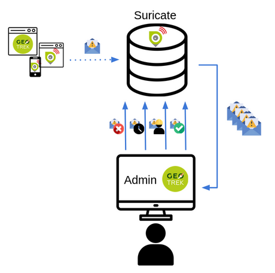

.. _feedback-report-settings:

==========================
Feedback reports settings
==========================

Send acknowledge email
------------------------

SEND_REPORT_ACK
~~~~~~~~~~~~~~~~

    If ``False``, no email will be sent to the sender of any feedback on Geotrek-rando website.

    Example::

        SEND_REPORT_ACK = True

    Default::

        False

.. _suricate-support:

Suricate support
-----------------

Suricate is the French national database gathering such reports. It exposes an API for external software to connect to. For Geotrek to connect to Suricate, you need to request two pairs of API keys allowing access.

Geotrek reports can work together with Suricate API, using one of three modes. Proceed through a mode full configuration before proceeding to the next mode.

1 - No Suricate (default)
~~~~~~~~~~~~~~~~~~~~~~~~~~

This mode sends no report data to Suricate.

To initialize Report forms (Geotrek-admin, Geotrek-rando-V2, Geotrek-rando-V3) load lists for categories, activities, statuses and problem magnitude:

.. code-block:: python

    geotrek loaddata /opt/geotrek-admin/lib/python*/site-packages/geotrek/feedback/fixtures/basic.json

2 - Suricate Standard
~~~~~~~~~~~~~~~~~~~~~~~~~~

This mode forwards reports to Suricate, using the Standard API to post reports.

Reports are forwarded as long as we enter a value for the `email address` field at creation, otherwise they are kept for internal usage only.

Set your account settings in ``custom.py``:

.. code-block:: python

    SURICATE_REPORT_ENABLED = True

    SURICATE_REPORT_SETTINGS = {
        'URL': '<Suricate Standard API Url>',
        'ID_ORIGIN': '<Suricate origin ID>',
        'PRIVATE_KEY_CLIENT_SERVER': '<your private key client / server>',
        'PRIVATE_KEY_SERVER_CLIENT': '<your private key server / client>',
    }

3 - Suricate Management (Workflow)
~~~~~~~~~~~~~~~~~~~~~~~~~~~~~~~~~~~

This mode allows to retrieve reports and related data directly from Suricate, using the Management API to get data. It is used to process and manage reports, using the Intervention module and following a predefined worklow, while sending all progress to Suricate. It implies enabling Suricate Report mode as well.

   Suricate workflow

Suricate Workflow mode defines a strict process, composed of several steps representing the lifecycle of a user report, from creation to closing. A report is always characterized with a status, depicting how far in the process the report is, and displayed using a specific color on the map.

Reports
^^^^^^^^

A report consists of the following information :
    * A GPS position
    * A message describing the problem
    * A category : environment, security, usage conflit, signages
    * A magnitude : usage is possible, difficult, or impossible
    * A practice : trekking, cycling, horse-riding…
    * Up to three pictures

Stakeholders and responsibility
^^^^^^^^^^^^^^^^^^^^^^^^^^^^^^^^

This workflow defines three stakeholders categories :
    * The sentinel : the person who submitted the report. They do not have a Geotrek user account nor intervene in the workflow, but they are kept updated on the processing of their report via semi-automatic e-mails.
    * Supervisors : they are assigned (a) report(s) for treatment. They are tasked with planning an Intervention on Geotrek and enter information about it.
    * The manager : they maintain a global view of all reports on the territory, assign reports to supervisors, handle messaging to the sentinel, and confirm reports resolution.

Any Geotrek user account can be used as a supervisor, as long as they have proper access and modification rights on both Report and Intervention modules. There can only be one Manager.

Report processing
^^^^^^^^^^^^^^^^^^

Every night, Geotrek fetches new reports and updates through Suricate API. The manager receives an e-mail listing new reports (with “Filed” status). They can visualize them on Geotrek.

**1** - Qualification

The manager has three options when handling a newly filed report:
    * Classify : The report isn’t relevant. The manager sets the report to “Classified” and enters a message for the sentinel, explaining their choice. The report is considered closed.
    * Reject treatment : The report does not involve an area or an equipment under responsibility of the workflow users, but could be handled by another member of the Suricate community. The report is excluded from Geotrek workflow but is still accessible to the community via other applications using Suricate API.
    * Assignation : The manager selects a supervisor from a drop-down selector, and enters a message with instructions or further information. The supervisor receives an e-mail notifying them about the newly assigned report, along with the manager’s message. * The manager also enters a message destined to the sentinel, to notify them that the report is about to be handled. The report is set to status “Waiting”. Only after assignation can we proceed to the following steps.

**2** - Planification

The supervisor logs onto Geotrek and creates an Intervention linked to the assigned report, with a planification date. The intervention has status “Plannified”. If too many days have passed between report assignation and intervention creation, the report is automatically set to “Late intervention” status, marked with color red, and the supervisor receives a reminder by e-mail.

**3** - Resolution

The supervisor sets their intervention to “Resolved” status. The manager receives an e-mail notifying that a report is ready to be closed. If too many days have passed between intervention creation and intervention resolution, the report is automatically set to “Late resolution” status, marked with color red, and the supervisor receives a reminder e-mail.

**4** - Closing

Following the intervention’s resolution, the manager has to confirm the report was handled and sets it to “Resolved”. They enter a message for the sentinel to inform them that the report’s processing is over. The report is considered closed.

**5** - GPS relocalisation

At any point, the manager or the supervisor can re-define GPS location for the report. Relocating it outside of the district marked as workflow responsibility area causes the treatment to be rejected (see part 1 Qualification).
Furthermore, it is now possible to display the report layer on other Geotrek modules, for instance to compare positions between reports and signages or treks.

**6** - Reports visibility

When a supervisor logs in to Geotrek, they can only see reports that are currently assigned to them. Both the manager and administrators can see all existing reports.

**7** - Predefined messages

As we have seen above, the manager enters messages destined to the sentinel or to supervisors. These messages can be predefined in the administration interface and picked from a drop-down selector, then modified before sending. It is possible to automatically retrieve in a message the intervention date and the username of the supervisor that handled it.

Workflow configuration
^^^^^^^^^^^^^^^^^^^^^^^^

Even though the workflow is a strict process, the following items are customisable.

**Through administration interface** :
    * Colors for each status
    * Selecting the manager
    * Selecting the workflow responsibility area
    * Predefined messages

**Through application configuration**:
    * API keys to connect to Suricate
    * Enabling of Workflow mode or any other mode
    * Enabling/disabling status colors on map
    * Duration of timers setting reports to “late” statuses

**Synchronization and network losses**

Communication between Suricate and Geotrek operates as follows :
    * Suricate to Geotrek : new information is fetched once a night
    * Geotrek to Suricate : every report update on Geotrek is immediately forwarded to Suricate

Maintaining synchronization between Suricate and Geotrek confronts us to the challenges of distributed software architecture. At any point, the connection between both applications can be lost, meaning that Suricate and Geotrek will no longer agree on a report’s status. Most of the time, this is simply due to temporary network failure.
A system is in place to compensate for such failures. If a request to Suricate API fails, it is stored in the database and resent a few hours later. In case of a long term loss of connection, Django commands are available for an administrator to run some connection tests and resend stored information once connection is recovered.

For technical documentation refer to : https://geotrek.ecrins-parcnational.fr/ressources/technique/2023-02-Geotrek-Suricate-configuration.pdf

You can find the same detailled explanation on the workflow in this article in french : https://makina-corpus.com/geotrek/gestion-territoires-naturels-geotrek-traitement-signalements-suricate

- Set your settings in ``custom.py`` :

.. code-block:: python

    SURICATE_WORKFLOW_ENABLED = True

    SURICATE_MANAGEMENT_SETTINGS = {
        'URL': '<Suricate Management API Url>',
        'ID_ORIGIN': '<Suricate origin ID>',
        'PRIVATE_KEY_CLIENT_SERVER': '<your private key client / server>',
        'PRIVATE_KEY_SERVER_CLIENT': '<your private key server / client>',
    }

    SURICATE_WORKFLOW_SETTINGS = {
        "SURICATE_RELOCATED_REPORT_MESSAGE": "This report is not located in Workflow responsiblity area.",
        "SKIP_MANAGER_MODERATION": False
    }

You can use the following command to test your connection settings:

.. code-block:: python

    geotrek sync_suricate -v 2 --connection-test

Load lists for activities and/or report statuses from Suricate:

.. code-block:: python

    geotrek sync_suricate --activities --statuses -v 2

Load alerts from Suricate (located in your bounding box) :

.. code-block:: python

    geotrek sync_suricate -v 2 --no-notification

- Then load extra required statuses for Reports and Interventions:

.. code-block:: python

    geotrek loaddata /opt/geotrek-admin/lib/python*/site-packages/geotrek/feedback/fixtures/management_workflow.json
    geotrek loaddata /opt/geotrek-admin/lib/python*/site-packages/geotrek/maintenance/fixtures/basic.json

- Go to the configuration site and :

  - if you want to include the moderation steps (``SKIP_MANAGER_MODERATION = False``), select a user as Workflow Manager (`/admin/feedback/workflowmanager/`). Their role is to assign reports to other users.
  - select a district as Workflow District (`/admin/feedback/workflowdistrict/`). This zone defines the area of reponsibility for reports. Reports relocated outside of the district will be excluded from workflow.
  - create predefined emails (`/admin/feedback/predefinedemail/`) to notify Suricate Sentinels and Administrators. You can use `##intervention_end_date##` and `##supervisor##` in the messages' body to automatically replace with the report's linked Intervention date and author. The Extended Username field will be dsiplayed (see User Profile under `/admin/auth/user/`).
  - Make sure Users involved in the workflow have proper permissions to create and update Reports and Interventions (`/admin/auth/user/`)

.. note:: 
  - Be aware that, when enabling Suricate Management mode, Suricate becomes the master database for reports. This means **reports created in Geotrek-admin will not be saved to the database, they will only be sent to Suricate**.
  - Reports are only saved when synchronized back from Suricate, when the synchronization command is run. 

Make sure to run these three commands daily to maintain synchronization and update reports (thanks to `cron` for instance) :

.. code-block:: python

    geotrek retry_failed_requests_and_mails
    geotrek check_timers
    geotrek sync_suricate

Display reports with status defined colors
--------------------------------------------

ENABLE_REPORT_COLORS_PER_STATUS
~~~~~~~~~~~~~~~~~~~~~~~~~~~~~~~~~

    Go to the Configuration site and select colors to display for each status (`/admin/feedback/reportstatus/`).

    Example::

        ENABLE_REPORT_COLORS_PER_STATUS = True

    Default::

        False

Use timers to receive alerts for your reports
-------------------------------------------------

.. tip::
  - It is possible to enable receiving email alerts for reports that have remained in the same status for too long.
  - For instance, I can create two report statuses "To program" with timer days set to 10 and "Programmed" with timer days set to 0.
  - If a report has had status "To program" for 10 days, an email alert will be sent. If its status is changed to "Programmed" within these 10 days, this will cancel the alert.
  - The email alert will be sent to the assigned user for this report, or to managers (setting `MANAGERS`) if there is no assigned user.

**To enable the alerts :**

- Go to the Configuration module and set "Timer days" to some integer other than 0 in relevant statuses (`/admin/feedback/reportstatus/`)

- Select the "Uses timers" checkbox on reports that you wish to receive alerts for (in report update form)

- Make sure to run this commands daily to send email alerts and clear obsolete timers (thanks to `cron` for instance) :

.. code-block:: python

    geotrek check_timers

Anonymize feedback reports
---------------------------

To be compliant to GDPR, you cannot keep personnal data infinitely,
and should notice your users on how many time you keep their email.

A Django command is available to anonymize reports, by default older
than 365 days.

.. code-block:: bash

    geotrek erase_emails

Or if you want to erase emails for reports older than 90 days

.. code-block:: bash

    geotrek erase_emails --days 90

