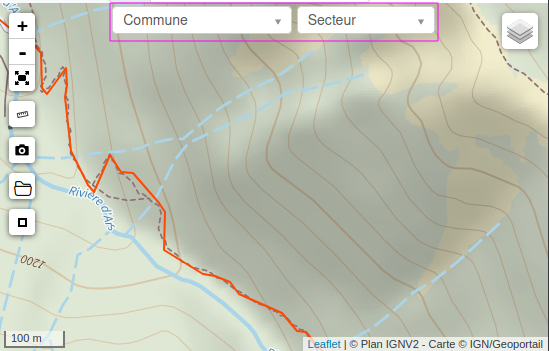

.. _modules-and-components:

=======================
Modules and components
=======================

.. info::
  
  For a complete list of available parameters, refer to the default values in `geotrek/settings/base.py <https://github.com/GeotrekCE/Geotrek-admin/blob/master/geotrek/settings/base.py>`_.
  
Enable Apps
------------

To disable specific modules, modify the custom settings file by adding the following code:

.. md-tab-set::
    :name: disable-app-tabs

    .. md-tab-item:: Example

         .. code-block:: python
    
              # Disable infrastructure and maintenance modules
              _INSTALLED_APPS = list(INSTALLED_APPS)
              _INSTALLED_APPS.remove('geotrek.infrastructure')
              _INSTALLED_APPS.remove('geotrek.maintenance')
              INSTALLED_APPS = _INSTALLED_APPS

    .. md-tab-item:: Default Enabled Modules

         .. code-block:: python
    
              INSTALLED_APPS = (
                'geotrek.cirkwi',
                'geotrek.authent',
                'geotrek.common',
                'geotrek.altimetry',
                'geotrek.core',
                'geotrek.infrastructure',
                'geotrek.signage',
                'geotrek.maintenance',
                'geotrek.zoning',
                'geotrek.land',
                'geotrek.trekking',
                'geotrek.tourism',
                'geotrek.flatpages',
                'geotrek.feedback',
                'geotrek.api',
              )

Path model enabled
~~~~~~~~~~~~~~~~~~~~
This parameter allows enabling or disabling the Path module:

.. md-tab-set::
    :name: path-model-enabled-tabs

    .. md-tab-item:: Default configuration

         .. code-block:: python
    
                PATH_MODEL_ENABLED = True

    .. md-tab-item:: Example

         .. code-block:: python
    
                PATH_MODEL_ENABLED = False

Trail model enabled
~~~~~~~~~~~~~~~~~~~~
This parameter allows enabling or disabling the Trail module:

.. md-tab-set::
    :name: trail-model-enabled-tabs

    .. md-tab-item:: Default configuration

         .. code-block:: python
    
                TRAIL_MODEL_ENABLED = True

    .. md-tab-item:: Example

         .. code-block:: python
    
                TRAIL_MODEL_ENABLED = False

Landedge model enabled
~~~~~~~~~~~~~~~~~~~~~~~

This parameter allows enabling or disabling the Landedge module:

.. md-tab-set::
    :name: landedge-model-enabled-tabs

    .. md-tab-item:: Default configuration
    
         .. code-block:: python
    
                LANDEDGE_MODEL_ENABLED = True

    .. md-tab-item:: Example

         .. code-block:: python
    
                LANDEDGE_MODEL_ENABLED = False

Signage model enabled
~~~~~~~~~~~~~~~~~~~~~~
This parameter allows enabling or disabling the Signage module:

.. md-tab-set::
    :name: signage-model-enabled-tabs

    .. md-tab-item:: Default configuration

         .. code-block:: python
    
                SIGNAGE_MODEL_ENABLED = True

    .. md-tab-item:: Example

         .. code-block:: python
    
                SIGNAGE_MODEL_ENABLED = False

Infrastructure model enabled
~~~~~~~~~~~~~~~~~~~~~~~~~~~~~
This parameter allows enabling or disabling the Infrastructure module:

.. md-tab-set::
    :name: infrastructure-model-enabled-tabs

    .. md-tab-item:: Default configuration

         .. code-block:: python
    
                INFRASTRUCTURE_MODEL_ENABLED = True

    .. md-tab-item:: Example

         .. code-block:: python
    
                INFRASTRUCTURE_MODEL_ENABLED = False

Project model enabled
~~~~~~~~~~~~~~~~~~~~~~~
This parameter allows enabling or disabling the Project module:

.. md-tab-set::
    :name: project-model-enabled-tabs

    .. md-tab-item:: Default configuration

         .. code-block:: python
    
                PROJECT_MODEL_ENABLED = True

    .. md-tab-item:: Example

         .. code-block:: python
    
                PROJECT_MODEL_ENABLED = False

Intervention model enabled
~~~~~~~~~~~~~~~~~~~~~~~~~~~~
This parameter allows enabling or disabling the Intervention module:

.. md-tab-set::
    :name: intervention-model-enabled-tabs

    .. md-tab-item:: Default configuration

         .. code-block:: python
    
                INTERVENTION_MODEL_ENABLED = True

    .. md-tab-item:: Example

         .. code-block:: python
    
                INTERVENTION_MODEL_ENABLED = False

Report model enabled
~~~~~~~~~~~~~~~~~~~~~~~~~~~~
This parameter allows enabling or disabling the Report module:

.. md-tab-set::
    :name: report-model-enabled-tabs

    .. md-tab-item:: Default configuration

         .. code-block:: python
    
                REPORT_MODEL_ENABLED = True

    .. md-tab-item:: Example

         .. code-block:: python
    
                REPORT_MODEL_ENABLED = False

Trekking model enabled
~~~~~~~~~~~~~~~~~~~~~~~
This parameter allows enabling or disabling the Trekking module:

.. md-tab-set::
    :name: trekking-model-enabled-tabs

    .. md-tab-item:: Default configuration

         .. code-block:: python
    
                TREKKING_MODEL_ENABLED = True

    .. md-tab-item:: Example

         .. code-block:: python
    
                TREKKING_MODEL_ENABLED = False

Poi model enabled
~~~~~~~~~~~~~~~~~~~~~~~
This parameter allows enabling or disabling the Poi module:

.. md-tab-set::
    :name: poi-model-enabled-tabs

    .. md-tab-item:: Default configuration

         .. code-block:: python
    
                POI_MODEL_ENABLED = True

    .. md-tab-item:: Example

         .. code-block:: python
    
                POI_MODEL_ENABLED = False

Service model enabled
~~~~~~~~~~~~~~~~~~~~~~~
This parameter allows enabling or disabling the Service module:

.. md-tab-set::
    :name: service-model-enabled-tabs

    .. md-tab-item:: Default configuration

         .. code-block:: python
    
                SERVICE_MODEL_ENABLED = True

    .. md-tab-item:: Example

         .. code-block:: python
    
                SERVICE_MODEL_ENABLED = False

Tourism enabled
~~~~~~~~~~~~~~~~~

This setting enables or disables tourism-related menus, such as touristic content and events:

.. md-tab-set::
    :name: tourism-enabled-tabs

    .. md-tab-item:: Default configuration

         .. code-block:: python
    
                TOURISM_ENABLED = True

    .. md-tab-item:: Example

         .. code-block:: python
    
                TOURISM_ENABLED = False

Touristic content model enabled
~~~~~~~~~~~~~~~~~~~~~~~~~~~~~~~~
This parameter allows enabling or disabling the Touristic content module:

.. md-tab-set::
    :name: touristiccontent-model-enabled-tabs

    .. md-tab-item:: Default configuration

         .. code-block:: python
    
                TOURISTICCONTENT_MODEL_ENABLED = True

    .. md-tab-item:: Example

         .. code-block:: python
    
                TOURISTICCONTENT_MODEL_ENABLED = False

Touristic event model enabled
~~~~~~~~~~~~~~~~~~~~~~~~~~~~~~
This parameter allows enabling or disabling the Touristic event module:

.. md-tab-set::
    :name: touristicevent-model-enabled-tabs

    .. md-tab-item:: Default configuration

         .. code-block:: python
    
                TOURISTICEVENT_MODEL_ENABLED = True

    .. md-tab-item:: Example

         .. code-block:: python
    
                TOURISTICEVENT_MODEL_ENABLED = False

Site model enabled
~~~~~~~~~~~~~~~~~~~~~~~~~~~~~~
This parameter allows enabling or disabling the Site module:

.. md-tab-set::
    :name: site-model-enabled-tabs

    .. md-tab-item:: Default configuration

         .. code-block:: python
    
                SITE_MODEL_ENABLED = True

    .. md-tab-item:: Example

         .. code-block:: python
    
                SITE_MODEL_ENABLED = False

Course model enabled
~~~~~~~~~~~~~~~~~~~~~~~~~~~~~~
This parameter allows enabling or disabling the Course module:

.. md-tab-set::
    :name: course-model-enabled-tabs

    .. md-tab-item:: Default configuration

         .. code-block:: python
    
                COURSE_MODEL_ENABLED = True

    .. md-tab-item:: Example

         .. code-block:: python
    
                COURSE_MODEL_ENABLED = False
              
Flatpages enabled
~~~~~~~~~~~~~~~~~~~~

Flatpages are used in Geotrek-rando and Geotrek-mobile. This setting allows enabling or disabling them in the Django menus:

.. md-tab-set::
    :name: flatpages-enabled-tabs

    .. md-tab-item:: Default configuration

         .. code-block:: python
    
                FLATPAGES_ENABLED = True

    .. md-tab-item:: Example

         .. code-block:: python
    
                FLATPAGES_ENABLED = False

Accessibility attachments enabled
~~~~~~~~~~~~~~~~~~~~~~~~~~~~~~~~~~~

This setting enables or disables the accessibility menu for attachments:

.. md-tab-set::
    :name: accessibility-attachements-enabled-tabs

    .. md-tab-item:: Default configuration

         .. code-block:: python
    
                ACCESSIBILITY_ATTACHMENTS_ENABLED = True

    .. md-tab-item:: Example

         .. code-block:: python
    
                ACCESSIBILITY_ATTACHMENTS_ENABLED = False

.. note::
  - Disabling some modules may cause compatibility issues during software upgrades.
  - If you seek community support, mention any customizations you have made.

Paths
------

Allow path deletion 
~~~~~~~~~~~~~~~~~~~~~~

If set to ``False``, paths that are linked to at least one topology cannot be deleted:

.. md-tab-set::
    :name: allow-path-deletion-topology-tabs

    .. md-tab-item:: Default configuration

         .. code-block:: python
    
                ALLOW_PATH_DELETION_TOPOLOGY = True

    .. md-tab-item:: Example

         .. code-block:: python
    
                ALLOW_PATH_DELETION_TOPOLOGY = False

Show extremities
~~~~~~~~~~~~~~~~

If set to ``True``, shows a bullet at path extremities :

.. md-tab-set::
    :name: show-extremities-tabs

    .. md-tab-item:: Default configuration

         .. code-block:: python
    
                SHOW_EXTREMITIES = False

    .. md-tab-item:: Example

         .. code-block:: python
    
                SHOW_EXTREMITIES = True

Alert draft
~~~~~~~~~~~~~

If set to ``True``, managers will receive an email notification whenever a path is changed to draft:

.. md-tab-set::
    :name: alert-draft-tabs

    .. md-tab-item:: Default configuration

         .. code-block:: python
    
                ALERT_DRAFT = False

    .. md-tab-item:: Example

         .. code-block:: python
    
                ALERT_DRAFT = True

Alert review
~~~~~~~~~~~~~

If set to ``True``, managers will receive an email notification whenever an object that can be validated is moved to review mode:

.. md-tab-set::
    :name: alert-review-tabs

    .. md-tab-item:: Default configuration

         .. code-block:: python
    
                ALERT_REVIEW = False

    .. md-tab-item:: Example

         .. code-block:: python
    
                ALERT_REVIEW = True

Treks
------

Trek signage intersection margin
~~~~~~~~~~~~~~~~~~~~~~~~~~~~~~~~~

This setting defines the maximum distance (in meters) within which signage is considered related to treks. Works only without dynamic segmentation (``TREKKING_TOPOLOGY_ENABLED = False``). 

.. md-tab-set::
    :name: trek-signage-intersection-margin-tabs

    .. md-tab-item:: Default configuration

         .. code-block:: python
    
                TREK_SIGNAGE_INTERSECTION_MARGIN = 500 # meters

    .. md-tab-item:: Example

         .. code-block:: python
    
                TREK_SIGNAGE_INTERSECTION_MARGIN = 800 # meters

Trek infrastructure intersection margin
~~~~~~~~~~~~~~~~~~~~~~~~~~~~~~~~~~~~~~~~

This setting defines the maximum distance (in meters) within which infrastructure is considered related to treks. Works only without dynamic segmentation (``TREKKING_TOPOLOGY_ENABLED = False``). 

.. md-tab-set::
    :name: trek-infrastructure-intersection-margin-tabs

    .. md-tab-item:: Default configuration

         .. code-block:: python
    
                TREK_INFRASTRUCTURE_INTERSECTION_MARGIN = 500 # meters

    .. md-tab-item:: Example

         .. code-block:: python
    
                TREK_INFRASTRUCTURE_INTERSECTION_MARGIN = 800 # meters

Interventions
--------------

Intervention intersection margin
~~~~~~~~~~~~~~~~~~~~~~~~~~~~~~~~~~~

This setting defines the maximum distance (in meters) within which intervention are considered related to other objects such as treks, POIs, services, or tourism content, etc. Works only without dynamic segmentation (``TREKKING_TOPOLOGY_ENABLED = False``). 

.. md-tab-set::
    :name: intervention-intersection-margin-tabs

    .. md-tab-item:: Default configuration

         .. code-block:: python
    
                INTERVENTION_INTERSECTION_MARGIN = 500 # meters

    .. md-tab-item:: Example

         .. code-block:: python
    
                INTERVENTION_INTERSECTION_MARGIN = 800 # meters

Maintenance intersection margin
~~~~~~~~~~~~~~~~~~~~~~~~~~~~~~~~~~~

.. ns-detail::

    .. 

This setting defines the maximum distance (in meters) within which interventions are considered related to other objects such as treks, POIs, services, or tourism content, etc. 

.. md-tab-set::
    :name: maintenance-intersection-margin-tabs

    .. md-tab-item:: Default configuration

         .. code-block:: python
    
                MAINTENANCE_INTERSECTION_MARGIN = 500 # meters

    .. md-tab-item:: Example

         .. code-block:: python
    
                MAINTENANCE_INTERSECTION_MARGIN = 800 # meters

Report
-------

Report intersection margin
~~~~~~~~~~~~~~~~~~~~~~~~~~~~~~~~~~~

.. ns-detail::

    .. 

This setting defines the maximum distance (in meters) within which reports are considered related to other objects such as treks, POIs, services, or tourism content, etc. 

.. md-tab-set::
    :name: report-intersection-margin-tabs

    .. md-tab-item:: Default configuration

         .. code-block:: python
    
                REPORT_INTERSECTION_MARGIN = 500 # meters

    .. md-tab-item:: Example

         .. code-block:: python
    
                REPORT_INTERSECTION_MARGIN = 800 # meters

Signage, blades and lines
--------------------------

Blade and line enabled
~~~~~~~~~~~~~~~~~~~~~~~

These parameters enable or disable submodules for signage blades and lines:

.. md-tab-set::
    :name: signage-blade-tabs

    .. md-tab-item:: Default configuration

         .. code-block:: python
    
                BLADE_ENABLED = True
                LINE_ENABLED = True

    .. md-tab-item:: Example

         .. code-block:: python
    
                BLADE_ENABLED = False
                LINE_ENABLED = True

Direction on lines enabled
~~~~~~~~~~~~~~~~~~~~~~~~~~~

This parameter is used to have ``direction`` field on lines instead of blades.

.. md-tab-set::
  :name: direction-on-lines-enabled-tabs

  .. md-tab-item:: Default configuration

      .. code-block:: python

              DIRECTION_ON_LINES_ENABLED = False

  .. md-tab-item:: Example

      .. code-block:: python

              DIRECTION_ON_LINES_ENABLED = True

Signage line enabled
~~~~~~~~~~~~~~~~~~~~~

This parameter is used to manage lines by blades.

.. md-tab-set::
  :name: signage-line-enabled-tabs

  .. md-tab-item:: Default configuration

      .. code-block:: python

              SIGNAGE_LINE_ENABLED = False

  .. md-tab-item:: Example

      .. code-block:: python

              SIGNAGE_LINE_ENABLED = True

Blade code type
~~~~~~~~~~~~~~~~

You can change the type of the blade code field (string or integer):

.. md-tab-set::
    :name: blade-code-type-tabs

    .. md-tab-item:: Default configuration

         .. code-block:: python
    
                BLADE_CODE_TYPE = INT

    .. md-tab-item:: Example

         .. code-block:: python
    
                BLADE_CODE_TYPE = STR

Blade code format
~~~~~~~~~~~~~~~~~~

You can modify the format of blade codes:

.. md-tab-set::
    :name: blade-code-format-tabs

    .. md-tab-item:: Default configuration

        .. code-block:: python

              BLADE_CODE_FORMAT = "{signagecode}-{bladenumber}"

    .. md-tab-item:: Example

        .. info::
            Example display: ``CD99.XIDNZEIU.01 (first blade of XIDNZEIU)``

          .. code-block:: python
      
                BLADE_CODE_FORMAT = "CD99.{signagecode}.{bladenumber}"
        
Line code format
~~~~~~~~~~~~~~~~~

You can modify the format of line codes. This setting is used in CSV exports for lines:

.. md-tab-set::
    :name: line-code-format-tabs

    .. md-tab-item:: Default configuration

         .. code-block:: python
    
              LINE_CODE_FORMAT = "{signagecode}-{bladenumber}-{linenumber}"

    .. md-tab-item:: Example

        .. info::
            Example display: ``CD99.XIDNZEIU-01.02``

          .. code-block:: python
      
                LINE_CODE_FORMAT = "CD99.{signagecode}-{bladenumber}.{linenumber}"

Line distance format
~~~~~~~~~~~~~~~~~~~~

You can modify the format of line distance. This setting is used in CSV exports for lines:

.. md-tab-set::
    :name: line-distance-format-tabs

    .. md-tab-item:: Default configuration

        .. info::
            Example display: ``8.5 km``

         .. code-block:: python
    
              LINE_DISTANCE_FORMAT = "{:0.1f} km"

    .. md-tab-item:: Example

        .. info::
            Example display: ``8.5 mi``

          .. code-block:: python
      
              LINE_DISTANCE_FORMAT = "{:0.1f} mi" # miles

Line time format
~~~~~~~~~~~~~~~~~~~~

You can modify the format of line time. This setting is used in CSV exports for lines:

.. md-tab-set::
    :name: line-time-format-tabs

    .. md-tab-item:: Default configuration

        .. info::
            Example display: ``3h05``

         .. code-block:: python
    
              LINE_TIME_FORMAT = "{hours}h{minutes:02d}"

    .. md-tab-item:: Example

        .. info::
            Example display: ``3:05``

          .. code-block:: python
      
              LINE_TIME_FORMAT = "{hours}:{minutes:02d}"
         
.. _trek-poi-intersection:

POI
----

Trek POI intersection margin
~~~~~~~~~~~~~~~~~~~~~~~~~~~~~~

You can define a buffer around treks to intersect POIs (works only without dynamic segmentation).

.. md-tab-set::
    :name: trek-poi-intersection-marging-tabs

    .. md-tab-item:: Default configuration

         .. code-block:: python
    
                TREK_POI_INTERSECTION_MARGIN = 500  # meters

    .. md-tab-item:: Example

         .. code-block:: python
    
                TREK_POI_INTERSECTION_MARGIN = 800  # meters

Tourism
-------

The ``TOURISM_INTERSECTION_MARGIN`` and ``OUTDOOR_INTERSECTION_MARGIN`` settings define a buffer distance (in meters) used to dynamically associate nearby content (POIs, services, events, tourism content, etc.) with other entities such as treks or outdoor sites. These parameters help control which elements are considered "nearby" and displayed in the API and Geotrek-rando or included in print/PDF exports.

.. _trek-tourism-intersection:

Tourism intersection margin
~~~~~~~~~~~~~~~~~~~~~~~~~~~~

The ``TOURISM_INTERSECTION_MARGIN`` setting defines the maximum distance (in meters) within which touristic contents and events are considered related to other objects (treks, POIs, services, etc.).

This setting is especially useful to reduce the number of tourism contents displayed around a trek, in order to improve readability and performance in the map interface (in the API, Geotrek-rando, Geotrek-widget...).

.. md-tab-set::
    :name: tourism-intersection-margin-tabs

    .. md-tab-item:: Default configuration

        .. code-block:: python

            TOURISM_INTERSECTION_MARGIN = 500  # meters

    .. md-tab-item:: Example

        .. code-block:: python

            TOURISM_INTERSECTION_MARGIN = 800  # meters

.. note::
   This distance can be customized **per trek practice** in the admin interface:
   ``/admin/trekking/practice/<id>/change/``

Outdoor intersection margin
~~~~~~~~~~~~~~~~~~~~~~~~~~~~

The ``OUTDOOR_INTERSECTION_MARGIN`` setting defines the maximum distance (in meters) within which outdoor content (sites and courses) is considered related to other objects such as treks, POIs, services, or tourism content.

Like the tourism intersection margin, it can help limit the number of associated elements shown around outdoor content, making the map and exports more readable.

.. md-tab-set::
    :name: outdoor-intersection-margin-tabs

    .. md-tab-item:: Default configuration

        .. code-block:: python

            OUTDOOR_INTERSECTION_MARGIN = 500  # meters

    .. md-tab-item:: Example

        .. code-block:: python

            OUTDOOR_INTERSECTION_MARGIN = 800  # meters

.. note::
   - This setting applies **globally** to all outdoor objects (sites and courses) and **cannot be customized by activity**.
   - Currently, adjusting the ``OUTDOOR_INTERSECTION_MARGIN`` also affects the distance used to associate outdoor content with treks. This side effect may lead to unintended behavior when trying to reduce only tourism content density around outdoor elements.

Land
-----

You can insert circulation and authorization types using this command:

.. md-tab-set::
    :name: loaddata-circulation-tabs

    .. md-tab-item:: With Debian

         .. code-block:: bash
    
                sudo geotrek loaddata /opt/geotrek-admin/lib/python*/site-packages/geotrek/land/fixtures/circulations.json

    .. md-tab-item:: With Docker

         .. code-block:: python
    
                docker compose run --rm web ./manage.py loaddata /opt/geotrek-admin/lib/python*/site-packages/geotrek/land/fixtures/circulations.json

Show labels
~~~~~~~~~~~~~~~~

Display labels on status elements on the map view:

.. md-tab-set::
    :name: show-labels-tabs

    .. md-tab-item:: Default configuration

         .. code-block:: python
    
                SHOW_LABELS = True

    .. md-tab-item:: Example

         .. code-block:: python
    
                SHOW_LABELS = False

.. _outdoor:

Outdoor
--------

Installed app for Outdoor
~~~~~~~~~~~~~~~~~~~~~~~~~~~~

To enable the Outdoor module, add the following code to the custom settings file:

.. code-block:: python

    INSTALLED_APPS += ('geotrek.outdoor', )

Then run:

.. md-tab-set::
    :name: install-outdoor-tabs

    .. md-tab-item:: With Debian

         .. code-block:: bash
    
                sudo dpkg-reconfigure -pcritical geotrek-admin

    .. md-tab-item:: With Docker

         .. code-block:: python
    
                docker compose run --rm web update.sh

To insert Outdoor minimal data:

.. md-tab-set::
    :name: loaddata-outdoor-minimal-data-tabs

    .. md-tab-item:: With Debian

         .. code-block:: bash
    
                sudo geotrek loaddata /opt/geotrek-admin/lib/python*/site-packages/geotrek/outdoor/fixtures/basic.json

    .. md-tab-item:: With Docker

         .. code-block:: python
    
                docker compose run --rm web ./manage.py loaddata /opt/geotrek-admin/lib/python*/site-packages/geotrek/outdoor/fixtures/basic.json

After installing the Outdoor module, you need to add permissions to user groups for outdoor sites and courses.

.. note::
  - The Outdoor module is not compatible with PostGIS <= 2.4.
  - Upgrade your Ubuntu distribution or upgrade PostGIS to 2.5 via https://launchpad.net/~ubuntugis/+archive/ubuntu/ppa

.. _sensitivity:

Sensitive areas
-----------------

.. note::
    - The sensitivity module was developed as part of the Biodiv'Sports project to provide a central platform for managing sensitive areas.

    - The official address of the Geotrek instance for Biodiv'Sports is: https://biodiv-sports.fr, which serves as the base URL for API calls.

Installed app for Sensitive areas
~~~~~~~~~~~~~~~~~~~~~~~~~~~~~~~~~~~

To enable the Sensitivity module, add the following code to the custom settings file:

.. code-block:: python

    INSTALLED_APPS += ('geotrek.sensitivity', )

To insert sensitivity area rules:

.. md-tab-set::
    :name: loaddata-sensitivity-tabs

    .. md-tab-item:: With Debian

         .. code-block:: bash
    
                sudo geotrek loaddata /opt/geotrek-admin/lib/python*/site-packages/geotrek/sensitivity/fixtures/rules.json
                cp -r /opt/geotrek-admin/lib/python*/site-packages/geotrek/sensitivity/fixtures/upload/rules/ /opt/geotrek-admin/var/media/upload/

    .. md-tab-item:: With Docker

         .. code-block:: python
    
                sudo docker compose run --rm web ./manage.py loaddata rules
                docker compose run --rm web bash
                cp -r /opt/geotrek-admin/geotrek/sensitivity/fixtures/upload/* /opt/geotrek-admin/var/media/upload/

Sensitivity default radius
~~~~~~~~~~~~~~~~~~~~~~~~~~~

Defines the radius of sensitivity areas when not specified for species:

.. md-tab-set::
    :name: sensitivity-default-radius-tabs

    .. md-tab-item:: Default configuration

        .. code-block:: python

                SENSITIVITY_DEFAULT_RADIUS = 100  # meters

    .. md-tab-item:: Example

        .. code-block:: python

                SENSITIVITY_DEFAULT_RADIUS = 200  # meters

Sensitive area intersection margin
~~~~~~~~~~~~~~~~~~~~~~~~~~~~~~~~~~~

This setting defines the maximum distance (in meters) within which sensitive areas are considered related to other objects such as treks, POIs, services, or tourism content, etc. 

.. md-tab-set::
    :name: sensitive-areas-intersection-margin-tabs

    .. md-tab-item:: Default configuration

        .. code-block:: python

                SENSITIVE_AREA_INTERSECTION_MARGIN = 500  # meters

    .. md-tab-item:: Example

        .. code-block:: python

                SENSITIVE_AREA_INTERSECTION_MARGIN = 800  # meters

.. note::
  If you modify this value after adding data, you must update the buffered geometry in SQL:
  ``UPDATE sensitivity_sensitivearea SET geom_buffered = ST_BUFFER(geom, <your new value>);``

.. seealso::
  See :ref:`Sensitive area import section <sensitive-areas-import>` for data import instructions.

Zoning
--------

These 3 parameters (`LAND_BBOX_CITIES_ENABLED`, `LAND_BBOX_DISTRICTS_ENABLED` and `LAND_BBOX_AREAS_ENABLED`) enable or disable zoning combo-boxes in the list map view:

.. md-tab-set::
    :name: zoning-combo-boxes-tabs

    .. md-tab-item:: Default configuration

         .. code-block:: python
    
              LAND_BBOX_CITIES_ENABLED = True
              LAND_BBOX_DISTRICTS_ENABLED = True
              LAND_BBOX_AREAS_ENABLED = False

    .. md-tab-item:: Example

         .. code-block:: python
    
              LAND_BBOX_CITIES_ENABLED = False
              LAND_BBOX_DISTRICTS_ENABLED = False
              LAND_BBOX_AREAS_ENABLED = True

