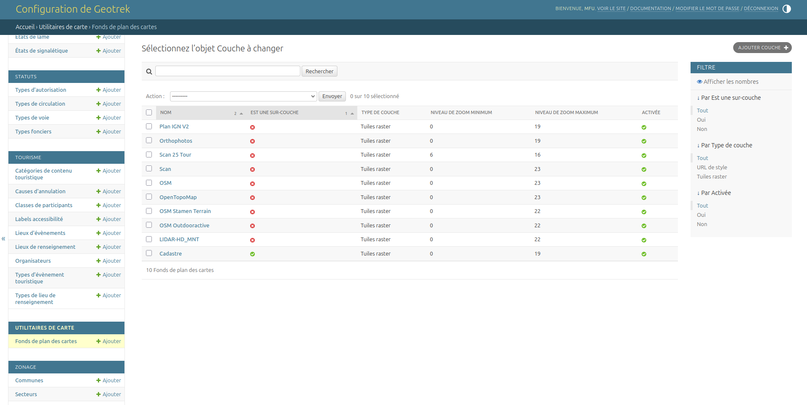

.. _settings-for-geotrek-admin-mobile:

=================================
Settings for Geotrek-admin mobile
=================================

.. info::
  
  For a complete list of available parameters, refer to the default values in `geotrek/settings/base.py <https://github.com/GeotrekCE/Geotrek-admin/blob/master/geotrek/settings/base.py>`_.

Reference data synchronization interval
---------------------------------------

Defines the maximum amount of time reference data can remain unsynchronized. Once this interval has elapsed, the user must manually synchronize the reference data before continuing to use the application.

Example::

    GTAM_CONFIG["REFERENCES_INTERVAL_SYNC"] = 7 * 24

.. note::

   - The value is expressed in hours.

Embedded data synchronization interval
------------------------------------------------

Defines the maximum amount of time embedded data can remain unsynchronized. Once this interval has elapsed, the user must manually synchronize the embedded data before continuing to use the application.

Example::

    GTAM_CONFIG["DATA_INTERVAL_SYNC"] = 7 * 24

.. note::

   - The value is expressed in hours.

Minimum zoom level for map synchronization
-------------------------------------------

Defines the minimum zoom level from which users are allowed to download map tiles.

Example::

    GTAM_CONFIG["SYNC_MAP_MIN_ZOOM"] = 10

.. note::

   - A zoom level greater than ``10`` is recommended to limit the number of downloaded tiles.

JWT authentication
------------------

Defines the lifetime of the JSON Web Tokens used for API authentication.

Example::

    SIMPLE_JWT["ACCESS_TOKEN_LIFETIME"] = timedelta(days=3)
    SIMPLE_JWT["REFRESH_TOKEN_LIFETIME"] = timedelta(days=21)

.. note::

   - ``ACCESS_TOKEN_LIFETIME`` defines how long an access token remains valid before it expires.
   - ``REFRESH_TOKEN_LIFETIME`` defines how long a refresh token remains valid. Once it expires, the user must authenticate again to obtain new tokens.

Nginx configuration for docker
------------------------------

* This new version require the following configuration in your Nginx server to allow the mobile application to access the API:

Example::

    location ~ ^/m/(?<remaining_path>.*)$ {
        root /;
        try_files /opt/geotrek-admin/var/frontend/dist/$remaining_path /opt/geotrek-admin/var/frontend/dist/index.html =404;
    }

    location ^~ /m/sw.js {
        alias /opt/geotrek-admin/var/frontend/dist/sw.js;
        add_header Cache-Control "no-store, no-cache, must-revalidate, proxy-revalidate, max-age=0";
        expires off;
        access_log off;
    }

    location = /m {
        return 307 /m/;
    }

This snippet is defined in new default Nginx configuration for Docker. https://github.com/GeotrekCE/Geotrek-admin/blob/master/docker/install/conf/nginx.conf

Configuring map base layers
-----------------------------

Geotrek-admin supports both raster and vector tile basemaps.

Basemaps can be added in two different ways:

- **Automatically**, using the ``install_layer`` management command. This is the
  recommended approach for the providers supported by the command (IGN,
  OpenStreetMap, Mapbox, etc.).
- **Manually**, from the administration interface. This method is intended for
  custom basemaps that are not provided by the ``install_layer`` command.

Installing predefined basemaps
^^^^^^^^^^^^^^^^^^^^^^^^^^^^^^

The ``install_layer`` command allows you to list and install the predefined
basemaps available for a given provider.

.. md-tab-set::
    :name: install-layer-command-tabs

    .. md-tab-item:: With Debian

        To list the available IGN basemaps:

        .. code-block:: bash

            sudo geotrek install_layer ign

        Output:

        .. code-block:: text

            - plan: Plan IGN (raster)
            - ortho: Orthophoto IGN (raster)
            - maps: Cartes IGN (raster)
            - scan_25: Scan IGN (raster)
            - cadastre: Cadastre IGN (raster)
            - plan_vt: Plan IGN VT (mapbox style)
            - scan_25_vt: Scan IGN VT (mapbox style)
            - gris_vt: Gris IGN VT (mapbox style)
            - cadastre_vt: Cadastre IGN VT (mapbox style)

        To install one of these basemaps, specify its identifier:

        .. code-block:: bash

            sudo geotrek install_layer ign ortho

    .. md-tab-item:: With Docker

        To list the available IGN basemaps:

        .. code-block:: bash

            docker compose run --rm web ./manage.py install_layer ign

        Output:

        .. code-block:: text

            - plan: Plan IGN (raster)
            - ortho: Orthophoto IGN (raster)
            - maps: Cartes IGN (raster)
            - scan_25: Scan IGN (raster)
            - cadastre: Cadastre IGN (raster)
            - plan_vt: Plan IGN VT (mapbox style)
            - scan_25_vt: Scan IGN VT (mapbox style)
            - gris_vt: Gris IGN VT (mapbox style)
            - cadastre_vt: Cadastre IGN VT (mapbox style)

        To install the IGN orthophoto:

        .. code-block:: bash

            docker compose run --rm web ./manage.py install_layer ign ortho

The same principle applies to the other supported providers (``osm``,
``mapbox``, etc.).

For additional options and supported providers, refer to the
`django-mapbox-baselayer documentation <https://github.com/makinacorpus/django-mapbox-baselayer#unified-install_layer-command>`_.

Managing basemaps
^^^^^^^^^^^^^^^^^

Once installed, basemaps are managed from the administration interface:

::

    <your_geotrek_admin_url>/admin/mapbox_baselayer/mapbaselayer/

From this page, administrators can enable, disable or edit existing basemaps
without modifying the application configuration.

.. important::

    If ``LEAFLET_CONFIG['TILES']`` is defined in ``custom.py``, it overrides the
    basemaps configured in the administration interface.

    To use the administration interface, comment out or remove the
    ``LEAFLET_CONFIG['TILES']`` setting before restarting Geotrek-admin.

   Managing basemaps

Custom basemaps
^^^^^^^^^^^^^^^

If the basemap you need is not available through the ``install_layer`` command,
you can create it manually from the administration interface:

::

    <your_geotrek_admin_url>/admin/mapbox_baselayer/mapbaselayer/add/

Both raster and vector tile basemaps are supported.

For vector tile basemaps, a valid **Style URL** must be provided.

.. _vector-basemaps:

Vector basemaps
^^^^^^^^^^^^^^^

Vector basemaps (like ``plan_vt``or ``scan_25_vt``) are currently used :ref:`to generate PMTiles for Geotrek Admin Mobile (GTAM) offline maps <generating-offline-maps>`.

They are **not yet displayed** in the Geotrek-admin layer selector. Support for
displaying vector basemaps in the layer control is planned for Geotrek-admin v3.

.. _generating-offline-maps:

Generating offline maps
-----------------------

The ``generate_pmtiles`` management command generates a PMTiles archive from a
vector basemap. This archive can then be used by Geotrek Admin Mobile (GTAM) to
display maps while working offline.

The command requires the identifier of the vector basemap configured in the
administration interface.

.. note::

    This command can only be used with **vector basemaps** (``*_vt``) configured in :ref:`in the previous section <vector-basemaps>`.

.. md-tab-set::
    :name: generate-pmtiles-command-tabs

    .. md-tab-item:: With Debian

        .. code-block:: bash

            sudo geotrek generate_pmtiles <id>

    .. md-tab-item:: With Docker

        .. code-block:: bash

            docker compose run --rm web ./manage.py generate_pmtiles <id>

Finding the basemap identifier
^^^^^^^^^^^^^^^^^^^^^^^^^^^^^^

The ``<id>`` parameter corresponds to the identifier of the **MapBaseLayer**
configured in the administration interface.

Open the desired basemap from:

::

    <your_geotrek_admin_url>/admin/mapbox_baselayer/mapbaselayer/

The identifier is visible in the edit page URL. For example:

::

    <your_geotrek_admin_url>/admin/mapbox_baselayer/mapbaselayer/1/change/

In this example, the basemap identifier is ``1``.

You can then generate the corresponding PMTiles archive:

.. md-tab-set::
    :name: generate-pmtiles-example-tabs

    .. md-tab-item:: With Debian

        .. code-block:: bash

            sudo geotrek generate_pmtiles 1

    .. md-tab-item:: With Docker

        .. code-block:: bash

            docker compose run --rm web ./manage.py generate_pmtiles 1

Generation time
^^^^^^^^^^^^^^^

.. warning::

    PMTiles generation is resource-intensive and may take a long time,
    depending on the server hardware, the selected basemap and the maximum zoom
    level.

    On a typical production server, generation can take around **one hour**, or
    even longer.

By default, tiles are generated for zoom levels **0** to **18**.

To reduce the generation time and the output file size, you can limit the
maximum zoom level using the ``--maxzoom`` option. For example:

.. md-tab-set::
    :name: generate-pmtiles-maxzoom-tabs

    .. md-tab-item:: With Debian

        .. code-block:: bash

            sudo geotrek generate_pmtiles 1 --maxzoom 15

    .. md-tab-item:: With Docker

        .. code-block:: bash

            docker compose run --rm web ./manage.py generate_pmtiles 1 --maxzoom 15