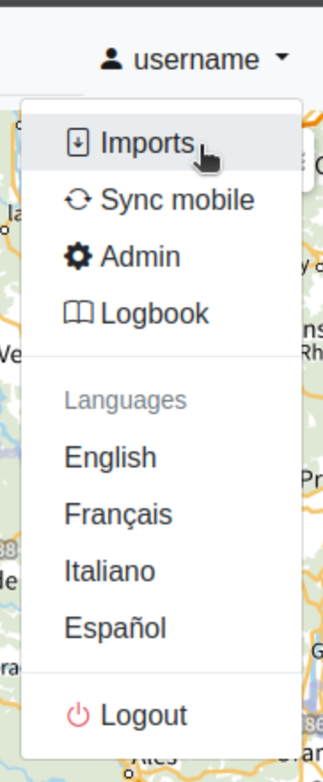
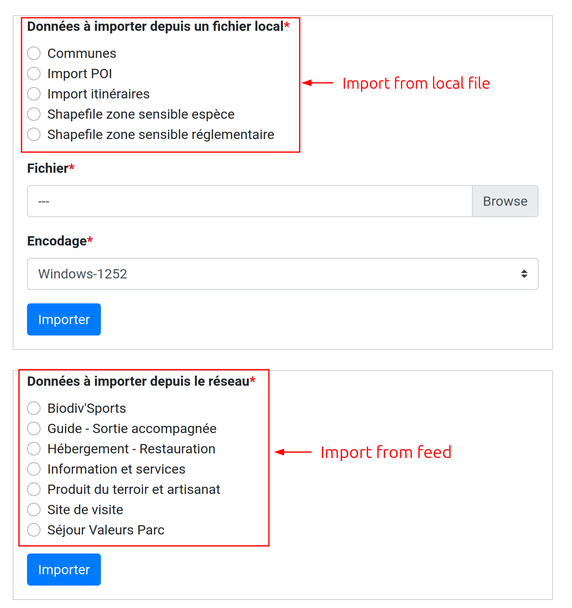
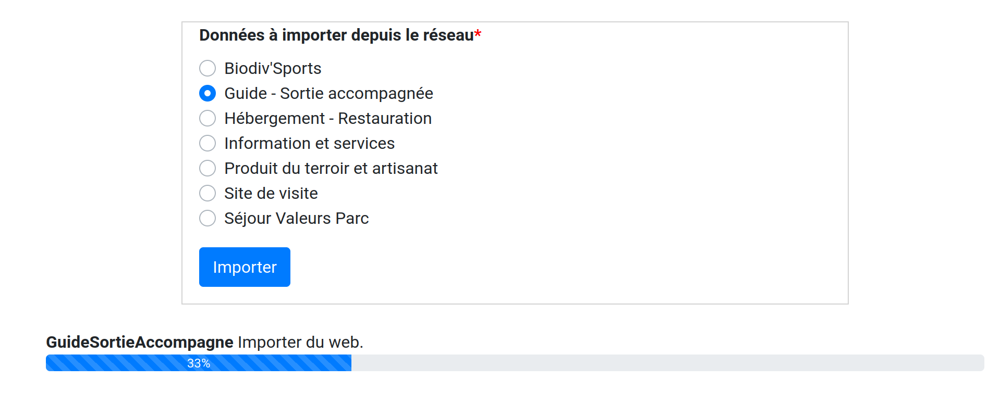
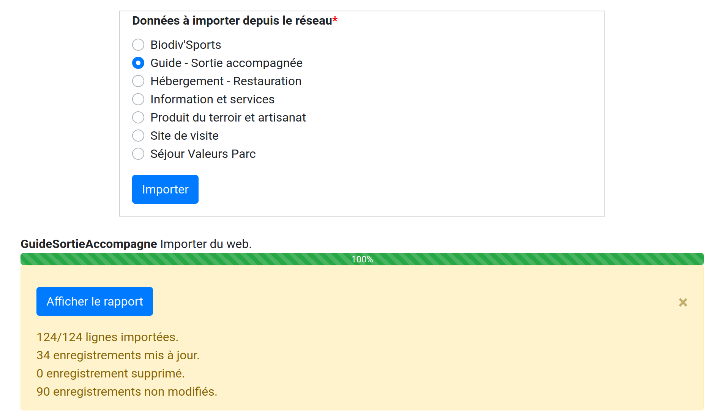
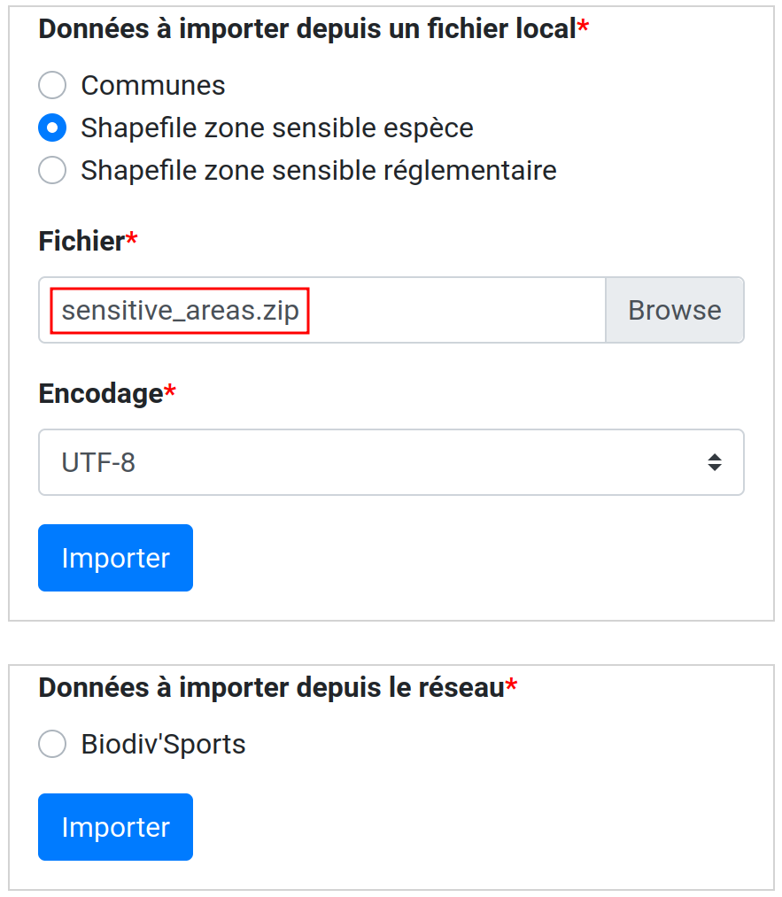

.. parsers-import:

======================
Parsers
======================

Introduction
=============

**Parsers** are tools that automate the import of external data into Geotrek-admin. They act as connectors between Geotrek and various data sources, transforming and integrating information such as cities, POIs, treks, sensitive areas, and more.

There are two main types of data sources supported by parsers:

* **Local files**, typically zipped shapefiles, often used for importing geographical data stored on your computer or network.
* **Online feeds**, accessed via a URL from a Tourism Information System, which allow real-time synchronization with platforms like Apidae, Tourinsoft, or Biodiv'Sport.

Geotrek-admin includes several **default parsers** for common data types (cities, POIs, treks, sensitive areas, Biodiv'Sport, etc.), but it is also possible to define **custom parsers** to suit specific needs or data formats.

Parsers can be used in two ways:

* **Through the web interface**, using the *Imports* section in the admin panel.
* **Via the command line**, using a dedicated ``import`` command.

Parser import methods
=====================

Web interface
-------------

Access Geotrek-admin's import interface
~~~~~~~~~~~~~~~~~~~~~~~~~~~~~~~~~~~~~~~

Open the top-right menu and click on "Imports".




.. _start-import-from-geotrek-admin-ui:

Start an import from Geotrek-admin's import interface
~~~~~~~~~~~~~~~~~~~~~~~~~~~~~~~~~~~~~~~~~~~~~~~~~~~~~

The import interface in Geotrek-admin is divided into two sections:

- Import from a local file: allows loading data from a shapefile.

- Import from an online source: allows retrieving data via a feed (URL from a Tourism Information System).




During the import process, a progress bar is displayed to indicate the current status. Once the import is complete, a summary report appears at the bottom of the screen.

It provides details on :

- the number of lines imported
- the number of records updated
- the number of records deleted
- the number of records left unchanged

If any warnings or errors occur during the import, they are listed at the bottom of the report. Each entry specifies the line where the issue occurred and includes the corresponding message.





Command line
--------------

.. _start-import-from-command-line:

Start an import from the command line
~~~~~~~~~~~~~~~~~~~~~~~~~~~~~~~~~~~~~

Just run:

.. md-tab-set::
    :name: import-from-hebergement-parser-tabs

    .. md-tab-item:: With Debian

         .. code-block:: python

          sudo geotrek import <Parser>

    .. md-tab-item:: With Docker

         .. code-block:: python

          docker compose run --rm web ./manage.py import <Parser>

The ``Parser`` argument corresponds to:
  - for custom parsers, the class name of the parser (e.g. ``PicNicTableParser``), which you can find in your ``var/conf/parsers.py`` file ;
  - for default parsers, the fully qualified name of the parser class (e.g. ``geotrek.sensitivity.parsers.BiodivParser``). You can find the default parser classes in the ``parsers.py`` file of each Geotrek-admin app's source code directory.

Display logs when importing from the command line
~~~~~~~~~~~~~~~~~~~~~~~~~~~~~~~~~~~~~~~~~~~~~~~~~

You can use the ``-v2`` parameter to make the command more verbose: the logs will display the progress of the import, showing for each entry its number, the ID of the object being imported, and the completion percentage.

Once the import is complete, a report is displayed, showing:
  - the number of lines imported
  - the number of records updated
  - the number of records deleted
  - the number of records left unchanged

If any warnings or errors occur during the import, they are listed at the bottom of the report. Each entry specifies the line where the issue occurred and includes the corresponding message.

Automate imports
~~~~~~~~~~~~~~~~

You can configure automatic imports at a defined frequency by scheduling tasks with the ``cron`` utility.

.. seealso::

  For more information on configuring scheduled tasks (cron jobs), refer to :ref:`this section <automatic-commands>`.


Types of parsers
=================

Default parsers
----------------

There are several default parsers, which are more or less generic scripts that help save time when creating mappings. Here is the list of these scripts for each Touristic Data System:

+-------------------+--------+------------+-----+-------------+---------------+----------+--------------+
|                   | Apidae | Tourinsoft | Lei | Esprit Parc | OpenStreetMap | Datagouv | Biodiv'sport |
+===================+========+============+=====+=============+===============+==========+==============+
| Touristic event   | X      | X          | X   |             |               |          |              |
+-------------------+--------+------------+-----+-------------+---------------+----------+--------------+
| Touristic content | X      | X          | X   |             |               |          |              |
+-------------------+--------+------------+-----+-------------+---------------+----------+--------------+
| Information desk  | X      |            |     |             | X             |          |              |
+-------------------+--------+------------+-----+-------------+---------------+----------+--------------+
| POI               | X      |            |     |             | X             |          |              |
+-------------------+--------+------------+-----+-------------+---------------+----------+--------------+
| Trek              | X      |            |     |             |               | X        |              |
+-------------------+--------+------------+-----+-------------+---------------+----------+--------------+
| Signage           |        |            |     |             | X             |          |              |
+-------------------+--------+------------+-----+-------------+---------------+----------+--------------+
| Infrastructure    | X      |            |     |             | X             |          |              |
+-------------------+--------+------------+-----+-------------+---------------+----------+--------------+
| Service           | X      |            |     |             |               |          |              |
+-------------------+--------+------------+-----+-------------+---------------+----------+--------------+
| Sensitive areas   |        |            |     |             |               |          | X            |
+-------------------+--------+------------+-----+-------------+---------------+----------+--------------+
| Sensitive species |        |            |     |             |               |          | X            |
+-------------------+--------+------------+-----+-------------+---------------+----------+--------------+
| City              |        |            |     |             | X             |          | X            |
+-------------------+--------+------------+-----+-------------+---------------+----------+--------------+


.. note::

  Geometries cannot be integrated for treks in a database with dynamic segmentation.

.. _import-cities-ui:

Cities
~~~~~~~

**(To complete)**

.. _import-poi-ui:

POIs
~~~~~~~

**(To complete)**

.. _import-treks-ui:

Treks
~~~~~~~

**(To complete)**

.. _import-sensitive-areas:

Sensitive areas
~~~~~~~~~~~~~~~~~

Geotrek-admin provides tools to import sensitive areas data when the module is enabled. The imports can be done through the web interface or the command line. Below are the available options:

Import from Biodiv'Sports
"""""""""""""""""""""""""""""

Automatically import sensitive areas from Biodiv'Sports:

From the web interface
''''''''''''''''''''''

1. Click on the **user button** (top-right corner) and go to **Imports**.
2. Under **Data to import from network**, select **Biodiv'Sports** and click **Import**.
3. Wait for the import process to complete.
4. Check the Sensitivity module in Geotrek to view the imported data.

.. warning::
    If no data appears, Biodiv'Sports might not have data for your region. Consider adding your data directly to Biodiv'Sports for shared access across users.

From the command line
''''''''''''''''''''''

.. md-tab-set::
    :name: import-from-biodiv-tabs

    .. md-tab-item:: Example with Debian

         .. code-block:: python

          sudo geotrek import geotrek.sensitivity.parsers.BiodivParser

    .. md-tab-item:: Example with Docker

         .. code-block:: python

          docker compose run --rm web ./manage.py import  geotrek.sensitivity.parsers.BiodivParser

Import from a Shapefile
""""""""""""""""""""""""

Refer to :ref:`this section <sensitiveareas-source-list>` to learn about the available downloadable data sources.

Sensitive areas can also be imported from an ESRI Shapefile (zipped). Ensure the following:

- The archive must include ``.shp``, ``.shx``, ``.dbf``, ``.prj``, etc.
- Field names must be configured correctly, as detailed below.

.. warning::
    Re-importing the same file will create duplicates.

**Species sensitive areas**:

- ``espece``: Species name (required, must exist in Biodiv'Sports).
- ``contact``: Optional contact information (text or HTML).
- ``descriptio``: Optional description (text or HTML).

**Regulatory sensitive areas**:

- ``name``: Area name (required).
- ``contact``: Optional contact information (text or HTML).
- ``descriptio``: Optional description (text or HTML).
- ``periode``: Months during which the area is sensitive (comma-separated, e.g., ``6,7,8`` for June-August).
- ``practices``: Practices associated with the area (comma-separated).
- ``url``: Optional URL for the record.

.. warning::
    Field names in shapefiles are limited to 10 characters (e.g., ``descriptio``).

From the web interface
''''''''''''''''''''''''

1. Click on the **user button** (top-right corner) and go to **Imports**.
2. Select the data type (**species** or **regulatory area**).
3. Upload the zipped shapefile and select the appropriate encoding (UTF-8 or Windows-1252).
4. Click **Import** and monitor the progress.
5. View the import report for details.



     Import shapefile in user interface

From the command line
''''''''''''''''''''''

- For species sensitive areas:

.. md-tab-set::
    :name: import-species-sensitive-areas-tabs

    .. md-tab-item:: Example with Debian

         .. code-block:: python

          sudo geotrek import geotrek.sensitivity.parsers.SpeciesSensitiveAreaShapeParser <file.zip>

    .. md-tab-item:: Example with Docker

         .. code-block:: python

          docker compose run --rm web ./manage.py import  geotrek.sensitivity.parsers.SpeciesSensitiveAreaShapeParser <file.zip>

- For regulatory sensitive areas:

.. md-tab-set::
    :name: import-regulatory-sensitive-areas-tabs

    .. md-tab-item:: Example with Debian

         .. code-block:: python

          sudo geotrek import geotrek.sensitivity.parsers.RegulatorySensitiveAreaShapeParser <file.zip>

    .. md-tab-item:: Example with Docker

         .. code-block:: python

          docker compose run --rm web ./manage.py import geotrek.sensitivity.parsers.RegulatorySensitiveAreaShapeParser <file.zip>

**Default import options:**

- **Cities**, **Species sensitive areas**, and **Regulatory sensitive areas**: imported from Shapefile files.

- **Biodiv’Sport**: imported via data feed.

.. note::
   Trek imports cannot be used with dynamic segmentation.

Custom parsers
---------------

Introduction
~~~~~~~~~~~~

You can add custom parsers to your Geotrek-admin instance. However, in most cases, these are not plug-and-play : they must be properly configured to suit the structure and format of your data source. You will need to adapt or create a parser class that can interpret your data and map it to the corresponding Geotrek-admin models.

Adding a custom parser
~~~~~~~~~~~~~~~~~~~~~~

Custom parser code must be added to the ``var/conf/parsers.py`` file.

Some parsers are not available by default but you can use them adding some lines in your parsers file :

.. code-block:: python

    from geotrek.trekking.parsers import TrekParser
    from geotrek.trekking.parsers import POIParser

.. note::

  Not all parsers support dynamic segmentation. For example, the ``TrekParser`` can only be used if ``TREKKING_TOPOLOGY_ENABLED``` is set to ``False``.

Configuring built-in parsers
~~~~~~~~~~~~~~~~~~~~~~~~~~~~

Data sources
"""""""""""""

Geotrek-admin includes built-in configurable parsers for various data sources, such as Apidae, Tourinsoft, OpenStreetMap, etc. Here is the list of touristic information systems and other sources managed for the moment:
  - `Apidae <https://www.apidae-tourisme.com/>`_ is a collaborative network and a tourism information management platform. It enables tourist offices, local authorities, service providers, and private partners to share, structure, and distribute tourism data (accommodations, events, sites, services, etc.). It serves as a common reference system at the local, regional, and national levels.
  - `Tourinsoft <https://www.tourinsoft.com/>`_ is a Tourism Information System developed by the company Ingénie for tourism organizations in France, such as Departmental Tourism Committees (CDT), Tourism Development Agencies (ADT), and Tourist Offices. This system allows for the centralization, management, and standardized dissemination of tourism-related information.
  - `Cirkwi <https://www.cirkwi.com/>`_ is a platform for distributing tourism content (treks, points of interest, digital guides) aimed at tourism professionals. It helps promote tourism data through websites, mobile apps, or interactive kiosks using widgets or APIs, relying on a library of shared or proprietary content.
  - LEI / Décibelles Data : The **LEI** (Lieu d’Échanges et d’Informations) was the former shared tourism information system used in Alsace to centralize and distribute regional tourism data (accommodations, events, sites, etc.). It has been replaced by `Décibelles Data <https://wiki.decibelles-data.com/>`_, the new regional database for the entire Bourgogne-Franche-Comté region. Décibelles Data enables collaborative management and multichannel distribution of tourism information, while also ensuring integration with national platforms such as DataTourisme.
  - The `Esprit Parc <https://www.espritparcnational.com/>`_ brand promotes tourist offers committed to the preservation of nature and local know-how in national park areas.
  - OpenStreetMap (OSM) is a collaborative, open-source mapping database that provides freely accessible geographic data, maintained by a global community of contributors. OpenStreetMap parsers retrieve OSM data using the `Overpass API <https://wiki.openstreetmap.org/wiki/Overpass_API>`_.
  - The `trek data schema <https://schema.data.gouv.fr/PnX-SI/schema_randonnee/>`_ is a national standard published on `schema.data.gouv.fr <schema.data.gouv.fr>`_, which aims to standardize the description of treks in France. It facilitates the exchange and dissemination of data between producers (tourist offices, natural parks, local authorities) and reusers (applications, websites, open data platforms).


Setup for data sources
""""""""""""""""""""""

Some data sources, especially online feeds such as Apidae or Tourinsoft, require additional setup, such as:

* an API key
* URL endpoints
* Filters or project IDs

Depending on the source, you can configure your custom parser to:

* load local files (e.g. zipped shapefile)
* retrieve data from a remote feed via URL


Real-time integration
"""""""""""""""""""""

Geotrek-admin integrates with various Tourism Information Systems (SIT) such as Apidae, Tourinsoft, and others, enabling real-time retrieval of data entered by tourism offices. This includes information on points of interest, accommodations, cultural heritage, and more.

These imported data elements are automatically linked to nearby treks, regardless of activity type (trekking, trail running, mountain biking, cycling, gravel, climbing, rafting, etc.).

This seamless integration enriches the descriptive pages of routes, ensuring that users benefit from comprehensive and up-to-date information with no additional effort required from administrators or agents.

Building a parser from scratch
~~~~~~~~~~~~~~~~~~~~~~~~~~~~~~

If you want to implement your own parser or adapt an existing one, refer to :ref:`the parsers developer documentation <development-parser-import>` for details and examples.


FAQ / Common errors
=====================

Geometry issues
----------------

**(To complete)**

Duplicates
----------

**(To complete)**

Structure conflicts
--------------------

**(To complete)**

Silent failures
----------------

**(To complete)**

Media formats
--------------

**(To complete)**
