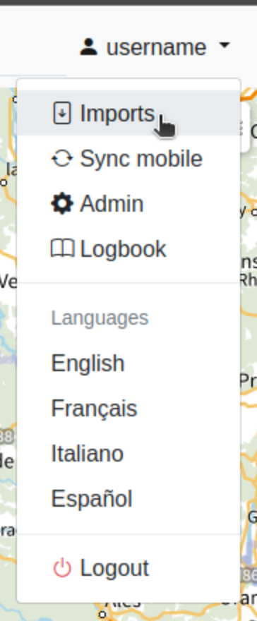
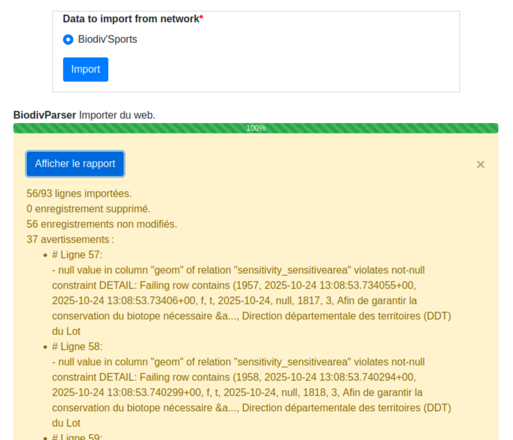

.. parsers-import:

======================
Parsers
======================

Introduction
=============

**Parsers** are tools that automate the import of external data into Geotrek-admin. They act as connectors between Geotrek and various data sources, transforming and integrating information such as cities, POIs, treks, sensitive areas, and more.

There are two main types of data sources supported by parsers:

* **Local files**, typically zipped shapefiles or geojson files, often used for importing geographical data stored on your computer or network.
* **Online feeds**, accessed via a URL from a Tourism Information System, which allow real-time synchronization with platforms like Apidae, Tourinsoft, or Biodiv'Sport.

Geotrek-admin includes several **configurable parsers** for common data types and sources (cities, POIs, treks, sensitive areas, Biodiv'Sport, Apidae, OSM etc.), but it is also possible to create **custom parsers** to suit specific needs or data formats.

Parsers can be used in two ways:

* **Through the web interface**, using the *Imports* section in the admin panel.
* **Via the command line**, using a dedicated ``import`` command.

.. warning::

  Not all parsers support dynamic segmentation. For instance, trek parsers can only be used if ``TREKKING_TOPOLOGY_ENABLED``` is set to ``False``.


Parser import methods
=====================

Web interface
-------------

Access Geotrek-admin's import interface
~~~~~~~~~~~~~~~~~~~~~~~~~~~~~~~~~~~~~~~

Open the top-right menu and click on "Imports".




.. _start-import-from-geotrek-admin-ui:

Start an import from Geotrek-admin's import interface
~~~~~~~~~~~~~~~~~~~~~~~~~~~~~~~~~~~~~~~~~~~~~~~~~~~~~

The import interface in Geotrek-admin is divided into two sections:

- Import from a local file (shapefile, geojson, etc).

- Import from an online source: allows retrieving data via a feed.


During the import process, a progress bar is displayed to indicate the current status. Once the import is complete, a summary report appears at the bottom of the screen.

It provides details on :

- the number of lines imported
- the number of records updated
- the number of records deleted
- the number of records left unchanged

If any warnings or errors occur during the import, they are listed at the bottom of the report. Each entry specifies the line where the issue occurred and includes the corresponding message.

.. figure:: ../images/import-data/import-sit1.png
  :alt: Progress bar during feed import
  :align: center



Command line
--------------

.. _start-import-from-command-line:

Start an import from the command line
~~~~~~~~~~~~~~~~~~~~~~~~~~~~~~~~~~~~~

Just run:

.. md-tab-set::
    :name: import-from-hebergement-parser-tabs

    .. md-tab-item:: With Debian

         .. code-block:: python

          sudo geotrek import <Parser>

    .. md-tab-item:: With Docker

         .. code-block:: python

          docker compose run --rm web ./manage.py import <Parser>

The ``Parser`` argument corresponds to:
  - for custom parsers, the class name of the parser (e.g. ``PicNicTableParser``), which you can find in your ``var/conf/parsers.py`` file ;
  - for ready-to-use parsers, the `fully qualified class name (FQCN) <https://en.wikipedia.org/wiki/Fully_qualified_name/>`_ of the parser (e.g. ``geotrek.sensitivity.parsers.BiodivParser``). You can find the parser classes in the ``parsers.py`` file of each Geotrek-admin app's source code directory.

Display logs when importing from the command line
~~~~~~~~~~~~~~~~~~~~~~~~~~~~~~~~~~~~~~~~~~~~~~~~~

You can use the ``-v2`` parameter to make the command more verbose: the logs will display the progress of the import, showing for each entry its number, the ID of the object being imported, and the completion percentage.

Once the import is complete, a report is displayed, showing:
  - the number of lines imported
  - the number of records updated
  - the number of records deleted
  - the number of records left unchanged

If any warnings or errors occur during the import, they are listed at the bottom of the report. Each entry specifies the line where the issue occurred and includes the corresponding message.

Automate imports
~~~~~~~~~~~~~~~~

You can configure automatic imports at a defined frequency by scheduling tasks with the ``cron`` utility.

.. seealso::

  For more information on configuring scheduled tasks (cron jobs), refer to :ref:`this section <automatic-commands>`.


Types of parsers
=================

Ready-to-use parsers
--------------------

The following parsers are available via the web interface and the command line, and do not require any configuration before use.

+-----------------+--------------------------------------------+---------------------+--------------------------------------------+----------------------------------------------------------------------------------------------------------------------------------------+
| Geotrek model   | Availability                               | Type of data source | Label (for running from the web interface) | FQCN (for running from CLI)                                                                                                            |
+=================+============================================+=====================+============================================+========================================================================================================================================+
| Cities          | Always                                     | Shapefile           | Cities                                     | ``geotrek.zoning.parsers.CityParser``                                                                                                  |
+-----------------+--------------------------------------------+---------------------+--------------------------------------------+----------------------------------------------------------------------------------------------------------------------------------------+
| Sensitive areas | When the ``sensitivity`` module is enabled | Online feed         | Biodiv'Sports                              | ``geotrek.sensitivity.parsers.BiodivParser``                                                                                           |
+-----------------+--------------------------------------------+---------------------+--------------------------------------------+----------------------------------------------------------------------------------------------------------------------------------------+
| Sensitive areas | When the ``sensitivity`` module is enabled | Shapefile           | Shapefile species sensitive area           | ``geotrek.sensitivity.parsers.SpeciesSensitiveAreaShapeParser`` and ``geotrek.sensitivity.parsers.RegulatorySensitiveAreaShapeParser`` |
+-----------------+--------------------------------------------+---------------------+--------------------------------------------+----------------------------------------------------------------------------------------------------------------------------------------+

.. note::
    If no data appears after the Biodiv'Sports parser has run, Biodiv'Sports might not have data for your region. Consider adding your data directly to Biodiv'Sports for shared access across users.

.. _import-sensitive-areas:

Shapefile requirements for importing sensitive areas
~~~~~~~~~~~~~~~~~~~~~~~~~~~~~~~~~~~~~~~~~~~~~~~~~~~~

Refer to :ref:`this section <sensitiveareas-source-list>` to learn about the available downloadable data sources.

To import sensitive areas from an ESRI Shapefile (zipped), ensure the following:

- The archive must include ``.shp``, ``.shx``, ``.dbf``, ``.prj``, etc.
- Field names must be configured correctly, as detailed below.

**Species sensitive areas**:

- ``espece``: Species name (required, must exist in Biodiv'Sports).
- ``contact``: Optional contact information (text or HTML).
- ``descriptio``: Optional description (text or HTML).

**Regulatory sensitive areas**:

- ``name``: Area name (required).
- ``contact``: Optional contact information (text or HTML).
- ``descriptio``: Optional description (text or HTML).
- ``periode``: Months during which the area is sensitive (comma-separated, e.g., ``6,7,8`` for June-August).
- ``practices``: Practices associated with the area (comma-separated).
- ``url``: Optional URL for the record.

.. warning::
    - Re-importing the same file will create duplicates.
    - Field names in shapefiles are limited to 10 characters (e.g., ``descriptio``).

Custom parsers
---------------

Introduction
~~~~~~~~~~~~

You can add custom parsers to your Geotrek-admin instance, either by building them from scratch, or by using base parsers.

Base parsers are not plug-and-play: they must be properly configured to suit the structure and format of your data source. You will need to create a parser class that can interpret your data and map it to the corresponding Geotrek-admin models.

This section explains how to configure the base parsers available in Geotrek-admin. For information on how to further customize them to your needs, or how to build a parser from scratch, see the :ref:`development section of the parsers documentation<development-parser-import>`

Adding a custom parser to your instance
~~~~~~~~~~~~~~~~~~~~~~~~~~~~~~~~~~~~~~~

Custom parser code must be added to the ``var/conf/parsers.py`` file. There are no additional steps: once added to this file, the parsers will be accessible via the command line and the web interface, if configured accordingly.

Applying parser changes
~~~~~~~~~~~~~~~~~~~~~~~

After modifying your parser code, you might need to restart the related services for the changes to take effect, depending on your environment and how you intend to launch the parsers.

.. md-tab-set::
    :name: apply-parser-changes

    .. md-tab-item:: With Debian

      Whether you will launch the parsers through the command line or the web interface, run:

      .. code-block:: bash

        sudo systemctl geotrek restart

    .. md-tab-item:: With Docker

      Needed only when the parsers will be run through the web interface:

      .. code-block:: bash

        docker compose down
        docker compose up -d

.. _custom-parsers-data-sources:

Data sources
~~~~~~~~~~~~

Geotrek-admin includes built-in configurable parsers for various data sources, such as Apidae, Tourinsoft, OpenStreetMap, etc.

To know which objects can be parsed for each data source, look up the parser classes in the ``parsers.py`` file of each Geotrek-admin's app directory.


Here is the list of touristic information systems and other sources managed for the moment:
  - `Apidae <https://www.apidae-tourisme.com/>`_ is a collaborative network and a tourism information management platform. It enables tourist offices, local authorities, service providers, and private partners to share, structure, and distribute tourism data (accommodations, events, sites, services, etc.). It serves as a common reference system at the local, regional, and national levels.
  - `Tourinsoft <https://www.tourinsoft.com/>`_ is a Tourism Information System developed by the company Ingénie for tourism organizations in France, such as Departmental Tourism Committees (CDT), Tourism Development Agencies (ADT), and Tourist Offices. This system allows for the centralization, management, and standardized dissemination of tourism-related information.
  - `Cirkwi <https://www.cirkwi.com/>`_ is a platform for distributing tourism content (treks, points of interest, digital guides) aimed at tourism professionals. It helps promote tourism data through websites, mobile apps, or interactive kiosks using widgets or APIs, relying on a library of shared or proprietary content.
  - LEI / Décibelles Data : The **LEI** (Lieu d’Échanges et d’Informations) was the former shared tourism information system used in Alsace to centralize and distribute regional tourism data (accommodations, events, sites, etc.). It has been replaced by `Décibelles Data <https://wiki.decibelles-data.com/>`_, the new regional database for the entire Bourgogne-Franche-Comté region. Décibelles Data enables collaborative management and multichannel distribution of tourism information, while also ensuring integration with national platforms such as DataTourisme.
  - The `Esprit Parc <https://www.espritparcnational.com/>`_ brand promotes tourist offers committed to the preservation of nature and local know-how in national park areas.
  - OpenStreetMap (OSM) is a collaborative, open-source mapping database that provides freely accessible geographic data, maintained by a global community of contributors. OpenStreetMap parsers retrieve OSM data using the `Overpass API <https://wiki.openstreetmap.org/wiki/Overpass_API>`_.
  - The `trek data schema <https://schema.data.gouv.fr/PnX-SI/schema_randonnee/>`_ is a national standard published on `schema.data.gouv.fr <schema.data.gouv.fr>`_, which aims to standardize the description of treks in France. It facilitates the exchange and dissemination of data between producers (tourist offices, natural parks, local authorities) and reusers (applications, websites, open data platforms).

Configuring base parsers
~~~~~~~~~~~~~~~~~~~~~~~~

Some data sources, especially online feeds such as Apidae or Tourinsoft, require additional setup, such as:

* an API key
* URL endpoints
* Filters or project IDs

Depending on the source, you can configure your custom parser to:

* load local files (e.g. zipped shapefile)
* retrieve data from a remote feed via URL

To learn how to configure base parsers, see :ref:`this section<configurable-built-in-parsers>`.
