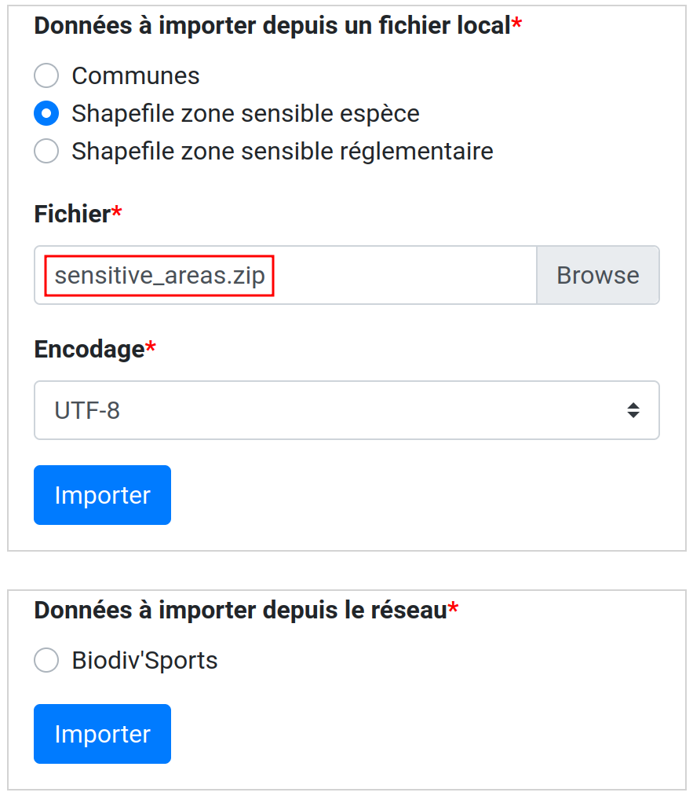

===========
Import data
===========

.. contents::
   :local:
   :depth: 2


Import paths
============

.. danger::
    With dynamic segmentation, importing paths is very risky if paths are already present in the same area in Geotrek,
    it is only safe for an area where no path is already created.

    Indeed, if you import paths where there are existing paths, treks, POIs or trails linked topology might be impacted.

Before import paths layer, it is important to prepare them. Paths must be:

- valid geometry
- simple geometry (no intersection)
- all intersections must cut the paths
- not double or covering others

We use QGis to clean a path layer, with plugin Grass.
Here are the operations:

- check the SRID (must be the same as in Geotrek)

- vectors → geometric tools → "collect geometries"

- vectors → geometric tools → "group"

- clean geometries
    - search "v_clean" in "Processing toolbox"
    - select following options in cleaning tool: break, snap, duplicate (ou rmdup), rmline, rmdangle, chdangle, bpol, prune
    - in threshold enter 2,2,2,2,2,2,2,2 (2 meters for each option)

- delete duplicate geometries
    - search "duplicate" in "Processing toolbox"

- regroup lines
    - search "v.build.polyline" in "Processing toolbox")
    - select "first" in "Category number mode"

There are two ways to import path : importing your shapefile with command line,
or `via QGis following this blog post <https://makina-corpus.com/sig-webmapping/importer-une-couche-de-troncons-dans-geotrek>`_.

To import a shapefile containing your paths, use the command ``loadpaths``::

    sudo geotrek loadpaths {Troncons.shp} \
        --srid=2154 --comments-attribute IT_VTT IT_EQ IT_PEDEST \
        --encoding latin9 -i

.. _import-data-from-touristic-data-systems-sit:

Import data from touristic data systems (SIT)
=============================================

.. _configure-apidae-ex-sitra-import:

Configure APIDAE (ex-SITRA) import
----------------------------------

To import touristic content from APIDAE (ex-SITRA), edit ``/opt/geotrek-admin/var/conf/parsers.py`` file with the following content:

::

    from geotrek.tourism.parsers import TouristicContentApidaeParser

    class HebergementParser(TouristicContentApidaeParser):
        label = "Hébergements"
        api_key = 'xxxxxxxx'
        project_id = 9999
        selection_id = 99999
        category = "Hébergement"
        type1 = ["Camping"]
        type2 = ["3 étoiles", "Tourisme et Handicap"]  # just remove this line if no type2

Then set up appropriate values:

* ``label`` at your convenience,
* ``api_key``, ``project_id`` and ``selection_id`` according to your APIDAE (ex-SITRA) configuration
* ``category``, ``type1`` and ``type2`` (optional) to select in which Geotrek category/type imported objects should go
* You can add ``delete = True`` in your class if you want to delete objects in Geotrek databases that has been deleted in your Apidae selection. It will only delete objects that match with your class settings (category, types, portal, provider...)
* You can also use the class ``HebergementParser`` if you only import accomodations
* See https://github.com/GeotrekCE/Geotrek-admin/blob/master/geotrek/tourism/parsers.py for details about Parsers

You can duplicate the class. Each class must have a different name.
Don't forget the u character before strings if they contain non-ascii characters.

To apply changes, you may have to run ``sudo service geotrek restart``.


Import Treks from APIDAE
------------------------

A parser implementation is available to import Treks from APIDAE. Use it by defining a subclass of ```geotrek.trekking.parsers.ApidaeTrekParser`` in your ``var/conf/parsers.py`` configuration file as shown above.

You'll have to configure how to access your APIDAE data: ``api_key``, ``project_id`` and ``selection_id`` (those are setting attributes from the APIDAE base parser).

The ``practices_mapped_with_activities_ids`` and ``practices_mapped_with_default_activities_ids`` attributes define default mapping with the trekking module data fixture. You may override this to match your own types of Trek Practice.


Import from LEI
---------------

To import touristic content or touristic event from LEI , create (or update) ``/opt/geotrek-admin/var/conf/parsers.py`` file with the following content:

::

    from geotrek.tourism.parsers import LEITouristicContentParser, LEITouristicEventParser

    class XXXLEIContentParser(LEITouristicContentParser):
        label = "LEI TouristicContent"
        url = "https://url.asp"

    class XXXLEIEventParser(LEITouristicEventParser):
        label = "LEI TouristicEvent"
        url = "https://url.asp"


Configure Marque Esprit Parc import
-----------------------------------

To import touristic content from Esprit Parc national database, create (or update) ``/opt/geotrek-admin/var/conf/parsers.py`` file with the following content:

::

    from geotrek.tourism.parsers import EspritParcParser

    class XXXEspritParcParser(EspritParcParser):
        label = "Marque Esprit Parc"
        url = "https://gestion.espritparcnational.com/ws/?f=getProduitsSelonParc&codeParc=XXX"

Then set up appropriate values:

* ``XXX`` by unique national park code (ex: PNE)

You can duplicate the class. Each class must have a different name.
Don't forget the u character before strings if they contain non-ascii characters.

In this case categories and types in Geotrek database have to be the same as in Esprit parc database. Otherwise missing categories and types will be created in Geotrek database.

Imported contents will be automatically published and approved. 

If you use an url that filters a unique category, you can change its name. Example to get only Honey products and set the Geotrek category and type in which import them:

::

    class MielEspritParcParser(EspritParcParser):
        label = "Miel Esprit Parc national"
        url = "https://gestion.espritparcnational.com/ws/?f=getProduitsSelonParc&codeParc=XXX&typologie=API"
        constant_fields = {
            'category': "GeotrekCategoryName",
            'published': True,
            'approved': True,
            'deleted': False,
        }
        m2m_constant_fields = {
            'type1': "GeotrekTypeName",
        }

URL to get Esprit parc types: `https://gestion.espritparcnational.com/ws/?f=getTypologieProduits`.


Sensitive areas import
----------------------

When sensitive areas module is enabled, Geotrek provides 3 parsers to import data:

* **Import sensitive areas from http://biodiv-sports.fr** (``geotrek.sensitivity.parsers.BiodivParser``). By default this
  parser imports all sensitive areas in configured spatial extent.
* **Import species sensitive areas from a zipped shapefile**. 
  Imported field names are: ``espece`` (required), ``contact`` and ``descriptio``. Species with corresponding names have to be created manually before import.
* **Import regulatory sensitive areas from a zipped shapefile**. Imported field names are: ``nom`` (required), ``contact``, ``descriptio``, ``periode`` (month numbers separated with comas), ``pratiques`` (separated with comas), and ``url``. Practices with corresponding names have to be created manually before import.

You can start imports from "Import" menu or from command line. You can override them in your ``var/conf/parsers.py``
file.


Multiple imports
----------------

When you need to import data for the same object found in 2 different parsers, you can to force the aggregation of both values in many to many relationship case.
It can be interesting with portals for example.

Param for the aggregation : ``m2m_aggregate_fields``

Here is an example with 2 parsers :

::

    class Portal_1Parser(XXXParser):
        portal = "portal_1"

    class AggregateParser(XXXParser):
        portal = "portal_2"
        m2m_aggregate_fields = ["portal"]

Then, when you import the first parser ``Portal_1Parser``, you get multiple objects with ``portal_1`` as portal.
If any object of the ``Portal_1Parser`` is also in ``AggregateParser``, fields in ``m2m_aggregate_fields`` will have their values not be replaced but aggregated.
Then your object in both portals will have as portal: ``portal_1, portal_2``

* Here in this example whenever you import the first parser ``Portal_1Parser``, portals are replaced because ``m2m_aggregate_fields`` is not filled. Then, be careful to import parsers in the right order or add the param ``m2m_aggregate_fields`` on all parsers.

If you need to cancel the aggregation of portals, remove param ``m2m_aggregate_fields``.


Importing from multiple sources with deletion
---------------------------------------------

When importing data for the same model using two (or more) different sources, the ``provider`` field should be used to differenciate between sources, allowing to enable object deletion with ``delete = True`` without causing the last parser to delete objects created by preceeding parsers.

In the following example, ``Provider_1Parser`` and ``Provider_2Parser`` will each import their objects, set the ``provider`` field on these objects, and only delete objects that disappeared from their respective source since last parsing.

.. code-block:: python

    class Provider_1Parser(XXXXParser):
        delete = True
        provider = "provider_1"

    class Provider_2Parser(XXXParser):
        delete = True
        provider = "provider_2"


.. danger::
    It is recommended to use ``provider`` from the first import - Do not add a ``provider`` field to preexisting parsers that already imported objects, or you will have to manually set the same value for ``provider`` on all objects already created by this parser. 


.. danger::
    If a parser does not have a ``provider`` value, it will not take providers into account, meaning that it could delete objects from preceeding parsers even if these other parsers do have a ``provider`` themselves.


The following example would cause ``NoProviderParser`` to delete objects from ``Provider_2Parser`` and ``Provider_1Parser``.

.. code-block:: python

    class Provider_1Parser(XXXXParser):
        delete = True
        provider = "provider_1"

    class Provider_2Parser(XXXParser):
        delete = True
        provider = "provider_2"

    class NoProviderParser(XXXParser):
        delete = True
        provider = None       (default)


Generic settings for your parser
--------------------------------

This settings may be overriden when you define a new parser:

- ``label`` parser display name (default: ``None``)
- ``model`` import content with this model (default: ``None``)
- ``filename`` file imported if no url (default: ``None``)
- ``url`` flow url imported from if no filename (default: ``None``)
- ``simplify_tolerance`` (default: ``0``)  # meters
- ``update_only`` don't create new contents (default: ``False``)
- ``delete`` (default: ``False``)
- ``duplicate_eid_allowed`` if True, allows differents contents with same eid (default: ``False``)
- ``fill_empty_translated_fields`` if True, fills empty translated fields with same value  (default: ``False``)
- ``warn_on_missing_fields`` (default: ``False``)
- ``warn_on_missing_objects`` (default: ``False``)
- ``separator`` (default: ``'+'``)
- ``eid`` field name for eid (default: ``None``)
- ``provider`` (default: ``None``)
- ``fields`` (default: ``None``)
- ``m2m_fields``  (default: ``{}``)
- ``constant_fields`` (default: ``{}``)
- ``m2m_constant_fields`` (default: ``{}``)
- ``m2m_aggregate_fields`` (default: ``[]``)
- ``non_fields`` (default: ``{}``)
- ``natural_keys`` (default: ``{}``)
- ``field_options`` (default: ``{}``)
- ``default_language`` use another default language for this parser (default: ``None``)


Start import from command line
------------------------------

Just run:

::

    sudo geotrek import HebergementParser

Change ``HebergementParser`` to match one of the class names in ``var/conf/parsers.py`` file.
You can add ``-v2`` parameter to make the command more verbose (show progress).
Thank to ``cron`` utility you can configure automatic imports.


Start import from Geotrek-admin UI
----------------------------------

Open the top right menu and clic on ``imports``.


Import data from a remote Geotrek instance
==========================================

Importing from a Geotrek instance works the same way as from SIT.
A usecase for this is to aggregate data from several Geotrek-admin instance.

.. danger::
    Importing data from a remote Geotrek instance does not work with dynamic segmentation, your instance where you import data
    must have dynamic segmentation disabled.


For example, to import treks from another instance,
edit ``/opt/geotrek-admin/var/conf/parsers.py`` file with the following content:

.. code-block:: python

    class DemoGeotrekTrekParser(BaseGeotrekTrekParser):
        url = "https://remote-geotrek-admin.net"  # replace url with remote instance url
        delete = False
        field_options = {
            'difficulty': {'create': True, },
            'route': {'create': True, },
            'themes': {'create': True},
            'practice': {'create': True},
            'accessibilities': {'create': True},
            'networks': {'create': True},
            'geom': {'required': True},
            'labels': {'create': True},
        }

Then run in command line

.. code-block:: bash

    sudo geotrek import DemoGeotrekTrekParser

Treks are now imported into your own instance.

.. _import-sensitive-areas:

Import sensitive areas
======================

Import from https://biodiv-sports.fr
------------------------------------

It is possible to import automatically data from Biodiv'sport. To do so, you just need to follow those steps : 

- Click on the **user link** at top right, then on **Imports**,
- Under the section **Data to import from network**, select **Biodiv'Sports**
- Click on **Import**,
- Wait a few seconds,
- The import progress is displayed on the right

When the import is done, you can check the Sensitivity module in Geotrek and you'll find data inside.

It is also possible to import sensitive areas through commande line:

.. code-block :: bash

    sudo geotrek import geotrek.sensitivity.parsers.BiodivParser

.. warning:: 
  If you don't see any data in your area, it means that Biodiv'Sport does not contains data for your territory. 
  Then it is widely recommended to add your data directly into Biodiv'Sport, as it will be available for 
  multiple users, and then retrieve them into your Geotrek instance. To import data in Biodiv'Sports 
  go visit their website : https://biodiv-sports.fr


Import from shapefile
---------------------

Imported data must be in standard ESRI shapefile format. 
The various Shapefile files (``.shp``, ``.shx``, ``.dbf``, ``.prj``, *etc*.) must be assembled in a zip archive.

.. warning::
  Please note! The description field name ``descriptio`` does not include the final ``n``, as field names are limited to 10 characters in shapefiles.

Attribute data for sensitive areas species

- ``espece``: Species name. Mandatory. A species with this name must first have been created in Biodiv'sports. Otherwise, import of the line will fail.
- ``contact``: Contact in text or HTML format. *Optional*.
- ``descriptio``: Description in text or HTML format. *Optional*. 

.. warning::
  Species name must strictly respect the species name string (accentuation, case and punctuation).

Attribute data for regulatory sensitive areas:

- ``name`` : Area name
- ``contact`` : Contact in text or HTML format. *Optional*.
- ``descriptio`` : Description in text or HTML format. *Optional*.
- ``periode``: Numbers of the months in which the area is occupied, **comma separated** and **without spaces** (e.g. ``6,7,8`` for June, July and August).
- ``practices``: Names of practices, separated by commas, without spaces (e.g. ``Terrestre,Aerien,Vertical``), see :envvar:`Sport practices`. Otherwise, the line import will fail.
- ``url`` : Record url. *Optional*.

Import from web interface

- Click on the **user link** at top right, then on **Imports**,
- Select the type of data to be imported (**species** or **regulatory area**),
- Select the *.zip* file to be imported,
- Select the correct encoding (``UTF8`` or ``Windows-1252``)
- Click on **Import**,
- Wait a few seconds,
- The import progress is displayed on the right,
- Click on **Display report** to see any unimported lines.



   Import shapefile in user interface

On command line, run:

.. code-block:: bash

    sudo geotrek import geotrek.sensitivity.parsers.SpeciesSensitiveAreaShapeParser <file.shp>

or:

.. code-block:: bash

    sudo geotrek  import geotrek.sensitivity.parsers.RegulatorySensitiveAreaShapeParser <file.shp>.


.. warning:: 
  Relaunching an import **with the same file** will create duplicates.


Import other datas from a file
==============================

You can add parsers in your custom `parsers.py` file (``/opt/geotrek-admin/var/conf/parsers.py``) which will allow you to
import data from files directly in your admin (superusers only).
For example, some parsers are not available by default but you can use them adding some lines in your parsers file :

.. code-block:: python

    from geotrek.trekking.parsers import TrekParser # only without dynamic segmentation (`TREKKING_TOPOLOGY_ENABLED` = False)
    from geotrek.trekking.parsers import POIParser


You can also use some of Geotrek commands to import data from a vector file handled by GDAL (https://gdal.org/drivers/vector/index.htm) (e.g.: ESRI Shapefile, GeoJSON, GeoPackage etc.)

Possible data are e.g.: POI, infrastructures, signages, cities, districts, restricted areas, dives, paths.

You must use these commands to import spatial data because of the dynamic segmentation, which will not be computed if you enter the data manually. 

Here are the Geotrek commands available to import data from file:

- ``loaddem``
- ``loadpoi``
- ``loaddive``
- ``loadinfrastructure``
- ``loadsignage``
- ``loadcities``
- ``loaddistricts``
- ``loadrestrictedareas``

Usually, these commands come with ability to match file attributes to model fields.

To get help about a command:

::

    sudo geotrek help <subcommand>
    
.. _import-dem-altimetry:


Import DEM (altimetry)
----------------------

``sudo geotrek help loaddem``

::

    usage: manage.py loaddem [-h] [--replace] [--update-altimetry] [--version] [-v {0,1,2,3}] [--settings SETTINGS] [--pythonpath PYTHONPATH] [--traceback] [--no-color] [--force-color]
                         [--skip-checks]
                         dem_path

    Load DEM data (projecting and clipping it if necessary). You may need to create a GDAL Virtual Raster if your DEM is composed of several files.

    positional arguments:
      dem_path

    optional arguments:
      -h, --help            show this help message and exit
      --replace             Replace existing DEM if any.
      --update-altimetry    Update altimetry of all 3D geometries, /!\ This option takes lot of time to perform
      --version             show program's version number and exit
      -v {0,1,2,3}, --verbosity {0,1,2,3}
                            Verbosity level; 0=minimal output, 1=normal output, 2=verbose output, 3=very verbose output
      --settings SETTINGS   The Python path to a settings module, e.g. "myproject.settings.main". If this isn't provided, the DJANGO_SETTINGS_MODULE environment variable will be used.
      --pythonpath PYTHONPATH
                            A directory to add to the Python path, e.g. "/home/djangoprojects/myproject".
      --traceback           Raise on CommandError exceptions
      --no-color            Don't colorize the command output.
      --force-color         Force colorization of the command output.
      --skip-checks         Skip system checks.

.. _import-pois:

Import POIs
-----------

``sudo geotrek help loadpoi``

::

    usage: manage.py loadpoi [-h] [--encoding ENCODING] [--name-field NAME_FIELD] [--type-field TYPE_FIELD] [--description-field DESCRIPTION_FIELD]
                             [--name-default NAME_DEFAULT] [--type-default TYPE_DEFAULT] [--version] [-v {0,1,2,3}] [--settings SETTINGS] [--pythonpath PYTHONPATH]
                             [--traceback] [--no-color] [--force-color] [--skip-checks]
                             point_layer

    Load a layer with point geometries in a model

    positional arguments:
      point_layer

    optional arguments:
      -h, --help            show this help message and exit
      --encoding ENCODING, -e ENCODING
                            File encoding, default utf-8
      --name-field NAME_FIELD, -n NAME_FIELD
                            Name of the field that contains the name attribute. Required or use --name-default instead.
      --type-field TYPE_FIELD, -t TYPE_FIELD
                            Name of the field that contains the POI Type attribute. Required or use --type-default instead.
      --description-field DESCRIPTION_FIELD, -d DESCRIPTION_FIELD
                            Name of the field that contains the description of the POI (optional)
      --name-default NAME_DEFAULT
                            Default value for POI name. Use only if --name-field is not set
      --type-default TYPE_DEFAULT
                            Default value for POI Type. Use only if --type-field is not set
      --version             show program's version number and exit
      -v {0,1,2,3}, --verbosity {0,1,2,3}
                            Verbosity level; 0=minimal output, 1=normal output, 2=verbose output, 3=very verbose output
      --settings SETTINGS   The Python path to a settings module, e.g. "myproject.settings.main". If this isn't provided, the DJANGO_SETTINGS_MODULE environment variable will
                            be used.
      --pythonpath PYTHONPATH
                            A directory to add to the Python path, e.g. "/home/djangoprojects/myproject".
      --traceback           Raise on CommandError exceptions
      --no-color            Don't colorize the command output.
      --force-color         Force colorization of the command output.
      --skip-checks         Skip system checks.

.. _import-infrastructure:

Import Infrastructure
---------------------

``sudo geotrek help loadinfrastructure``

::

    usage: manage.py loadinfrastructure [-h] [--use-structure] [--encoding ENCODING]
        [--name-field NAME_FIELD] [--name-default NAME_DEFAULT]
        [--type-field TYPE_FIELD] [--type-default TYPE_DEFAULT]
        [--category-field CATEGORY_FIELD] [--category-default CATEGORY_DEFAULT]
        [--condition-field CONDITION_FIELD] [--condition-default CONDITION_DEFAULT]
        [--structure-field STRUCTURE_FIELD] [--structure-default STRUCTURE_DEFAULT]
        [--description-field DESCRIPTION_FIELD] [--description-default DESCRIPTION_DEFAULT]
        [--year-field YEAR_FIELD] [--year-default YEAR_DEFAULT]
        [--eid-field EID_FIELD]
        [--version] [-v {0,1,2,3}] [--settings SETTINGS] [--pythonpath PYTHONPATH] [--traceback]
        [--no-color] [--force-color] [--skip-checks]
        point_layer

    Load a layer with point geometries and import features as infrastructures objects
    (expected formats: shapefile or geojson)

    positional arguments:
      point_layer

    optional arguments:
      -h, --help            show this help message and exit
      --use-structure
                            If set the given (or default) structure is used to select or create
                            conditions and types of infrastructures.
      --encoding ENCODING, -e ENCODING
                            File encoding, default utf-8
      --name-field NAME_FIELD, -n NAME_FIELD
                            The field to be imported as the `name` of the infrastructure
      --name-default NAME_DEFAULT
                            Default name for all infrastructures, fallback for entries without a name
      --type-field TYPE_FIELD, -t TYPE_FIELD
                            The field to select or create the type value of the infrastructure
                            (field `InfrastructureType.label`)
      --type-default TYPE_DEFAULT
                            Default type for all infrastructures, fallback for entries without a type.
      --category-field CATEGORY_FIELD, -i CATEGORY_FIELD
                            The field to select or create the type value of the infrastructure
                            (field `InfrastructureType.type`)
      --category-default CATEGORY_DEFAULT
                            Default category for all infrastructures, "B" by default. Fallback for entries
                            without a category
      --condition-field CONDITION_FIELD, -c CONDITION_FIELD
                            The field to select or create the condition value of the infrastructure
                            (field `InfrastructureCondition.label`)
      --condition-default CONDITION_DEFAULT
                            Default condition for all infrastructures, fallback for entries without a category
      --structure-field STRUCTURE_FIELD, -s STRUCTURE_FIELD
                            The field to be imported as the structure of the infrastructure
      --structure-default STRUCTURE_DEFAULT
                            Default Structure for all infrastructures
      --description-field DESCRIPTION_FIELD, -d DESCRIPTION_FIELD
                            The field to be imported as the description of the infrastructure
      --description-default DESCRIPTION_DEFAULT
                            Default description for all infrastructures, fallback for entries
                            without a description
      --year-field YEAR_FIELD, -y YEAR_FIELD
                            The field to be imported as the `implantation_year` of the infrastructure
      --year-default YEAR_DEFAULT
                            Default year for all infrastructures, fallback for entries without a year
      --eid-field EID_FIELD
                            The field to be imported as the `eid` of the infrastructure (external ID)
      --version             show program's version number and exit
      -v {0,1,2,3}, --verbosity {0,1,2,3}
                            Verbosity level; 0=minimal output,
                                1=normal output,
                                2=verbose output,
                                3=very verbose output
      --settings SETTINGS
                            The Python path to a settings module, e.g. "myproject.settings.main".
                            If this isn't provided, the DJANGO_SETTINGS_MODULE environment variable
                            will be used.
      --pythonpath PYTHONPATH
                            A directory to add to the Python path, e.g. "/home/djangoprojects/myproject".
      --traceback           Raise on CommandError exceptions
      --no-color            Don't colorize the command output.
      --force-color         Force colorization of the command output.
      --skip-checks         Skip system checks.


Load a layer with point geometries and import entities as infrastructures objects.

- expected formats for the `point_layer` file are shapefile or geojson (other geodjango supported-formats may work but untested),
- the command updates existing Infrastructure objects based on the `eid` field (external ID),
- if the Infrastructure object does not exist (or if `eid` is not specified) it is created.

**Usage example**

::

    sudo geotrek loadinfrastructure \
        --name-field "shpname" \
        --type-field "shptype" \
        --description-field "shpdesc" \
        --year-field "shpyear" \
        --eid-field "shpid" \
        --condition-default "Badly damaged" \
        --year-default "2023" \
        --category-default "A" \
        ./infrastructures_to_be_imported.shp

- The command expects entries from `point_layer` file to have the the following fields: `shpname`, `shptype`, `shpdesc`, `shpyear` and `shpid`.
- A default value is provided for the condition. It will be set for all imported infrastructures.
- A default value is provided for the year in addition to the field mapping. In case the shapefile entry does not have a year attribute the command will take the default value instead.
- The command will select or create InfrastructureType values based on the `type` argument, taking the default value "A" for the category.

**Required fields**

The following fields are mandatory to create an Infrastructure object: `name`, `type` and `category`. For each of those fields either an import field and/or a default value MUST be provided. If the command is unable to determine values for those fields for a given layer, the layer is skipped with an error message.

**Default values**

- When a default value is provided without a fieldname to import the default value is set for all Infrastructure objects.
- When a default value is provided in addition to a fieldname to import it is used as a fallback for entries without the specified import field.

**Selection and addition of parameterized values**

Infrastructure objects have several values from Geotrek's parameterized values sets:

- `type` from InfrastructureType values (and `category` which is implied by the `type` value),
- `condition` from InfrastructureCondition values.

New parameterized values are created and added to Geotrek Admin if necessary. The command checks if the imported `type` value already exists by looking for an InfrastructureType with the right `type` + `category`.

::

    sudo geotrek loadinfrastructure  --type-field "type"  --category-field "cat" [...]

Selected or added InfrastructureType value:

	- label <- value of `type` import field
	- type <- value of `cat` import field
	- optionnally if `--use-structure`: structure <- the structure value (import field or default)

For InfrastructureCondition the check uses the `condition` argument.

::

    sudo geotrek loadinfrastructure  --condition-field "cond" [...]

Selected or added InfrastructureCondition value:

 	- label <- value of `cond` field
	- optionnally if `--use-structure`: structure <- the structure value (import field or default)


Import Dive
-----------

``sudo geotrek help loaddive``

::

    usage: manage.py loaddive [-h] [--encoding ENCODING] [--name-field NAME_FIELD] [--depth-field DEPTH_FIELD] [--practice-default PRACTICE_DEFAULT]
                              [--structure-default STRUCTURE_DEFAULT] [--eid-field EID_FIELD] [--version] [-v {0,1,2,3}] [--settings SETTINGS] [--pythonpath PYTHONPATH] [--traceback]
                              [--no-color] [--force-color] [--skip-checks]
                              point_layer

    Load a layer with point geometries in the Dive model

    positional arguments:
      point_layer

    optional arguments:
      -h, --help            show this help message and exit
      --encoding ENCODING, -e ENCODING
                            File encoding, default utf-8
      --name-field NAME_FIELD, -n NAME_FIELD
      --depth-field DEPTH_FIELD, -d DEPTH_FIELD
      --practice-default PRACTICE_DEFAULT
      --structure-default STRUCTURE_DEFAULT
      --eid-field EID_FIELD
                            External ID field
      --version             show program's version number and exit
      -v {0,1,2,3}, --verbosity {0,1,2,3}
                            Verbosity level; 0=minimal output, 1=normal output, 2=verbose output, 3=very verbose output
      --settings SETTINGS   The Python path to a settings module, e.g. "myproject.settings.main". If this isn't provided, the DJANGO_SETTINGS_MODULE environment variable will be used.
      --pythonpath PYTHONPATH
                            A directory to add to the Python path, e.g. "/home/djangoprojects/myproject".
      --traceback           Raise on CommandError exceptions
      --no-color            Don't colorize the command output.
      --force-color         Force colorization of the command output.
      --skip-checks         Skip system checks.

.. _import-signage:

Import Signage
--------------


``sudo geotrek help loadsignage``

::

    usage: manage.py loadsignage [-h] [--use-structure] [--encoding ENCODING] [--name-field NAME_FIELD] [--type-field TYPE_FIELD] [--condition-field CONDITION_FIELD]
                                 [--structure-field STRUCTURE_FIELD] [--description-field DESCRIPTION_FIELD] [--year-field YEAR_FIELD] [--code-field CODE_FIELD]
                                 [--type-default TYPE_DEFAULT] [--name-default NAME_DEFAULT] [--condition-default CONDITION_DEFAULT] [--structure-default STRUCTURE_DEFAULT]
                                 [--description-default DESCRIPTION_DEFAULT] [--eid-field EID_FIELD] [--year-default YEAR_DEFAULT] [--code-default CODE_DEFAULT] [--version]
                                 [-v {0,1,2,3}] [--settings SETTINGS] [--pythonpath PYTHONPATH] [--traceback] [--no-color] [--force-color] [--skip-checks]
                                 point_layer

    Load a layer with point geometries in te structure model

    positional arguments:
      point_layer

    optional arguments:
      -h, --help            show this help message and exit
      --use-structure       Allow to use structure for condition and type of infrastructures
      --encoding ENCODING, -e ENCODING
                            File encoding, default utf-8
      --name-field NAME_FIELD, -n NAME_FIELD
                            Name of the field that will be mapped to the Name field in Geotrek
      --type-field TYPE_FIELD, -t TYPE_FIELD
                            Name of the field that will be mapped to the Type field in Geotrek
      --condition-field CONDITION_FIELD, -c CONDITION_FIELD
                            Name of the field that will be mapped to the Condition field in Geotrek
      --structure-field STRUCTURE_FIELD, -s STRUCTURE_FIELD
                            Name of the field that will be mapped to the Structure field in Geotrek
      --description-field DESCRIPTION_FIELD, -d DESCRIPTION_FIELD
                            Name of the field that will be mapped to the Description field in Geotrek
      --year-field YEAR_FIELD, -y YEAR_FIELD
                            Name of the field that will be mapped to the Year field in Geotrek
      --code-field CODE_FIELD
                            Name of the field that will be mapped to the Code field in Geotrek
      --type-default TYPE_DEFAULT
                            Default value for Type field
      --name-default NAME_DEFAULT
                            Default value for Name field
      --condition-default CONDITION_DEFAULT
                            Default value for Condition field
      --structure-default STRUCTURE_DEFAULT
                            Default value for Structure field
      --description-default DESCRIPTION_DEFAULT
                            Default value for Description field
      --eid-field EID_FIELD
                            External ID field
      --year-default YEAR_DEFAULT
                            Default value for Year field
      --code-default CODE_DEFAULT
                            Default value for Code field
      --version             show program's version number and exit
      -v {0,1,2,3}, --verbosity {0,1,2,3}
                            Verbosity level; 0=minimal output, 1=normal output, 2=verbose output, 3=very verbose output
      --settings SETTINGS   The Python path to a settings module, e.g. "myproject.settings.main". If this isn't provided, the DJANGO_SETTINGS_MODULE environment variable will be used.
      --pythonpath PYTHONPATH
                            A directory to add to the Python path, e.g. "/home/djangoprojects/myproject".
      --traceback           Raise on CommandError exceptions
      --no-color            Don't colorize the command output.
      --force-color         Force colorization of the command output.
      --skip-checks         Skip system checks.


Import Cities
-------------


``sudo geotrek help loadcities``

::

    usage: manage.py loadcities [-h] [--code-attribute CODE] [--name-attribute NAME] [--encoding ENCODING] [--srid SRID] [--intersect] [--version] [-v {0,1,2,3}] [--settings SETTINGS]
                            [--pythonpath PYTHONPATH] [--traceback] [--no-color] [--force-color] [--skip-checks]
                            file_path

    Load Cities from a file within the spatial extent

    positional arguments:
      file_path             File's path of the cities

    optional arguments:
      -h, --help            show this help message and exit
      --code-attribute CODE, -c CODE
                            Name of the code's attribute inside the file
      --name-attribute NAME, -n NAME
                            Name of the name's attribute inside the file
      --encoding ENCODING, -e ENCODING
                            File encoding, default utf-8
      --srid SRID, -s SRID  File's SRID
      --intersect, -i       Check features intersect spatial extent and not only within
      --version             show program's version number and exit
      -v {0,1,2,3}, --verbosity {0,1,2,3}
                            Verbosity level; 0=minimal output, 1=normal output, 2=verbose output, 3=very verbose output
      --settings SETTINGS   The Python path to a settings module, e.g. "myproject.settings.main". If this isn't provided, the DJANGO_SETTINGS_MODULE environment variable will be used.
      --pythonpath PYTHONPATH
                            A directory to add to the Python path, e.g. "/home/djangoprojects/myproject".
      --traceback           Raise on CommandError exceptions
      --no-color            Don't colorize the command output.
      --force-color         Force colorization of the command output.
      --skip-checks         Skip system checks.


Import Districts
----------------


``sudo geotrek help loaddistricts``


::

    usage: manage.py loaddistricts [-h] [--name-attribute NAME] [--encoding ENCODING] [--srid SRID] [--intersect] [--version] [-v {0,1,2,3}] [--settings SETTINGS]
                                   [--pythonpath PYTHONPATH] [--traceback] [--no-color] [--force-color] [--skip-checks]
                                   file_path

    Load Districts from a file within the spatial extent

    positional arguments:
      file_path             File's path of the districts

    optional arguments:
      -h, --help            show this help message and exit
      --name-attribute NAME, -n NAME
                            Name of the name's attribute inside the file
      --encoding ENCODING, -e ENCODING
                            File encoding, default utf-8
      --srid SRID, -s SRID  File's SRID
      --intersect, -i       Check features intersect spatial extent and not only within
      --version             show program's version number and exit
      -v {0,1,2,3}, --verbosity {0,1,2,3}
                            Verbosity level; 0=minimal output, 1=normal output, 2=verbose output, 3=very verbose output
      --settings SETTINGS   The Python path to a settings module, e.g. "myproject.settings.main". If this isn't provided, the DJANGO_SETTINGS_MODULE environment variable will be used.
      --pythonpath PYTHONPATH
                            A directory to add to the Python path, e.g. "/home/djangoprojects/myproject".
      --traceback           Raise on CommandError exceptions
      --no-color            Don't colorize the command output.
      --force-color         Force colorization of the command output.
      --skip-checks         Skip system checks.


Import Restricted areas
-----------------------


``sudo geotrek help loadrestrictedareas``

::

    usage: manage.py loadrestrictedareas [-h] [--name-attribute NAME] [--encoding ENCODING] [--srid SRID] [--intersect] [--version] [-v {0,1,2,3}] [--settings SETTINGS]
                                         [--pythonpath PYTHONPATH] [--traceback] [--no-color] [--force-color] [--skip-checks]
                                         file_path area_type

    Load Restricted Area from a file within the spatial extent

    positional arguments:
      file_path             File's path of the restricted area
      area_type             Type of restricted areas in the file

    optional arguments:
      -h, --help            show this help message and exit
      --name-attribute NAME, -n NAME
                            Name of the name's attribute inside the file
      --encoding ENCODING, -e ENCODING
                            File encoding, default utf-8
      --srid SRID, -s SRID  File's SRID
      --intersect, -i       Check features intersect spatial extent and not only within
      --version             show program's version number and exit
      -v {0,1,2,3}, --verbosity {0,1,2,3}
                            Verbosity level; 0=minimal output, 1=normal output, 2=verbose output, 3=very verbose output
      --settings SETTINGS   The Python path to a settings module, e.g. "myproject.settings.main". If this isn't provided, the DJANGO_SETTINGS_MODULE environment variable will be used.
      --pythonpath PYTHONPATH
                            A directory to add to the Python path, e.g. "/home/djangoprojects/myproject".
      --traceback           Raise on CommandError exceptions
      --no-color            Don't colorize the command output.
      --force-color         Force colorization of the command output.
      --skip-checks         Skip system checks.


Exploitation commands
=====================

Delete attachment from disk
---------------------------

When an attachment (eg. pictures) is removed, its file is not automatically removed from disk.
You have to run ``sudo geotrek clean_attachments`` manually or in a cron to remove old files.
After that, you should run ``sudo geotrek thumbnail_cleanup`` to remove old thumbnails.


Remove duplicate paths
----------------------

Duplicate paths can appear while adding paths with commands or directly in the application.
Duplicate paths can cause some problems of routing for topologies, it can generate corrupted topologies (that become MultiLineStrings instead of LineStrings).

You have to run ``sudo geotrek remove_duplicate_paths``

During the process of the command, every topology on a duplicate path will be set on the original path, and the duplicate path will be deleted.


Merge segmented paths
----------------------

A path network is most optimized when there is only one path between intersections.
If the path database includes many fragmented paths, they could be merged to improve performances.

You can run ``sudo geotrek merge_segmented_paths``. 

.. danger::
    This command can take several hours to run. During the process, every topology on a path will be set on the path it is merged with, but it would still be more efficient (and safer) to run it before creating topologies. 

Before :
::

       p1      p2      p3      p5     p6     p7      p8     p9     p14
    +-------+------+-------+------+-------+------+-------+------+------+
                   |                             |
                   |  p4                         |  p13
                   |                             |
                   +                             +-------
                   |                             |       |
                   |  p10                        |   p16 |
             p11   |                             |       |
            +------+------+ p15                  --------
                   |
                   |  p12
                   |

After :
::

           p1                     p6                       p14
    +--------------+-----------------------------+---------------------+
                   |                             |
                   |                             |  p13
                   |                             |
                   |  p10                        +-------
                   |                             |       |
                   |                             |   p16 |
             p11   |                             |       |
            +------+------+ p15                  --------
                   |
                   |  p12
                   |


Unset structure on categories
-----------------------------

Use this command if you wish to undo linking categories to structures for some models.


You have to run ``sudo geotrek unset_structure``

::

    usage: manage.py unset_structure [-h] [--all] [--list] [--version] [-v {0,1,2,3}] [--settings SETTINGS] [--pythonpath PYTHONPATH] [--traceback] [--no-color] [--force-color]
                                 [--skip-checks]
                                 [model [model ...]]

    Unset structure in lists of choices and group choices with the same name.

    positional arguments:
      model                 List of choices to manage

    optional arguments:
      -h, --help            show this help message and exit
      --all                 Manage all models
      --list                Show available models to manage
      --version             show program's version number and exit
      -v {0,1,2,3}, --verbosity {0,1,2,3}
                            Verbosity level; 0=minimal output, 1=normal output, 2=verbose output, 3=very verbose output
      --settings SETTINGS   The Python path to a settings module, e.g. "myproject.settings.main". If this isn't provided, the DJANGO_SETTINGS_MODULE environment variable will be used.
      --pythonpath PYTHONPATH
                            A directory to add to the Python path, e.g. "/home/djangoprojects/myproject".
      --traceback           Raise on CommandError exceptions
      --no-color            Don't colorize the command output.
      --force-color         Force colorization of the command output.
      --skip-checks         Skip system checks.

.. danger::
    You can't chose for each choice which set of category you want to unset structures, it will happen for all categories


Firstly, if a categroy is linked to a structure, it creates the same category but with no structure associated.
Secondly, every element with this old category gets assigned to this new category.
Finally all old categories are removed.


Reorder topologies
------------------

All topologies have information about which path they go through on and in which order.
Actually, when a path is split in 2 by another path, a new path is added to the database.
We need to add information for all topologies that need to go through this new path.
This is badly managed at the moment, especially for the order of passage of the paths.
``sudo geotrek reorder_topologies``

It removes a lot of useless information which can accelerate the process of editing topologies afterward.


During the process of this command, it tries to find a good order of passage on the paths which creates
only one Linestring from start to end. It stays as close as possible to the corrupted order. This command uses the same algorithm to generate one Linestring
when the order is not well managed during topologies' display.

.. danger::
    It can happen that this algorithm can't find any solution and will genereate a MultiLineString.
    This will be displayed at the end of the reorder


Automatic commands
------------------


You can set up automatic commands by creating a `cron` file under ``/etc/cron.d/geotrek_command`` that contains:

::

    0 3 * * * root /usr/sbin/geotrek <command> <options>

example :

::

    0 4 * * * root /usr/sbin/geotrek reorder_topologies


This example will automatically reorder topologies at 4 am every day.
