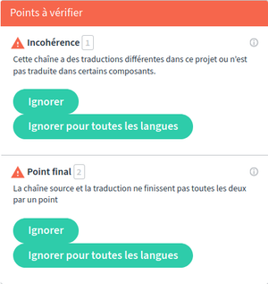
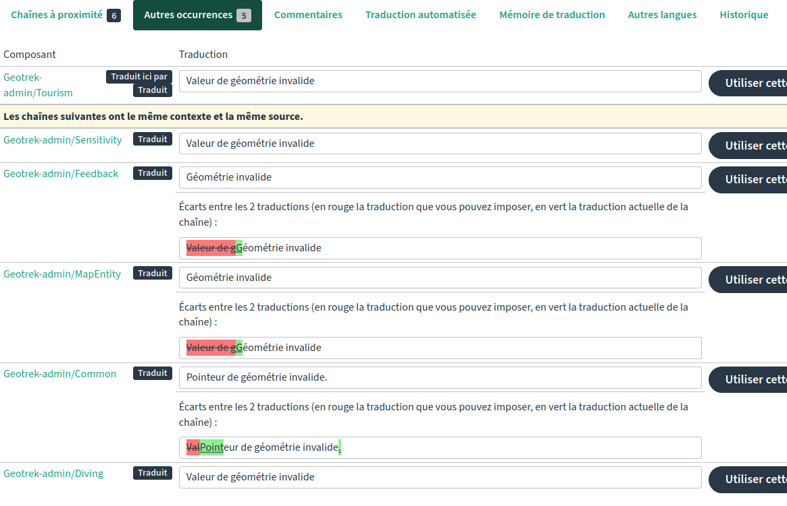

============
TRADUCTIONS
============

Contribuer à la traduction
==========================

Les traductions peuvent se faire en ligne sur
https://weblate.makina-corpus.net/

Pour traduire
-------------

-  Créer un compte
-  Naviguer par projet
-  Naviguer par langue

Créer un compte
~~~~~~~~~~~~~~~

-  Cliquer sur “S’inscrire”

-  Remplir le formulaire d’inscription

   .. figure:: ./images/translating/weblate-create-account.png
      :alt: image

-  Valider l’email

-  Saisir le mot de passe

-  Se connecter

`Documentation
officielle <https://docs.weblate.org/en/latest/user/profile.html>`__
pour la création de compte et la gestion du profil.

Naviguer par projet
~~~~~~~~~~~~~~~~~~~

-  Aller dans “Projet > Parcourir tous les projets”

   .. figure:: ./images/translating/weblate-project-menu.png
      :alt: image

-  Sélectionner le projet auquel contribuer dans la liste

-  Aller dans l’onglet “Langues”

-  Choisir la langue à traduire

   .. figure:: ./images/translating/weblate-list-of-languages.png
      :alt: image

Naviguer par langue
~~~~~~~~~~~~~~~~~~~

-  Aller dans “Langues > Parcourir toutes les langues”
-  Choisir la langue à traduire
-  Sélectionner le projet à traduire

Et c’est parti !

`Documentation
officielle <https://docs.weblate.org/en/latest/user/translating.html>`__
de l’outil Weblate pour la traduction.

Fonctionnalités de traduction
-----------------------------

Weblate permet une vue d’ensemble des traductions par langue et par module.
Il est possible d'afficher les erreurs de traduction ainsi que le reste à traduire.

Weblate permet de détecter automatiquement les points à vérifier, tels que
des incohérences incohérences entre les autres modules projets, les ponctuations

La liste des autres occurrences dans les autres composants permet de vérifier
la cohérence.

Chaque traduction génère un lien permanent (picto |image| à droite de
“Traduction”).

