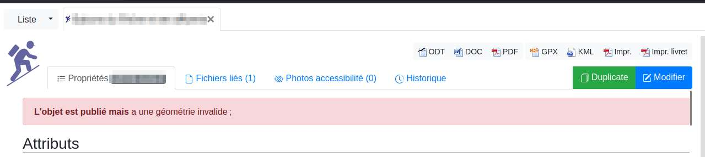
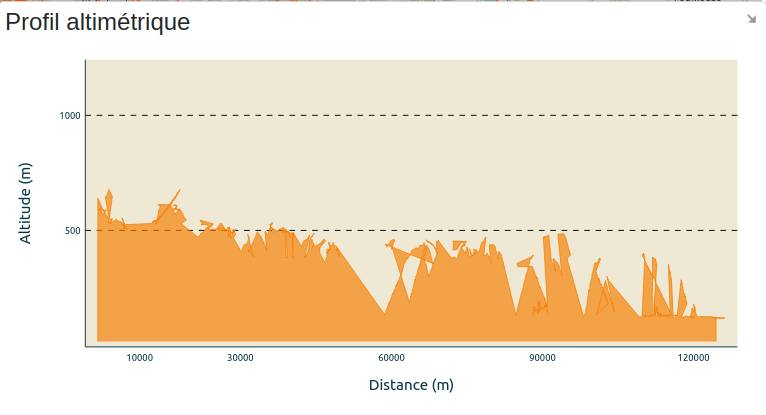
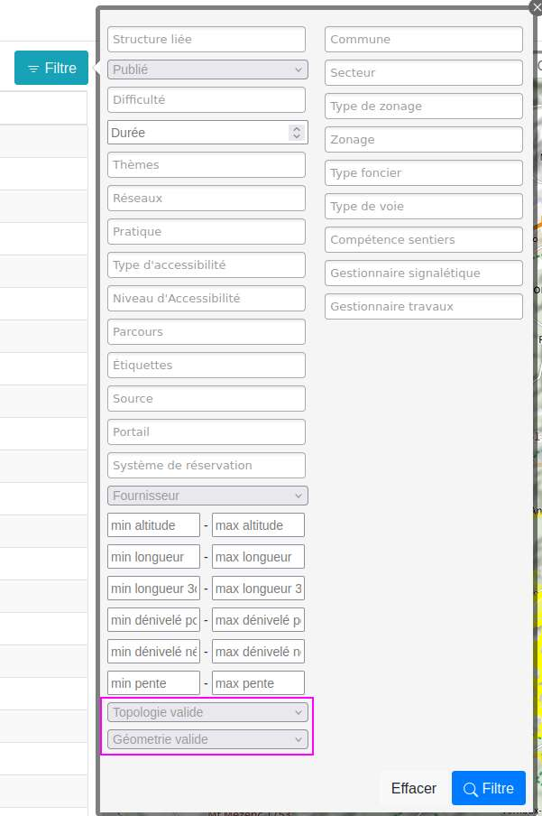

===================================
Corriger les problèmes de topologie
===================================

1. Diagnostic du problème
==========================

Lorsque vous observez des anomalies dans l'affichage de votre itinéraire dans Geotrek, cela peut se manifester de différentes manières :

Message d'erreur : "L'objet est publié mais a une géométrie invalide"
-------------------------------------------------------------------

Profil altimétrique incorrect : le profil ne correspond pas au terrain ou semble incohérent
-------------------------------------------------------------------------------

2. Causes possibles
====================

Si vous observez l'un des signes ci-dessus, vous êtes victime d'une modification non souhaitée des topologies dans Geotrek. Il s'agit d'un problème identifié dans le logiciel et pour lequel pour le moment aucun correctif définitif et global n'est disponible.

Un suivi détaillé de ce problème est consultable sur `ce ticket GitHub <https://github.com/GeotrekCE/Geotrek-admin/issues/2515>`_.

.. info::

	Le problème est lié au système de rattachement topologique des objets au réseau de tronçons. Lorsque le réseau de tronçons est fixe cela ne pose pas de problème mais dès qu'il est modifié, cela peu introduire des comportement imprévisibles dans les objets associés, particulièrement les objets linéaires (et donc les itinéraires).

Résumé des actions pouvant causer le problème 
---------------------------------------------

.. example:: Suppression d'un tronçon utilisé par un itinéraire
    :collapsible:

	Lorsque vous supprimez un tronçon déjà utilisé par un itinéraire, un "trou" est créé dans la continuité des tronçons de l'itinéraire. Cela provoque une rupture immédiate du tracé de l'itinéraire, le rendant incorrect. 

	Pour corriger ce problème, il est nécessaire de recréer un tronçon à l'endroit du "trou" et de reconfigurer l'itinéraire afin qu'il intègre ce nouveau tronçon. De même, si vous modifiez l'extrémité d'un tronçon utilisé par un itinéraire, cette modification peut créer une discontinuité, rendant le tracé de l'itinéraire incohérent.

.. example:: Ajout d'un tronçon intersectant un itinéraire existant 
    :collapsible:

	Lorsque vous ajoutez un tronçon qui vient intercepter l’un des tronçons déjà utilisés par un itinéraire, cela ne provoque pas automatiquement de rupture de l’itinéraire, car Geotrek recalculera normalement la topologie des tronçons pour s’ajuster aux changements. 

	Toutefois, dès que vous ouvrez la fiche de l'itinéraire pour modification, son tracé est recalculé automatiquement en fonction des évènements récents sur les tronçons qu'il utilise. 

	Ainsi, l'ajout d'un nouveau tronçon peut amener Geotrek à recalculer un itinéraire différent, en privilégiant un chemin plus court entre les points intermédiaires du tracé initial, si ce raccourci est rendu possible par le nouveau tronçon ajouté.

 	Dans cette situation, même si seules les informations attributaires de l'itinéraire sont modifiées, un tracé révisé sera enregistré lors de l'enregistrement.

	Ce problème devrait être prochainement résolu grâce à l’intégration d'un calcul de routage au niveau du backend, qui assurera un tracé stable lors des modifications (voir `le ticket GitHub correspondant <https://github.com/GeotrekCE/Geotrek-admin/issues/4286 pour plus de détails)>`_).

3. Comment prévenir ce problème ?
==================================

.. hint::

	Lorsque vous apportez des modifications au réseau de tronçons, il est conseillé de vérifier ensuite les objets associés (comme les itinéraires) pour s'assurer qu'ils n'ont pas été affectés de manière imprévue. Si des changements involontaires apparaissent, il faudra les corriger manuellement.

	Dans la plupart des cas, les ajustements topologiques sont gérés automatiquement et tout fonctionne sans problème. Cependant, il arrive que ces modifications automatiques échouent de manière aléatoire, entraînant une rupture dans la topologie. Dans ces cas-là, on dit que la topologie est invalide. Malgré cela, l'affichage de l'itinéraire peut rester correct à l'écran, car seule la topologie est invalide, alors que la géométrie reste fonctionnelle. Dans ce cas précis il est possible de rattraper le problème via le lancement d'une commande (voir ci-dessous).

4. Comment identifier les itinéraires qui peuvent être cassés ?
================================================================

Il est malheureusement plus facile de détecter les problèmes que de les corriger automatiquement. Aussi, il existe un filtre dans l'interface de Geotrek-admin, sur le module **Itinéraires** pour pouvoir lister les itinéraires qui comportent des topologies invalides ou des géométries invalides.

5. Comment corriger le problème ?
==================================

Les solutions varient en fonction de la nature du problème :

- Géométrie invalide : Lorsque la géométrie d'un itinéraire est invalide, il n’existe pas de correction automatique. La seule solution consiste à retracer manuellement l'itinéraire.
- Topologie invalide (géométrie intacte) : Si la topologie est invalide mais que la géométrie reste correcte, il est possible de lancer une commande pour réparer la topologie. La commande ``reorder_topologies`` est documentée :ref:`ici <reorder-topologies>`. Celle-ci peut corriger la plupart des erreurs de topologie. Pour toute assistance, n’hésitez pas à nous contacter pour lancer cette commande sur votre serveur.

6. Quelle suite pour ce sujet ?
================================

Voici les actions déjà entreprises pour limiter les impacts de ce problème structurel :

- Création d'un filtre permettant d'identifier les itinéraires impactés.
- Développement de la commande reorder topologies pour corriger automatiquement certaines erreurs de topologie.
- Amélioration du système de calcul d'itinéraires pour éviter les modifications imprévues du tracé.

