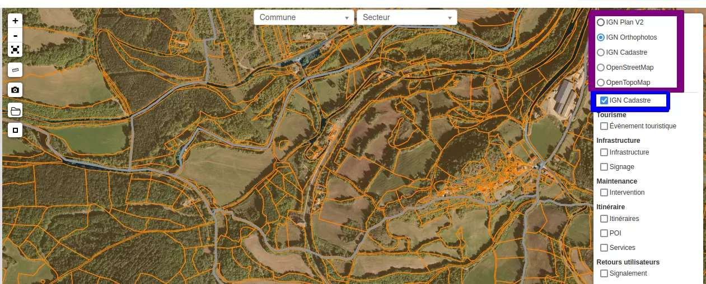

.. _configuration-fond-de-plan:

================================
Configuration des fonds de plan
================================

Dans Geotrek-admin, les fonds de plan sont configurés dans le fichier :

::

	/opt/geotrek-admin/var/conf/custom.py

C'est donc ce fichier qu'il va falloir modifier pour paramétrer les nouveaux fonds.

Configuration de Leaflet
=========================

Les fonds sont configurés dans Leaflet, la brique utilisée pour gérer la carte. La configuration se fait ainsi :

::

	LEAFLET_CONFIG['TILES'] = [
	('Titre de mon fond de plan', 'URL des données', 'Copyright / attribution'),
	]

Exemple : configuration de base pour OpenStreetMap dans Geotrek :

::

	LEAFLET_CONFIG['TILES'] = [
	('OSM', 'http://{s}.tile.openstreetmap.org/{z}/{x}/{y}.png', '© OpenStreetMap Contributors'),
	]

Ajout des fonds IGN
====================

Deux options s'offrent à vous pour mettre à jour les fonds IGN :

Option 1 : Aucun fond IGN configuré
------------------------------------

Si vous n'aviez aucun fond IGN ni aucun fond de paramétré dans votre fichier `custom.py`, ajoutez les lignes suivantes :

::

    LEAFLET_CONFIG['TILES'] = [
        (
            'IGN Plan V2',
            '//data.geopf.fr/wmts?SERVICE=WMTS&REQUEST=GetTile&VERSION=1.0.0&LAYER=GEOGRAPHICALGRIDSYSTEMS.PLANIGNV2&STYLE=normal&FORMAT=image/png&TILEMATRIXSET=PM&TILEMATRIX={z}&TILEROW={y}&TILECOL={x}',
            {
                'attribution': 'Plan IGNV2 - Carte © IGN/Geoportail',
                'maxNativeZoom': 19,
                'maxZoom': 22
            }
        ),
        (
            'IGN Orthophotos',
            '//data.geopf.fr/wmts?SERVICE=WMTS&REQUEST=GetTile&VERSION=1.0.0&LAYER=ORTHOIMAGERY.ORTHOPHOTOS&STYLE=normal&FORMAT=image/jpeg&TILEMATRIXSET=PM&TILEMATRIX={z}&TILEROW={y}&TILECOL={x}',
            {
                'attribution': 'Orthophotos - Carte © IGN/Geoportail',
                'maxNativeZoom': 19,
                'maxZoom': 22
            }
        ),
        (
            'IGN Cadastre',
            '//data.geopf.fr/wmts?SERVICE=WMTS&REQUEST=GetTile&VERSION=1.0.0&LAYER=CADASTRALPARCELS.PARCELLAIRE_EXPRESS&STYLE=normal&FORMAT=image/png&TILEMATRIXSET=PM&TILEMATRIX={z}&TILEROW={y}&TILECOL={x}',
            {
                'attribution': 'Cadastre - Carte © IGN/Geoportail',
                'maxNativeZoom': 19,
                'maxZoom': 22
            }
        ),
        (
            'OpenStreetMap',
            '//{s}.tile.openstreetmap.org/{z}/{x}/{y}.png',
            {
                'attribution': '&copy; <a href="https://www.openstreetmap.org/copyright">Contributeurs d\'OpenStreetMap</a>',
                'maxNativeZoom': 19,
                'maxZoom': 22
            }
        ),
        (
            'OpenTopoMap',
            '//{s}.tile.opentopomap.org/{z}/{x}/{y}.png',
            {
                'attribution': 'map data: © <a href="https://openstreetmap.org/copyright">OpenStreetMap</a> contributors, <a href="http://viewfinderpanoramas.org">SRTM</a> | map style: © <a href="https://opentopomap.org">OpenTopoMap</a> (<a href="https://creativecommons.org/licenses/by-sa/3.0/">CC-BY-SA</a>)',
                'maxNativeZoom': 17,
                'maxZoom': 22
            }
        )
    ]

Vous aurez ainsi ajouté les fonds IGN suivants :

- Orthophotos
- Plan IGN V2
- Cadastre

Option 2 : Fonds déjà configurés
---------------------------------

Si des fonds sont déjà configurés, modifiez soigneusement la section `LEAFLET_CONFIG['TILES']` pour inclure les nouvelles configurations IGN :

- **Plan IGN V2** ::

    (
        'IGN Plan V2',
        '//data.geopf.fr/wmts?SERVICE=WMTS&REQUEST=GetTile&VERSION=1.0.0&LAYER=GEOGRAPHICALGRIDSYSTEMS.PLANIGNV2&STYLE=normal&FORMAT=image/png&TILEMATRIXSET=PM&TILEMATRIX={z}&TILEROW={y}&TILECOL={x}',
        {
            'attribution': 'Plan IGNV2 - Carte © IGN/Geoportail',
            'maxNativeZoom': 19,
            'maxZoom': 22
        }
    )

- **Orthophotos** ::

    (
        'IGN Orthophotos',
        '//data.geopf.fr/wmts?SERVICE=WMTS&REQUEST=GetTile&VERSION=1.0.0&LAYER=ORTHOIMAGERY.ORTHOPHOTOS&STYLE=normal&FORMAT=image/jpeg&TILEMATRIXSET=PM&TILEMATRIX={z}&TILEROW={y}&TILECOL={x}',
        {
            'attribution': 'Orthophotos - Carte © IGN/Geoportail',
            'maxNativeZoom': 19,
            'maxZoom': 22
        }
    )

- **Cadastre** ::

    (
        'IGN Cadastre',
        '//data.geopf.fr/wmts?SERVICE=WMTS&REQUEST=GetTile&VERSION=1.0.0&LAYER=CADASTRALPARCELS.PARCELLAIRE_EXPRESS&STYLE=normal&FORMAT=image/png&TILEMATRIXSET=PM&TILEMATRIX={z}&TILEROW={y}&TILECOL={x}',
        {
            'attribution': 'Cadastre - Carte © IGN/Geoportail',
            'maxNativeZoom': 19,
            'maxZoom': 22
        }
    )

Bonus : Fond cadastral en surimpression
----------------------------------------

Ajoutez les lignes suivantes pour permettre la surimpression du fond cadastral :

::

    LEAFLET_CONFIG['OVERLAYS'] = [
        (
            'IGN Cadastre',
            '//data.geopf.fr/wmts?SERVICE=WMTS&REQUEST=GetTile&VERSION=1.0.0&LAYER=CADASTRALPARCELS.PARCELLAIRE_EXPRESS&STYLE=normal&FORMAT=image/png&TILEMATRIXSET=PM&TILEMATRIX={z}&TILEROW={y}&TILECOL={x}',
            {
                'attribution': 'Cadastre - Carte © IGN/Geoportail',
                'maxNativeZoom': 19,
                'maxZoom': 22
            }
        )
    ]

Validation des modifications
=============================

Une fois les modifications effectuées :

1. Sauvegardez le fichier de configuration.
2. Rechargez Geotrek-Admin avec la commande suivante :

::

   sudo dpkg-reconfigure geotrek-admin

Lorsqu'on vous demande des informations, validez en appuyant sur **ENTRER** sans rien changer. Geotrek sera reconfiguré et relancé.

Fonds de plan sélectionnables
=============================

En lançant ensuite l'interface, les fonds configurés seront disponibles. Les fonds apparaissent en violet et le fond cadastral en bleu peut être coché pour une surimpression.

.. seealso:: 

    Des ressources complémentaires peuvent être trouvées sur `cet article <https://makina-corpus.com/logiciel-libre/bascule-ign-tutoriel-modification-fonds-plan-geotrek/>`_ .
