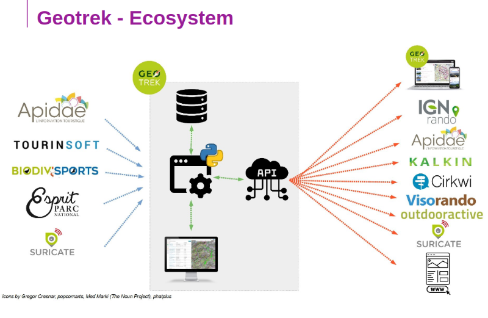
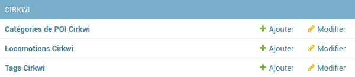

====
APIs
====

.. contents::
   :local:
   :depth: 2

API Geotrek
===========

Geotrek dispose d’une API (Application Programming Interface) qui sert à exposer les données stockées dans une instance de Geotrek-admin, dans le but de pouvoir la faire communiquer avec d'autres outils, systèmes et plateforme et ainsi échanger des données.

Cette API, désormais dans sa version 2 permet à toute structure tierce de récupérer des données et de les intégrer dans son système ou ses applications.

À ce jour de nombreux partenaires des structures utilisatrices de l’application Geotrek ont déjà utilisé cette API pour intégrer les données dans leurs outils.

L'API Geotrek est le point central pour permettre les interconnexions avec divers services. Grâce à cette interface de données, Geotrek s'est positionné comme un point central dans un écosystème de solutions du monde de la gestion et promotion des activités de pleine nature.

Pour changer les paramètres d'accès de l'API, référez vous à cette section :ref:`API <api>`

APIs externes
=============

Geotrek et IGNrando'
--------------------

Geotrek-admin est capable de produire un flux des itinéraires et POIs présents dans sa BDD au format Cirkwi pour pouvoir les importer directement dans IGNrando' (https://makina-corpus.com/sig-webmapping/geotrek-et-lign-ca-fonctionne).

Exemple des randonnées et POIs du Parc national des Ecrins publiées sur IGNrando' depuis Geotrek-admin : https://ignrando.fr/fr/communautes/parc-national-des-ecrins 

Depuis cette version, 2 flux sont automatiquement générés par Geotrek-admin au format attendu par l'IGN :

- [URL_GEOTREK-ADMIN]/api/cirkwi/circuits.xml
- [URL_GEOTREK-ADMIN]/api/cirkwi/pois.xml

Il est possible d'exclure les POI du flux pour ne diffuser que les randonnées. Pour cela, ajouter le paramètre ``?withoutpois=1`` à la fin de l'URL (``http://XXXXX/api/cirkwi/circuits.xml?withoutpois=1``).

Il est possible de filtrer les POI du flux par structure. Pour cela, ajouter le paramètre ``?structures=<identifiant_de_la_structure>`` à la fin de l'URL (``http://XXXXX/api/cirkwi/pois.xml?structures=2``).
Vous pouvez filtrer avec plusieurs structures : en séparant les identifiants par des virgules (``http://XXXXX/api/cirkwi/pois.xml?structures=2,5,3``).

Il est également possible de filtrer les randonnées du flux par structure et par portail. 
Pour cela, ajouter le paramètre ``?structures=<identifiant_de_la_structure>`` ou ``?portals=<identifian_de_la_structure>`` à la fin de l'URL (``http://XXXXX/api/cirkwi/circuits.xml?portals=3``).

Il est également possible d'exclure du flux les randonnées provenant de sources externes à Geotrek-Admin. Ce filtre est notamment nécessaire pour
ne pas renvoyer à Cirkwi les randonnées qui en proviennent déjà. Pour cela, ajouter le paramètre ``?include_externals=false`` à la fin de l'URL (``http://XXXXX/api/cirkwi/circuits.xml?include_externals=false``).

Il est possible de cumuler ces différents filtres, en séparant les valeurs par un ``&`` (``http://XXXXX/api/cirkwi/circuits.xml?portals=3&structures=1&include_externals=false``).

Il est également possible d'exclure du flux les randonnées provenant de sources externes à Geotrek-Admin. Ce filtre est notamment nécessaire pour ne pas renvoyer à Cirkwi les randonnées qui en proviennent déjà. Pour cela, ajouter le paramètre ``?include_externals=false`` à la fin de l'URL (``http://XXXXX/api/cirkwi/circuits.xml?include_externals=false``).

Il est possible de cumuler ces différents filtres, en séparant les valeurs par un ``&`` (``http://XXXXX/api/cirkwi/circuits.xml?portals=3&structures=1&include_externals=false``).

Le référentiel CIRKWI a été intégré dans 3 tables accessibles dans le module de configuration (à ne pas modifier) :

   Ensemble des champs paramétrables pour le référentiel CIRKWI

Si vous ne souhaitez pas utiliser les valeurs par défaut ou avez créez vos propres typologies, il faut que vous renseigniez les correspondances entre les catégories de votre Geotrek et celles du référentiel IGN (Cirkwi) dans le module de configuration. Comme indiqué ici : https://github.com/GeotrekCE/Geotrek-admin/issues/806.

* Pratique >> locomotion/loisirs
* Accessibilite >> thematiques/tags
* Themes >> thematiques/tags
* Types de POI >> Categories POI

Les correspondances avec les valeurs de ces 3 tables sont donc à renseigner dans les tables Geotrek des Pratiques, Accessibilités, Thèmes et Types de POI.

Ce même flux est aussi utilisable pour alimenter directement la plateforme Cirkwi : https://pro.cirkwi.com/importez-vos-donnees-geotrek-dans-cirkwi/.

.. note::

    Geotrek-admin dispose aussi d'une API générique permettant d'accéder aux contenus d'une instance à l'adresse : ``[URL_GEOTREK-ADMIN]/api/v2/``

Geotrek et APIDAE
-----------------

Il existe plusieurs passerelles entre la plateforme d'informations touristiques APIDAE et Geotrek. 

APIDAE vers Geotrek
~~~~~~~~~~~~~~~~~~~

Actuellement, certains contenus touristiques peuvent être synchronisés automatiquement avec une base APIDAE. Il s'agit des contenus situés dans les catégories suivantes :

* Contenus touristiques (hébergements, restaurants, produits du territoire, lieux de visites...)
* Evénements touristiques (expositions, conférences, sorties...)

Les contenus touristiques peuvent aussi être synchronisés depuis des flux Tourinsoft ou Esprit Parc National.

Il est également possible de mettre en place des passerelles pour importer des POIs, des lieux de renseignement, des aménagements ainsi que des randonnées d'APIDAE vers Geotrek. Il est aussi possible d'enrichir le lien avec les contenus touristiques pour avoir par exemple d'autres catégories.

Pour configurer APIDAE, se référer à cette section :ref:`Configure APIDAE (ex-SITRA) import <configure-apidae-ex-sitra-import>`

Geotrek vers APIDAE
~~~~~~~~~~~~~~~~~~~

Il existe aussi un lien dans l'autre sens, permettant d'importer automatiquement vers APIDAE les itinéraires existants dans une instance Geotrek.

L'API permet de connecter une instance Geotrek pour importer des itinéraires vers les objets de type "Équipements" dans APIDAE.

Les randonnées VTT, trail, vélo et les tours itinérants sont également intégrés dans la passerelle.

Pour plus d'information, se référer à la documentation en ligne de `Sitourisme <https://github.com/GeotrekCE/Sitourisme#sitourisme-paca-api>`_. 

Sensitivity module (or Biodiv'Sports)
-------------------------------------

.. note::

  You can play with API using Biodiv'Sports widget tool: https://biodivsports-widget.lpo-aura.org/

The Geotrek API provides a set of parameters that can be used to filter and sort data. There is a Swagger documentation (see :ref:`advanced-configuration-section` to enable it on your instance if needed) existing to test and browse those parameters that can be find at this address : ``/api/v2/``.

This section will focus on some common parameters useful to work with sensitivity information and will as give details about some endpoints.

.. envvar:: Commons parameters

   If ``language`` parameter is provided, api returns directly translated field, else, a dictionnary of traductions is returned
      
   e.g. ``/api/v2/sensitivearea_practice/1/?``

   .. code-block:: JSON

      {
         "id":1,
         "name":{
         "fr":"Terrestre",
         "en":"Land",
         "it":null
         }
      }

   e.g. ``/api/v2/sensitivearea_practice/1/?language=en``

   .. code-block:: JSON

      {
         "id":1,
         "name":"Land"
      }

.. envvar:: Sport practices

   List of outdoor practices

   ``/api/v2/sensitivearea_practice/``

   e.g. https://biodiv-sports.fr/api/v2/sensitivearea_practice/

.. envvar:: Sensitive areas

   List of sensitive areas

   ``/api/v2/sensitivearea/``

   The default output format is ``json``. To obtain output in ``geojson`` format, simply add the ``format=geojson`` parameter.

   ``/api/v2/sensitivearea/?format=geojson`` 

   e.g. https://biodiv-sports.fr/api/v2/sensitivearea/?format=geojson

   **Filtering data**

   Data can be filtered through those parameters:

   - ``language`` : API language (see :envvar:`Commons parameters`)

   - Expected values: ``fr``, ``en``, ``es`` or ``it``
   - e.g. ``/api/v2/sensitivearea/?language=fr``

   - ``period`` : Sensitivy period (monthes list)

   - Expected values: List of month number (from 1 to 12), comma separated
   - e.g. ``/api/v2/sensitivearea/?period=4,5,6,7``

   - ``practices`` : Sport practices

   - Expected values: List of practices ids (see :envvar:`Sport practices`)
   - e.g. ``/api/v2/sensitivearea/?practices=1,2``

   - ``structure`` : Organization that declared the sensitive area. 

   - Expected values: List of structures ids
   - e.g. ``/api/v2/sensitivearea/?structures=1,2``

   - ``in_bbox``

   - Expected values: List of bbox coordinates (respectively longitude and latitude South-West then North-East corner), comma separated.
   - e.g. ``/api/v2/sensitivearea/?in_bbox=5.0,45.0,6.0,46.0``

   Full example https://biodiv-sports.fr/api/v2/sensitivearea/?format=geojson&language=fr&practices=1,2&period=4,5,6,7&in_bbox=5.0,45.0,6.0,46.0

   **Filtering fields**

   - ``fields`` : list of expected fields (see :ref:`Field Descriptions <FielDesc>`)

   - Expected values: List of field names, comma separated
   - e.g. ``/api/v2/sensitivearea/?fields=name,geometry``

   - ``omit`` : list of excluded fields (see :ref:`Field Descriptions <FielDesc>`)

   - Expected values: List of field names, comma separated
   - e.g. ``/api/v2/sensitivearea/?omit=name,geometry``

   .. warning::
      **GeoJSON** format expect at least `id` and `geometry` fields.

   .. _FielDesc:

   **Field descriptions**

   - ``id`` : local unique identifier of the sensitive area (integer).
   - ``name`` : Area name (string).
   - ``description`` : Area description (string in HTML format).
   - ``period`` : Area occupancy for each of the 12 months of the year (ordered array of 12 Booleans).
   - ``contact`` : Contact for further information about the sensitive area (string in HTML format).
   - ``practices``: sports practices concerned by the hotspot (array of identifiers).
   - ``info_url`` : URL containing further information about the area (URL).
   - ``structure`` : Structure or acronyme that provided information on the area (string).
   - ``elevation`` : Elevation used to define area sensitivity volume (globally elevation, buffer radius for areas declared as Point).
   - ``geometry`` : Area GeoJSON geometry. Type is always "Polygon".
   - ``species_id``: species identifier or null for regulatory areas.
   - ``kml_url`` : URL of the downloadable KML file representing this regulatory zone.
   - ``openair_url`` : URL of the downloadable OpenAir file representing the regulatory zone (available only for aerial activities).
   - ``attachment`` : List of area attachment files.
   - ``rules`` : List of regulatory rules.
   - ``update_datetime``: last update timestamp.
   - ``create_datetime``: create timestamp.

.. note::
   Species informations are commons for each species areas share Zones sharing the same ``species_id`` value also share the same values for the ``name``, ``period``, ``practices`` and ``info_url`` fields.

