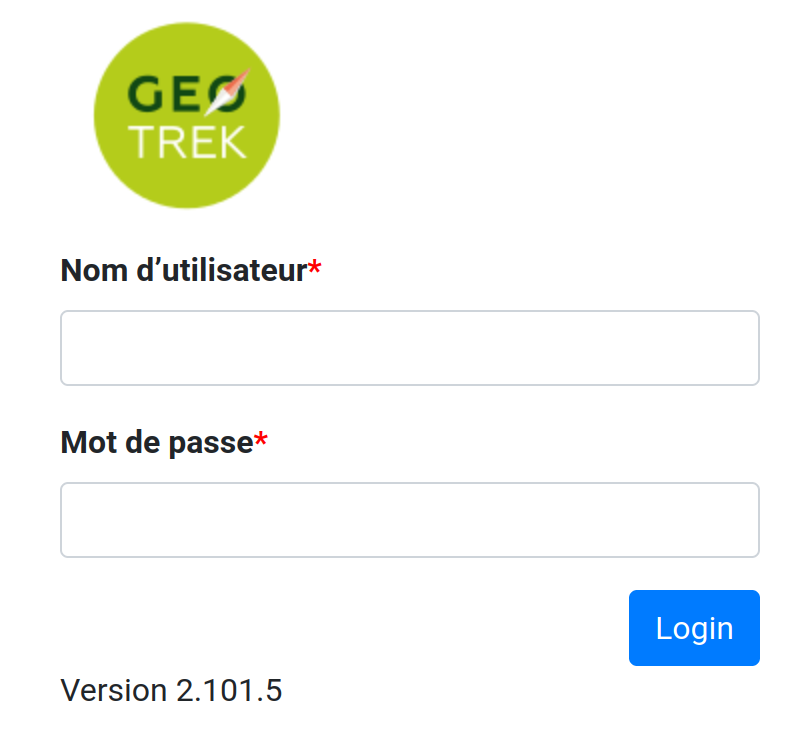
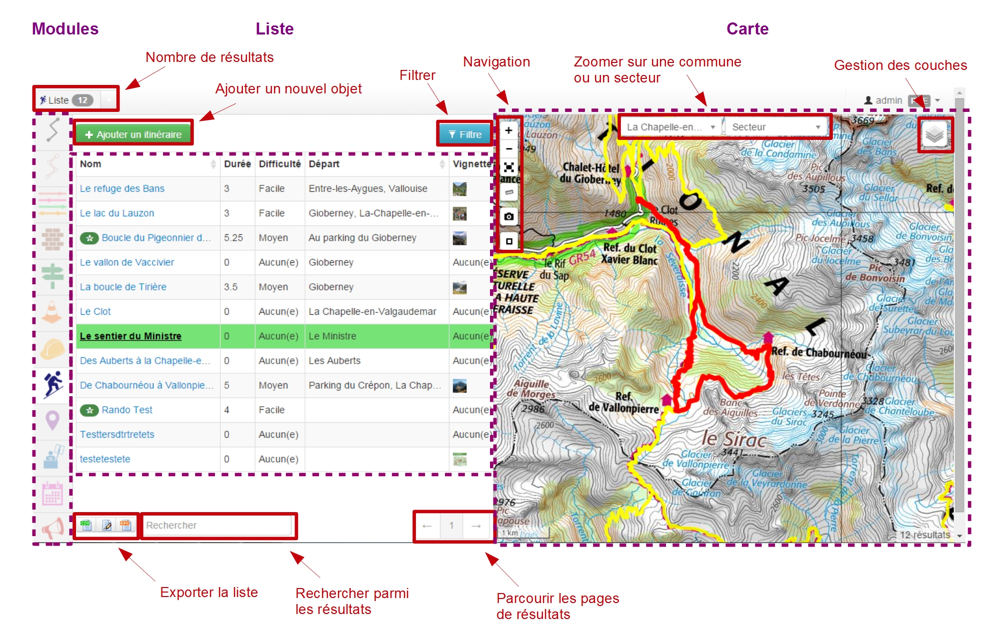
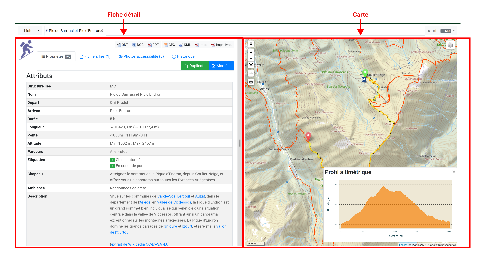
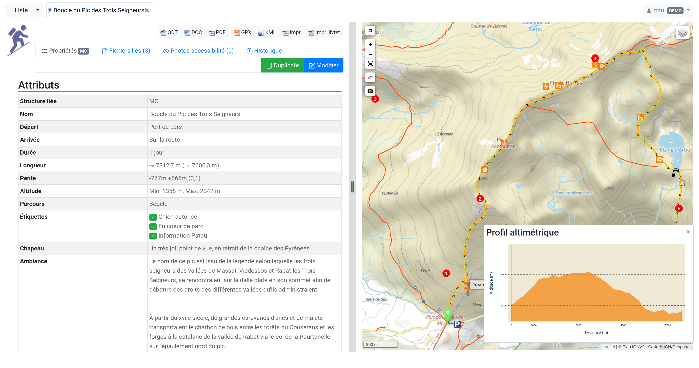
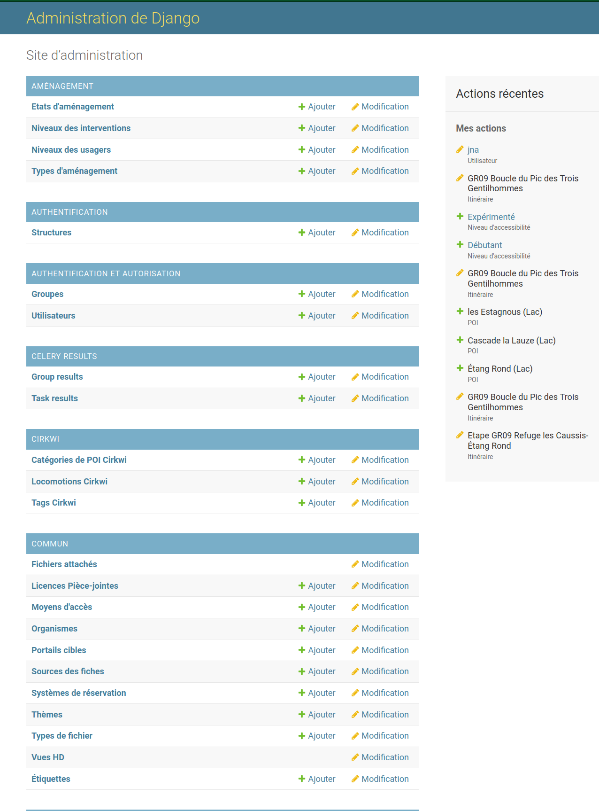
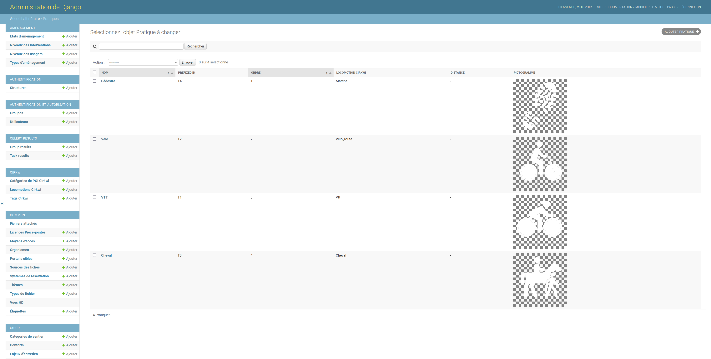

=====================
Présentation générale
=====================

.. contents::
   :local:
   :depth: 2

Architecture
=============

L’application est composée : 

- d’une **page d’accueil**, demandant la saisie d’un login et d’un mot de passe ;
- d’une **interface de consultation des modules** ;
  - avec la liste de sélection déroulante des modules avec compteur des résultats
  - un onglet latéral de sélection des modules
  - un accès aux paramètres d’administration
  - un bouton déconnexion de l’application
- de **paramètres d’administration** (gestion des droits, des listes déroulantes…).

Page d'accueil
==============

   Accès à Geotrek-admin via un login et un mot de passe

Interface de consultation des modules
=====================================

Modules
-------

Geotrek est composé de différents modules.

**Gestion des sentiers** :

* Tronçons (linéaire entre 2 intersections)
* Sentiers (groupe de tronçons)
* Statuts (physique, foncier, organismes ayant la compétence sentiers, gestionnaires des travaux et de la signalétique)
* Aménagements (ouvrages et équipements)
* Signalétique
* Interventions (travaux)
* Chantiers (groupe d'interventions)

**Valorisation de l'offre touristique** :

* Sites outdoor (sites d'escalade, rivières, aires de vol libre…)
* Parcours outdoor (voie d'escalade, parcours d'eau vive…)
* Itinéraires (randonnées)
* POI (points d'intérêt patrimoniaux)
* Services (informations pratiques comme les points d'eau, passages délicats... selon la typologie que vous souhaitez)
* Contenus touristiques (hébergements, restaurants, services, activités de pleine nature, musées, produits labellisés... Vous pouvez créer les catégories que vous souhaitez)
* Evènements touristiques (animations, expositions, sorties...)
* Signalements (problèmes signalés par les internautes sur un itinéraire depuis Geotrek-rando)
* Zones de sensibilité (module non activé par défaut permettant de gérer des zones de sensibilité de la faune sauvage pour les afficher sur Geotrek-rando ou les diffuser avec l'API de Geotrek-admin)

Chaque module est accessible depuis le bandeau vertical.

Navigation et saisie
--------------------

Les résultats sont affichés sous forme de liste puis on accède aux détails des objets.

Vue liste
~~~~~~~~~~

Tous les modules sont construits de la même façon :

* une liste paginée des objets du module
* la possibilité de filtrer la liste selon des attributs ou de faire une recherche libre
* la possibilité de filtrer selon l'étendu de la carte
* la sélection coordonnée (liste → carte, carte → liste)
* la possibilité d'exporter les résultats en CSV (pour EXCEL ou CALC), en SHAPEFILE (pour QGIS) et en GPX (pour l'importer dans un GPS)
* une carte dans laquelle il est possible de naviguer (déplacer, zoomer), d'afficher en plein écran, de mesurer une longueur, d'exporter une image de la carte, de réinitialiser l'étendue, de zommer sur une commune ou un secteur et de superposer des données externes (contours communes / secteurs / physique / foncier / responsabilités…)
* l'accès à la vue détail d'un objet au clic

   Vue liste avec la carte 

.. note::
	Au survol d'un objet dans la liste, celui-ci est mis en surbrillance sur la carte.
	Au survol d'un objet sur la carte, celui-ci est mis en évidence dans la liste.
	La liste des résultats est filtrée en fonction de l'étendue de la carte affichée.
	C'est aussi depuis un module qu'il est possible d'ajouter de nouveaux objets.
	Un clic sur un objet dans la liste ou la carte permet d'accéder à la fiche détaillée de celui-ci.

Vue détail
~~~~~~~~~~~

A partir de chaque module, il est possible d'afficher la fiche détail d'un objet en cliquant sur celui-ci dans la liste ou la carte du module. Les objets de chaque module peuvent ainsi être affichés individuellement dans une fiche détail pour en consulter tous les attributs, tous les objets des autres modules qui intersectent l'objet, les fichiers qui y sont attachés et l'historique des modifications de l'objet.

Voici les possibilités de la fiche détail :

- le récapitulatif des attributs (saisis et calculés)
- récupérer automatiquement des informations liées (communes, secteurs, POI…)
- ajouter des fichiers (redimensionnement automatique pour les photos)
- l'accès à la vue d’édition selon les droits de l’utilisateur connecté
- l'export GPX, KML, OpenDocument, Word, PDF

   Fiche détail d'un itinéraire

.. note::
	Lorsque le statut de publication de l’itinéraire est activé, celui-ci ainsi que tous ses objets associés, sont mis en ligne.
	À tout moment et ce sur chaque module, les informations peuvent être soit mises en ligne, soit désactivées, voire supprimées.
	Ne sont mises en ligne que les informations choisies et disponibles. Les catégories non encore alimentées ne seront pas visibles pour le grand public.

Vue édition
~~~~~~~~~~~

- Saisie des champs multilingues
- Saisie des tracés
- Possibilité de forcer des points de passage (détours, boucles, aller-retours)
- Édition WYSIWYG des champs texte
- Ajout de couches locales en superposition à partir de fichiers GPX ou KML (aide à la saisie)
- Outils de mesure

   Fiche détail d'un itinéraire en édition

Fichiers liés
~~~~~~~~~~~~~

L’ajout, la modification ou la suppression des illustrations et photos s’effectuent depuis l’onglet « Fichiers liés » de la fiche détail.

Pour chaque fichier lié, l’auteur, le titre, la légende et sa catégorie sont saisis. Les fichiers liés peuvent être de tout type (photo, dessin, PDF, fichier audio…). Pour les images, un aperçu est présenté.

Les vignettes et versions redimensionnées des photos sont créées automatiquement lors de l’ajout.
Les contenus saisis sont publiés automatiquement.

Il est possible de limiter la gestion des fichiers liés à un groupe restreint d’utilisateurs.

Paramètres d'administration
===========================

Toutes les listes de choix (thématiques, pratiques, parcours…) sont administrables depuis l'outil d'administration Django, selon les droits dont dispose l’utilisateur connecté.

   Interface de l'administration Django

   Exemple d’édition des pratiques et de leur pictogramme

Voir la section :ref:`parametrages-des-modules` pour connaître le détail des paramétrages des modules.
