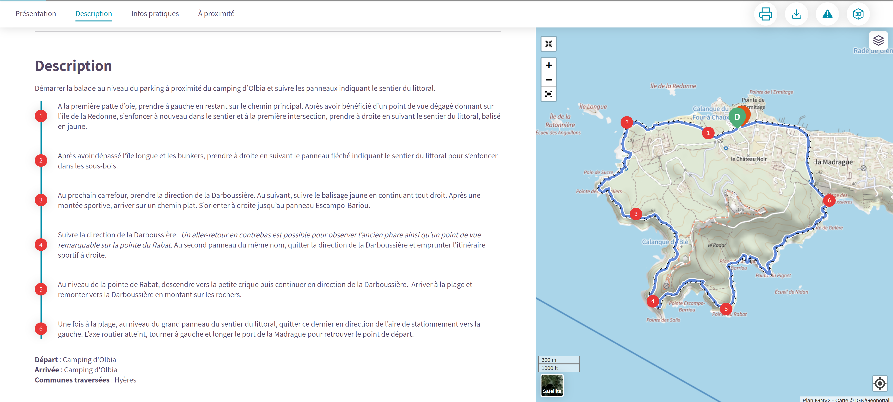
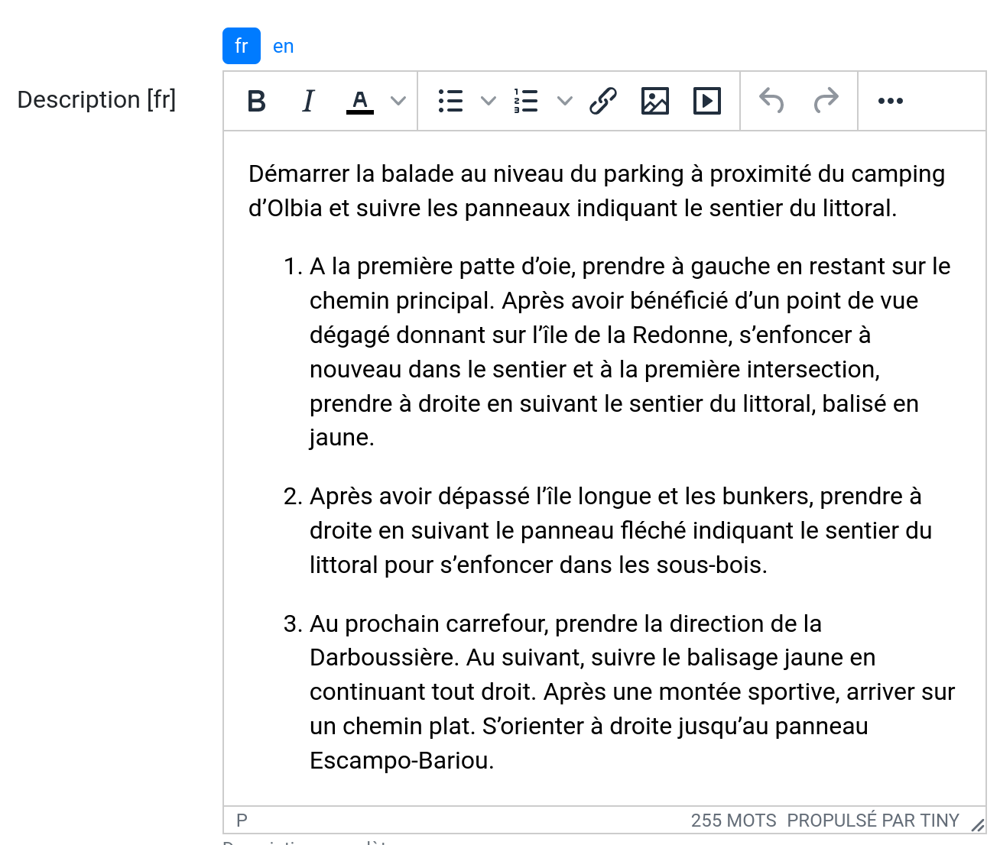

=======================
Modules de valorisation
=======================

.. contents::
   :local:
   :depth: 2

.. _itineraires:

Itinéraires
===========

Les itinéraires sont des randonnées présentés au grand public : l’itinéraire est défini selon la géométrie des tronçons empruntés.
L’ajout ou la modification sont fréquents.

Fiche détaillée
---------------

Basique
~~~~~~~

**Structure liée** ~ requis

- Description : nom de la structure d'appartenance de l'itinéraire
- Type : liste déroulante
- Choix : unique
- URl de configuration : `/admin/authent/structure/ </admin/authent/structure/>`_
- Visibilité : interne
- Exemple : CD09

**Nom [fr]** ~ requis

- Description : nom de l'itinéraire
- Type : champ libre
- Multilingue : oui
- Visibilité : publique
- Exemple : GR09 Boucle du Pic des Trois Gentilhommes

**En attente de publication**

- Description : itinéraire en attente d'être publié
- Type : case à cocher
- Valeur par défaut (décoché) : itinéraire publiable 
- Visibilité : publique

**Publié [fr]**

- Description : Itinéraire publié ou en brouillon
- Type : case à cocher
- Valeur par défaut (décoché) : brouillon 
- Visibilité : interne

**Départ [fr]** ~ Recommandé

- Description : description du lieu de départ
- Type : champ libre
- Visibilité : publique
- Exemple : Refuge de les Caussis

**Arrivée [fr]** ~ Recommandé

- Description : description du lieu de l'arrivée
- Type : champ libre
- Visibilité : publique
- Exemple : Refuge de les Caussis

**Durée** ~ Recommandé

- Description : durée de l'itinéraire (en heures (1.5 = 1 h 30, 24 = 1 jour, 48 = 2 jours))
- Type : numérique
- Visibilité : publique
- Exemple : 1.5

**Difficulté** ~ Recommandé

- Description : niveau de difficulté de l'itinéraire
- Type : liste déroulante
- Choix : unique
- Valeurs de champ paramétrables dans l'outil d'administration : oui
- Chemin d'accès dans l'outil d'administration : `/admin/trekking/difficultylevel/ </admin/trekking/difficultylevel/>`_ 
- Visibilité : publique
- Exemple : Intermédiaire

**Pratique** ~ Recommandé

- Description : type de pratique de l'itinéraire
- Type : liste déroulante
- Choix : unique
- Valeurs de champ paramétrables dans l'outil d'administration : oui
- Chemin d'accès dans l'outil d'administration : `/admin/trekking/practice/ </admin/trekking/practice/>`_  
- Visibilité : publique
- Exemple : Pédestre

**Échelle de cotation**

- Description : définition d'une cotation de l'itinéraire spécifique à la pratique
- Type : liste déroulante
- Choix : unique
- Conditionnel : selon la pratique choisie
- Valeurs de champ paramétrables dans l'outil d'administration : oui
- Chemin d'accès dans l'outil d'administration : `/admin/trekking/ratingscale/ </admin/trekking/ratingscale/>`_ 
- Visibilité : publique
- Exemple : Technicité : 3 - Moyen

**Description de cotation [fr]**

- Description : précision sur la valeur de cotation de l'itinéraire spécifique à la pratique
- Type : champ libre
- Visibilité : publique
- Exemple : La technicité de cet itinéraire est moyenne car elle ne comprend pas de passages délicats.

**Parcours**

- Description : type de parcours
- Type : liste déroulante
- Choix : unique
- Valeurs de champ paramétrables dans l'outil d'administration : oui
- Chemin d'accès dans l'outil d'administration : `/admin/trekking/route/ </admin/trekking/route/>`_ 
- Visibilité : publique
- Exemple : Boucle

**Accès routier [fr]**

- Description : accès routier jusqu'au point de départ
- Type : champ libre
- Visibilité : publique
- Exemple : Depuis Savines-Le-Lac (17km), prendre la D41 jusqu'à Réallon. Suivre ensuite la D241 jusqu'au hameau des Gourniers au fond de la vallée.

**Chapeau [fr]** ~ Recommandé

- Description : bref résumé de l'itinéraire avec accroche
- Type : champ libre
- Visibilité : publique
- Exemple : Une agréable randonnée familiale en boucle avec un beau point de vue sur la vallée de Réallon.

**Ambiance [fr]**

- Description : attractions principales et intérêts
- Type : champ libre
- Visibilité : publique
- Exemple : La montée commence dans la fraîcheur d'un bois de hêtre puis d'une belle forêt de mélèzes avant d'arriver à d'anciens près de fauche, témoignage des activités passées. Les ruines d'anciens chalets d'alpage rappellent ce qu'était la vie en montagne. Quand le sentier passe en balcon le paysage s'ouvre en un large point de vue sur la vallée de Réallon.

**Description [fr]**

- Description : description technique pas à pas de l'itinéraire (liste numérotée conseillée)
- Type : champ libre
- Visibilité : publique
- Exemple : Du parking, traverser le pont, au carrefour du hameau prendre la direction de Chargès, remonter la rue jusqu'à la dernière maison.

1. Prendre le sentier à droite direction l'Oussella
2. Après la marmite de Géant et le pont, continuer à gauche direction l'Oussella.

Avancé
~~~~~~

**Parking conseillé [fr]**

- Description : nom du lieu recommandé pour se garer en voiture
- Type : champ libre
- Visibilité : publique
- Exemple : Parking du refuge de les Caussis.

**Transport en commun [fr]**

- Description : indications du ou des transports en commun pour se rendre au départ
- Type : champ libre
- Visibilité : publique
- Exemple : Ce GR est accessible en train, il démarre de la gare SNCF de Boussenac (ligne Seix - Boussenac).

**Recommandations [fr]**

- Description : recommandations sur les risques, danger ou meilleure période pour pratiquer l'itinéraire
- Type : champ libre
- Visibilité : publique
- Exemple : Attention en cas d'orage. Fortement déconseillé par mauvais temps!

**Matériel [fr]**

- Description : matériel nécessaire ou conseillé
- Type : champ libre
- Visibilité : publique
- Exemple : Chaussures de randonnées

**Thèmes**

- Description : thématiques principales de l'itinéraire
- Type : liste déroulante
- Choix : multiple
- Valeurs de champ paramétrables dans l'outil d'administration : oui
- Chemin d'accès dans l'outil d'administration : `/admin/common/theme/ <//admin/common/theme/>`_
- Visibilité : publique
- Exemple : Lacs et glaciers, Géologie, Point de vue

**Étiquettes**

- Description : éléments de recommandation ou utiles à connaître
- Type : liste déroulante
- Choix : multiple
- Valeurs de champ paramétrables dans l'outil d'administration : oui
- Chemin d'accès dans l'outil d'administration : `/admin/common/label/ </admin/common/label/>`_ 
- Visibilité : publique
- Exemple : Chien autorisé

**Réseaux**

- Description : nom du réseau de balisage de l'itinéraire
- Type : liste déroulante
- Choix : multiple
- Valeurs de champ paramétrables dans l'outil d'administration : oui
- Chemin d'accès dans l'outil d'administration : `/admin/core/network/ </admin/core/network/>`_ 
- Visibilité : publique
- Exemple : GR

**Liens web**

- Description : liens web apportant des compléments d'informations utiles
- Type : liste déroulante
- Choix : multiple
- Valeurs de champ paramétrables dans l'outil d'administration : oui
- Chemin d'accès dans l'outil d'administration : `/admin/trekking/weblink/ </admin/trekking/weblink/>`_ 
- Visibilité : publique
- Exemple : `Consulter la météo locale de Boussenac <https://meteofrance.com/previsions-meteo-france/boussenac/09320>`_ 

**Lieux de renseignement**

- Description : lieux de renseignements utiles
- Type : liste déroulante
- Choix : multiple
- Valeurs de champ paramétrables dans l'outil d'administration : oui
- Chemin d'accès dans l'outil d'administration : `/admin/tourism/informationdesk/ </admin/tourism/informationdesk/>`_
- Visibilité : publique
- Exemple : Office de tourisme de Seix, Office du tourisme de Boussenac

**Source**

- Description : nom de l'organisme auteur de l'itinéraire
- Type : liste déroulante
- Choix : multiple
- Valeurs de champ paramétrables dans l'outil d'administration : oui
- Chemin d'accès dans l'outil d'administration : `/admin/common/recordsource/ </admin/common/recordsource/>`_
- Visibilité : publique
- Exemple : Conseil départemental de l'Ariège

**Portail**

- Description : site web grand public sur lequel sera publié l'itinéraire
- Type : liste déroulante
- Choix : multiple
- Valeurs de champ paramétrables dans l'outil d'administration : oui
- Chemin d'accès dans l'outil d'administration : `/admin/common/targetportal/ </admin/common/targetportal/>`_
- Visibilité : publique
- Exemple : CD09

**Enfants**

- Description : ensemble des itinéraires étapes constituant l'itinérance
- Type : liste déroulante
- Choix : multiple
- Visibilité : publique
- Exemple : Etape GR09 Refuge les Caussis-Étang Rond, Etape GR09 Étang Rond-Refuge les Caussis.

**ID externe**

- Description : identifiant de l'itinéraire dans sa base de données source (dans le cas d'un import)
- Type : numérique
- Visibilité : interne
- Exemple : 15715

**Deuxième id externe**

- Description : identifiant secondaire de l'itinéraire dans sa base de données source (dans le cas d'un import)
- Type : numérique
- Visibilité : interne
- Exemple : 15716

**Système de réservation**

- Description : nom du système de réservation
- Type : liste déroulante
- Choix : unique
- Valeurs de champ paramétrables dans l'outil d'administration : oui
- Chemin d'accès dans l'outil d'administration : `/admin/common/reservationsystem/ </admin/common/reservationsystem/>`_ 
- Visibilité : publique
- Exemple : Open system

**ID de réservation**

- Description : identifiant de l'itinéraire dans son système de réservation
- Type : numérique
- Visibilité : interne
- Exemple : 157187456

**POI exclus**

- Description : liste des points d'intérêt associés à l'itinéraire à ne pas faire remonter sur celui-ci
- Type : liste déroulante
- Choix : multiple
- Visibilité : interne
- Exemple : les Estagnous

Accessibilité
~~~~~~~~~~~~~~

**Type d'accessibilité**

- Description : type d'accessibilité
- Type : liste déroulante
- Choix : multiple
- Valeurs de champ paramétrables dans l'outil d'administration : oui
- Chemin d'accès dans l'outil d'administration : `/admin/trekking/accessibility/ </admin/trekking/accessibility/>`_ 
- Visibilité : publique
- Exemple : Fauteuil roulant, poussette

**Niveau d'accessibilité**

- Description : niveau d'accessibilité
- Type : liste déroulante
- Choix : unique
- Valeurs de champ paramétrables dans l'outil d'administration : oui
- Chemin d'accès dans l'outil d'administration : `/admin/trekking/accessibilitylevel/ </admin/trekking/accessibilitylevel/>`_  
- Visibilité : publique
- Exemple : Débutant

**Aménagements d'accessibilité [fr]**

- Description : infrastructure d'accessibilité spécifique à disposition
- Type : champ libre
- Visibilité : publique
- Exemple : Rampes d'accès amovibles.

**Pente accessibilité [fr]**

- Description : description de la pente : supérieure à 10 % (Nécessite une assistance quand la pente est supérieure à 8%) 
- Type : champ libre
- Visibilité : publique
- Exemple : Pente supérieure à 12%.

**Revêtement accessibilité [fr]**

- Description : description des revêtements rencontrés sur la totalité d’un itinéraire
- Type : liste déroulante
- Visibilité : publique
- Exemple : Piste ensablée à partir des Estagnous.

**Exposition accessibilité [fr]**

- Description : description des expositions et des zones ombragées
- Type : champ libre
- Visibilité : publique
- Exemple : Piste ombragée.

**Largeur accessibilité [fr]**

- Description : description des rétrécissements des sentiers et la largueur minimum
- Type : champ libre
- Visibilité : publique
- Exemple : Sentier étroit demandant une forte technique de conduite, avec un passage d'un mètre de large. Passage resserré sur le pont traversant la rivière.

**Conseil d'accessibilité [fr]**

- Description : éléments particuliers permettant d’apprécier le contexte de l’itinéraire pour les PMR (conseils, passages délicats, etc.)
- Type : liste déroulante
- Visibilité : publique
- Exemple : La montée du Saut du Laire, particulièrement les 150 derniers mètres, sont déconseillés aux joëlettes, notamment dans la perspective du retour en descente sur pavé pouvant être glissant.

**Signalétique accessiiblité [fr]**

- Description : description de taille, forme et couleurs des signalétiques d'accessibilité
- Type : liste déroulante
- Visibilité : publique
- Exemple : Panneau de signalisation PMR rampe d'accès amovible.

Itinérance
----------

Il est possible de créer des randonnées itinérantes (sur plusieurs jours) et d'y associer des étapes comme sur cet exemple : https://www.grand-tour-ecrins.fr/trek/937571-GR%C2%AE54---Tour-de-l-Oisans-et-des-Ecrins.

Pour cela il faut créer un itinéraire parent (séjour itinérant complet) puis y associer des itinéraires enfants (étapes) de manière ordonnée, dans le champs `Enfants` présent dans l'onglet `Avancé` du formulaire itinéraire du séjour complet.

Le séjour complet ainsi que chaque étape sont donc chacunes des randonnées comme les autres. La seule différence est que les étapes (itinéraires enfants) sont rattachées à l'itinéraire parent.

Si vous ne souhaitez pas que les étapes soient affichées dans la page de Recherche de Geotrek-rando, il ne faut pas les publier. Il suffit alors de publier l'itinéraire parent, pour que toutes les étapes qui y sont rattachées apparaissent uniquement dans sa fiche détail de Geotrek-rando.

Points de référence
--------------------

Lorsqu'on localise un itinéraire, il est aussi possible de localiser le parking de la randonnée et de placer des points de référence numérotés sous forme de puces rouges sur la carte.

Ces derniers servent à y faire référence dans le champs Description de l'itinéraire (Pas à pas) :

Pour que des puces numérotées sous forme de pastilles rouges soient affichées dans la description, il suffit de les saisir en tant que Liste numérotées dans le champs Description :

.. _points-d-interets-poi:

Points d'intérêts (POI)
=======================

Les POIs ne sont pas associés aux itinéraires par zone tampon, mais par segmentation dynamique, en fonction des tronçons communs de l'itinéraire et des POIs.

Dans le cas d'un Geotrek-admin avec segmentation dynamique, chaque POI est automatiquement rattaché au tronçon le plus proche, même si ce dernier se trouve à des kilomètres de distance. 

Afin qu'un POI rattaché à un tronçon remonte bien sur la fiche d'un itinéraire, il faut que ce dernier parcourt le tronçon sur une longueur suffisante pour pouvoir être associé par segmentation dynamique.

Pour en savoir plus sur la segmentation dynamique/référencement linéaire, `consulter l'article <https://makina-corpus.com/sig-cartographie/la-segmentation-dynamique>`_ 

Pour importer automatiquement des éléments de POIs, se référer à la section :ref:`Import POIs <import-pois>`

.. note::

	Lorsque Geotrek est installé en mode "sans segmentation dynamique", les POI sont rattachés aux itinéraires par zone tampon (buffer). Dans ce cas le paramètre pris en compte est le paramètre :ref:`TREK_POI_INTERSECTION_MARGIN <trek-poi-intersection>` qui est paramétrable dans le custom.py.

.. _services:

Services
========

.. _contenus-touristiques:

Contenus touristiques
=====================

Zone tampon pour contenus à proximité
----------------------------------------

La taille de la zone tampon est fixée à 500m autour de l'itinéraire pour remonter les informations des contenus/évènements touristiques et services.

Pour modifier la distance de la zone tampon (buffer), se référer à la section :ref:`Distances <distances>`

.. _evenements-touristiques:

Évènements touristiques
=======================

.. _signalements:

Signalements
============

Pour configurer Suricate, se référer à cette section :ref:`Suricate support <suricate-support>`

.. _zones-sensibles:

Zones sensibles
===============

Ce module permet d’inventorier, de localiser des zonages réglementaires (de type sites Natura 2000, Arrêtés Préfectoraux de Protection de Biotope (APPB), sites classés, sites d'intérêt écologique) ou des surfaces liées à la présence d’une ou plusieurs espèces protégées ou patrimoniales.

La saisie peut se faire sous forme de polygone ou de cercle pour les zones de sensibilité. Le diamètre du cercle est généré automatiquement selon la zone ou l’espèce, avec une valeur définie préalablement.

Si une randonnée ou un site outdoor intersecte une ou plusieurs zones zones de sensibilité, alors celles-ci sont affichées à la suite des recommandations dans Geotrek-Rando.

Il est également possible d’importer directement les zonages depuis un format Shapefile (SHP).

Pour activer le module Zones sensibles, se référer à cette section :ref:`Sensitive areas <sensitive-areas>`

.. _pleinenature:

Activités outdoor
==================

Par défaut, ce module est désactivé dans Geotrek. Pour activer le module Outdoor, se référer à cette section :ref:`Outdoor <outdoor>`

Sites et parcours
------------------

Geotrek-admin dédie deux modules aux activités outdoor : les sites et les parcours. Un site correspond à une zone ou à un réseau hydrographique à gérer et/ou à valoriser d'un seul tenant : site d'escalade, cours d'eau, zone de vol libre…

Les sites peuvent être subdivisés en sous-sites (dits enfants), qui peuvent eux-mêmes être subdivisés en sous-sites :
secteurs d'escalade (groupe de blocs ou falaise), aires de décollage ou d'atterrissage…

Chaque site (ou sous-site) peut contenir différents parcours : voie d'escalade, parcours d'eau vive…

Il est possible de regrouper un enchaînement de parcours sous forme d'un parcours particulier appelé itinérance :
grande voie d'escalade, enchainement entre différentes pratiques…

Les deux modules outdoor permettent de :

- **Lister, filtrer, créer, modifier et exporter des sites et des parcours outdoor** de manière générique pour gérer tout type de pratiques (escalade, alpinisme, via ferrata, canyoning, kayak, vol libre, plongée...)
- **Ajouter les pratiques** que l'on souhaite de manière générique, et de définir leurs propres types et leurs propres niveaux et valeurs de cotation
- **Lier des sites entre eux** de manière hiérarchisée, pour avoir des sites, des sous-sites, des sous-sous-sites... Par exemple pour un site global avec différentes pratiques, pour un site d'escalade avec des secteurs, des sous-secteurs...
- **Agréger des informations au niveau d'un site**, en fonction des sous-sites qui lui sont rattachés. Par exemple les pratiques d'un grand site outdoor sont l'agrégation des pratiques des sous-sites qui le composent
- **Lier des parcours à des sites** et leur appliquer une cotation en fonction de la pratique du site auquel ils sont rattachés
- **Lier des parcours entre eux pour faire de l'itinérance** avec une fiche mère et des fiches enfants (étapes), comme c'est déjà la cas pour les itinéraires
- **Associer des aménagements aux sites** (parking, toilettes, banc...) automatiquement par intersection géographique
- **Associer des interventions à des sites ou parcours**, automatiquement par intersection géographique, ou explicitement en passant par le site ou le parcours sur lequel l'intervention a été réalisée
- **Associer des POI à un site ou parcours**, automatiquement par intersection géographique
- **Associer des accès au site**, automatiquement par intersection géographique des itinéraires à proximité

Pour activer le module Outdoor, se référer à la section :ref:`Outdoor <outdoor>`

Arborescence
~~~~~~~~~~~~~

Les fiches détail des sites et des parcours présentent les liens entre eux sous forme d'une arborescence. Pour ne pas surcharger,
tous les éléments ne sont pas repris, mais uniquement :

- le site/parcours courant,
- le site auquel il appartient (parent), ainsi que le grand-parent, etc. jusqu'à remonter au plus haut niveau,
- Les sites et parcours "frères", ayant le même site parent.
- les différents sous-sites et/ou parcours enfants.

Des liens permettent d'ajouter des sites ou parcours en les positionnant directement dans l'arborescence.

Nomenclatures
--------------

Via l'interface de configuration de Geotrek-Admin, il est possible de modifier les nomenclatures.

* **Filières** : elles servent à regrouper les pratiques pour pouvoir filtrer rapidement les sites ou parcours.
  Par exemple la filière « eau vive » peut regrouper « kayak » et « canyoning ».
* **Pratiques** : les pratiques sportives. Vous pouvez préciser à quelle filière elle appartient.
* **Types de sites** : ces catégories permettent d'étiqueter et de filtrer les sites. Elles sont spécifiques à chaque pratique.
  Par exemple « Site école » pour l'escalade.
* **Échelle de cotation** : permet de regrouper les cotations faisant partie de la même échelle. Elles sont spécifiques à chaque pratique.

Filières
---------

Escalade
~~~~~~~~~

La notion de site est naturelle. Elle peut être définie géographiquement par un polygone.
Il est possible (mais pas obligatoire) de créer des sous-sites pour représenter des secteurs.
Ou pour des falaises, elles-mêmes divisées en sous-sous sites pour les différents secteurs.

Chaque voie correspond à un parcours. La voie étant verticale et la carte horizontale,
le plus pertinent est de définir géographiquement la voie par un simple point.
Une grande voie peut être décrite simplement par un parcours mais, pour plus de détails,
il est également possible de créer autant de parcours que de longueurs dans la grande voie.
Lors de la saisie de la grande voie, il faudra préciser les différentes longueurs dans le champ « Enfants », dans le bon ordre.
Le nom de chaque longueur pourra reprendre le nom de la voie suffixé par « longueur 1 », « longueur 2 », etc.

Vol libre
~~~~~~~~~

La zone de vol n'est pas définie géographiquement de manière précise mais fait quand même l'objet d'un site avec un nom
(ex: « massif de … ») et un polygone approximatif ou bien un point (de préférence celui de départ). Cela n'a pas une importance
déterminante. Ce qui compte c'est 1) de rendre cela lisible sur une carte et 2) d'être cohérent entre les différents sites.

Pour chaque zone de vol, les différentes aires de décollage et d'atterrissage sont définies à l'aide de sous-sites.
Afin de les identifier, il faut créer les types de site « Aire de décollage » et « Aire d'atterrissage » pour la catégorie
« Vol libre » dans la nomenclature et associer ces types aux aires.
Comme le vol est libre, il n'est pas nécessaire de définir des parcours. Cependant, il est possible d'en définir pour donner
des exemples de trajectoires.

Eau vive
~~~~~~~~~

Le site est généralement constitué par une rivière ou une portion de rivière. Il est possible d'y adjoindre des affluents.
La géométrie du site est donc un linéaire correspondant à un réseau hydrographique.

Les aires d'embarquement/débarquement sont définies par des sous-sites. Leur géométrie peut être définie sous forme d'un point
ou d'un polygone.
Les parcours sont automatiquement attachés à une aire d'embarquement et une aire de débarquement qui sont les aires les plus
proches respectivement du début et de la fin du parcours.
