===========
Paramétrage
===========

.. contents::
   :local:
   :depth: 2

Accès interface de configuration
=================================

Menu à droite > admin

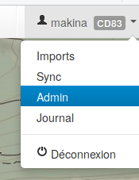

   Lien vers le module de configuration

.. _parametrages-des-modules:

Paramétrages des modules
========================

Cette section présente quelques exemples de paramétrages des catégories au sein des modules.

Itinéraires
-----------

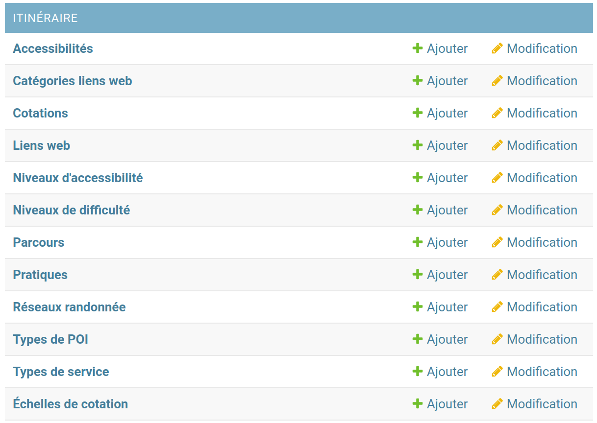

   Ensemble des champs paramétrables du module Itinéraires

Exemple : ajouter une pratique
~~~~~~~~~~~~~~~~~~~~~~~~~~~~~~

-  Dans le module de configuration, à la ligne “Pratiques” cliquer sur “+ ajouter”
-  Remplir les champs (en gras les champs obligatoires)

.. note::
  La couleur n’est utilisée que pour le mobile actuellement.

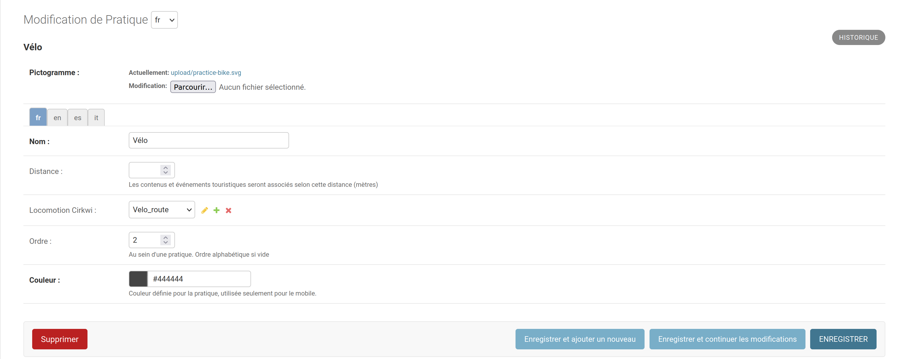

   Ajout d'une nouvelle pratique

Exemple : ajouter une étiquette
~~~~~~~~~~~~~~~~~~~~~~~~~~~~~~~

Les étiquettes sont des encarts "pré-configurés" pouvant être réutilisés sur de multiples itinéraires. Elles présentent plusieurs avantages : 

- ne pas avoir à saisir à chaque itinéraire les même informations
- permet de filtrer les itinéraires dans la vue liste (catégorie "Autres") sur Geotrek-Rando.

Pour les configurer, vous devez :

- vous rendre dans le module de configuration
- dans la section Étiquettes du groupe **COMMUN** cliquer sur :guilabel:`+ Ajouter`

Via cette interface vous pourrez créer des étiquettes puis, une fois créées, les rattacher à des itinéraires.

* Créer une étiquette :

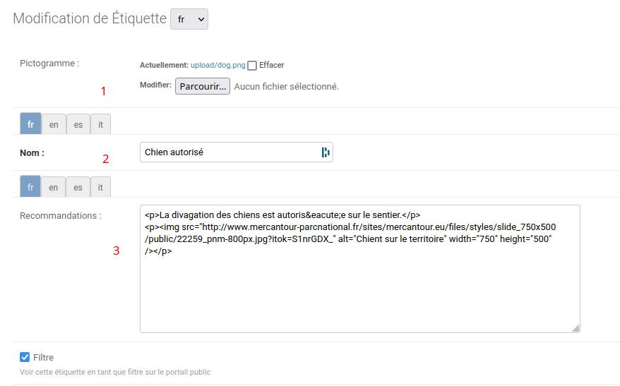

   Création d'une étiquette

Pour mettre en forme le contenu de l'étiquette, il est possible d'utiliser du ``HTML``. Pour cela, il est recommandé d'utiliser des outils permettant de formater du contenu et d'obtenir le résultat en HTML directement. Par exemple via l'outil libre `Summernote <https://summernote.org/>`_.

* Associer une étiquette à un itinéraire :

Une fois l'étiquette créée il faut l'associer à un itinéraire pour qu'elle soit visible sur le site. 
Une fois dans votre instance Geotrek Admin, éditez l'itinéraire concerné. Cliquez ensuite sur l'onglet :guilabel:`Avancé` et dans le champ Étiquettes choisissez dans le menu déroulant l'étiquette de votre choix (si vous en avez défini plusieurs). 

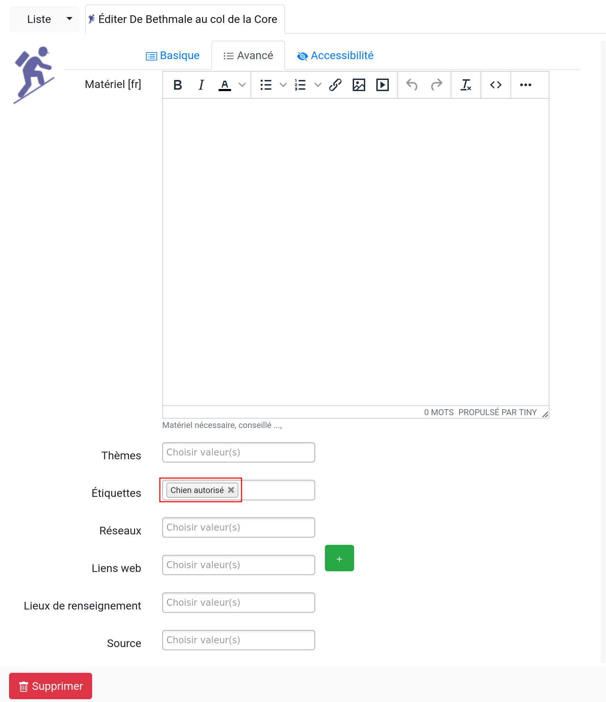

   Ajout d'une étiquette à un itinéraire

.. tip::

    * L'ajout d'un pictogramme est facultatif, par défaut le pictogramme de l'étiquette sera le même que celui des recommandations dans les "Infos pratiques" de la fiche d'une randonnées (Geotrek Rando).
    * Si le champ "Filtre" est coché, l'étiquette sera proposée comme filtre dans Geotrek-Rando.
    * Les images (hors pictogramme) utilisées dans le contenu de l'étiquette doivent être des liens web. 

Rendu dans **Geotrek Rando** (onglet :guilabel:`Infos pratiques` d'une fiche randonnée) :

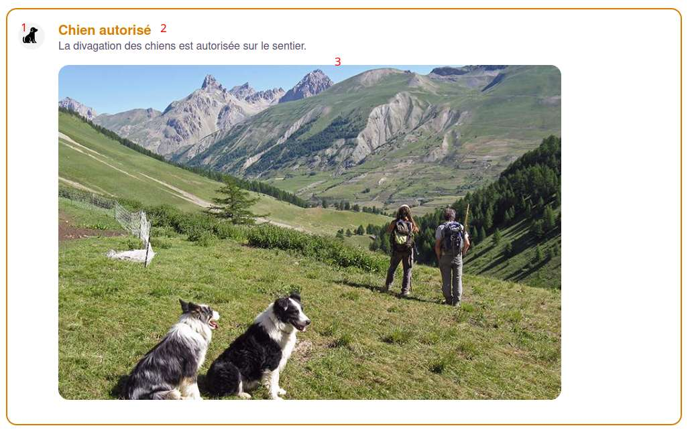

   Rendu d'une étiquette dans Geotrek-rando

Rendu dans **Geotrek Rando** (partie :guilabel:`Filtres`) :

.. figure:: ../images/admin/rendu_etiquette2.png
   :alt: Rendu des étiquettes dans les filtres de Geotrek-rando
   :align: center

   Rendu des étiquettes dans les filtres de Geotrek-rando

Tourisme
--------

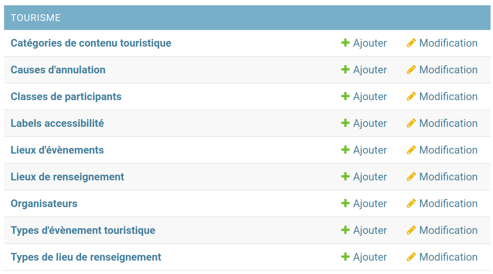

   Ensemble des champs paramétrables des modules Contenus et Évènements touristiques

Exemple : catégorie de contenu touristique et ses sous-types
~~~~~~~~~~~~~~~~~~~~~~~~~~~~~~~~~~~~~~~~~~~~~~~~~~~~~~~~~~~~

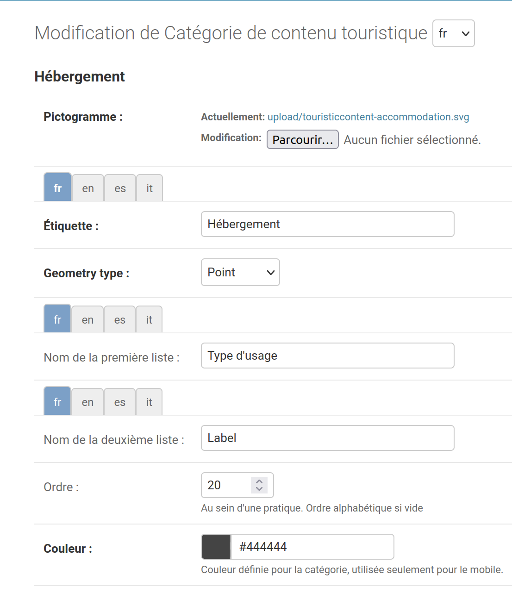

   Création de catégorie de contenu touristique et ses sous-types

Pour chaque catégorie il est possible de définir deux listes de
sous-types et leur nom.

Édition des sous-types de la catégorie “Hébergements”

.. figure:: ../images/admin/django-admin-categorie-contenu-touristique-sous-types.png
   :alt: Sous-types de la catégorie “Hébergements”
   :align: center

   Sous-types de la catégorie “Hébergements”

.. _user-management-section:

Gestion des utilisateurs
========================

Geotrek-admin s'appuie sur le `système d'authentification et de permissions Django <https://docs.djangoproject.com/en/4.2/topics/auth/default>`_ .

Les utilisateurs appartiennent à des groupes et les permissions peuvent être attribuées au niveau de l'utilisateur ou du groupe.

Avec les groupes, vous pouvez créer et configurer un profil utilisateur, chacun possédant des permissions spécifiques.

Toute la configuration des utilisateurs, groupes et permissions est disponible depuis le module de configuration, si vous n'avez pas activé *Authentification externe* (voir ci-dessous).

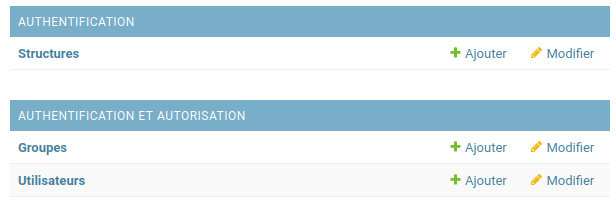

   Interface de configuration des utilisateurs/groupes

Utilisateurs et permissions
---------------------------

L’application permet d’attribuer des droits à autant de groupes que souhaité.
Nous recommandons cependant de privilégier la diffusion la plus large par défaut et de ne restreindre l’application que pour des raisons impératives.

L’application permet de définir des rôles disposant chacun de certains droits.
  - visiteurs anonymes (par exemple : tous les internautes)
  - partenaires, élus
  - agents techniques
  - prestataires externes
  - administrateurs de l’application
  - …

À chaque rôle est associé un ensemble de permissions (consulter telle donnée, la modifier…) qui peuvent être attribuées à un document ou à une catégorie.
Les utilisateurs sont ensuite associés à un ou plusieurs rôles.

Un utilisateur donné peut avoir trois niveaux permissions basiques :

- **Actif** : si cette case est cochée, l’utilisateur peut se connecter à Geotrek-admin

.. note::
  Il est préférable de désactiver un compte lorsqu’un utilisateur n’intervient plus sur Geotrek, plutôt que de le supprimer. En effet supprimer le compte supprimera également par exemple toutes les entrées dans l’historique de Geotrek associées à ce compte.

- **Équipe** : si la case est cochée l’utilisateur pourra accéder au module de configuration de Geotrek-Admin

- **Super-utilisateur** : permet d’octroyer toutes les permissions à un utilisateur sans avoir à les définir explicitement

Un utilisateur peut avoir des permissions spécifiques, définies par type d’objet.

Pour cela, sélectionner les permissions dans l’écran de gauche pour les positionner dans l’écran de droite. Par exemple sur la capture ci-dessous l’utilisateur possède les permissions pour consulter uniquement et exporter les informations relatives aux signalétiques sans possibilité d’accéder aux autres modules ou de modifier les contenus.

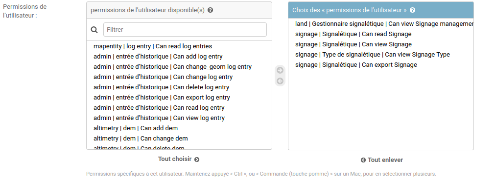

   Choix des permissions de l'utilisateur

Il existe quatre principaux types de permissions :

* add
* change
* delete
* read / view

Chaque type de donnée est au moins associée à ces quatres actions de base (*ajout*, *modification*, *suppression*, *lecture*). Un type de donnée correspond à un table dans la base de données (*signage_signage*, *trekking_trek*…) »

Voici la signification des actions autorisées dans les permissions :

* *view* : voir les données dans le module de configuration (pour ledonnées dans « category », comme les types de POI, ou les niveaux de difficulté)
* *read* : voir les données dans Geotrek-admin (détail et liste)
* *add* : ajouter une nouvelle donnée (itinéraire, thème…)
* *change* : modifier une donnée
* *change_geom* : modifier la géométrie d’une donnée
* *publish* : publier la donnée
* *export* : exporter les données via l’interface de Geotrek-admin (CSV, JSON…)

Groupes
-------

Les groupes facilitent la gestion des utilisateurs et des permissions.Chaque groupe est configuré avec un certain nombre de permissions.

Dans la vue de modification d’un utilisateur, il est possible d’associer un utilisateur à un ou plusieurs groupes pour bénéficier des permissioncorrespondantes.

Par défaut, six groupes sont disponibles :

* Readers ("Lecteurs")
* Path managers ("Référents sentiers")
* Trek managers ("Référents communication")
* Editors ("Rédacteurs")
* Geotrek-rando ("Geotrek-rando")
* Trek and management editors ("Rédacteurs rando et gestion")

Lorsque l’application est installée, il est possible de modifier les permissions par défaut de ces groupes, d’en créer de nouveaux, etc.

Pour autoriser les utilisateurs à accéder à l’interface AdminSite, accordez-leur le statut équipe. L’interface AdminSite permet aux utilisateurs d’éditer les catégories comme *niveaux de difficulté*, *types de POI*, etc

Il est possible de créer ou de supprimer des comptes administrateurs ou éditeurs.
De même qu’il est possible d’ajouter, modifier ou supprimer des itinéraires, tout comme pour les contenus additionnels.

Les éditeurs et les administrateurs peuvent travailler en simultané sur des fiches balades, mais pas en même temps sur la même fiche, car il y aurait sinon un risque de perte d’informations lors de la validation / enregistrement des informations saisies.

Structures
----------

Chaque utilisateur est obligatoirement rattaché à une structure. Lors de l’installation, Geotrek crée une structure par défaut à laquellles premiers utilisateurs seront rattachés.Il est possible d’ajouter de nouvelles structures, reflétant des partenaires territoriaux, entreprises, entités qui seront amenés à travailler à vos côtés sur Geotrek.

Les utilisateurs d’une structure ne peuvent travailler que sur les objets dans Geotrek liés à leur structure. Ils pourront consulter les objets des autres structures mais n’auront pas le droit de les modifier.

*Exemple : si on imagine un Geotrek déployé sur l’ensemble du territoire français, il pourrait y avoir des structures correspondant à chaque région. Chaque utilisateur serait rattaché à sa région. Il y aurait alors la garantie qu’un utilisateur de Bretagne ne puisse pas modifier les objets saisis par un utilisateur de Normandie.*

Cette notion de structures permet de segmenter les périmètres d’action des utilisateurs et de permettre à différentes entités de travailler sur un même Geotrek-Admin, tout en garantissant une cohérence des données.

.. note::

    Un utilisateur d’une structure pourra tout de même tracer des itinéraires sur des tronçons tracés par une autre structure

.. note::

    Pour qu’un utilisateur puisse modifier les objets d’une autre structure il y a deux possibilités :

    - celui-ci est super-utilisateur

    - celui-ci possède la permission « Can bypass structure », qui permet d’outrepasser la restriction des structures.

Pour définir la structure par défaut, se référer à la section :ref:`Default structure <default-structure>`

Gestion multilingue
===================

La configuration des langues de la plate-forme est réalisée au travers du fichier de configuration principal. 
Lors de sa mise à jour, la commande de déploiement créé les champs nécessaires qui manquent dans la base de données (exemple : nom_fr, nom_es, nom_it…).
Ceci est à distinguer des langues dans lesquelles sont traduits les éléments de l'interface de l'application (Français, Anglais, Italien, Espagnol).

Il est par exemple possible d'intégrer des textes dans différentes langues (à minima français, anglais) dans Geotrek-Admin.

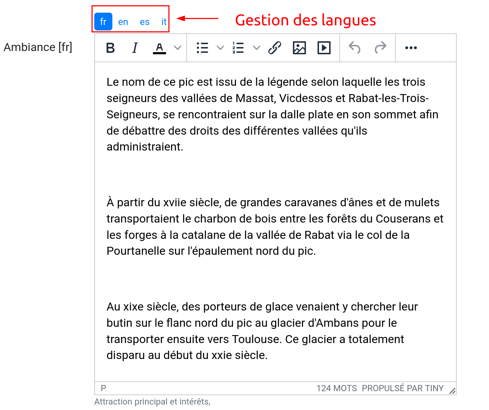

   Gestion multilingue dans la fiche détail

Configuration des portails
==========================

Geotrek permet de configurer un ou plusieurs portails. Ce terme est utilisé pour référencer un site grand public sur lequel seront visibles les objets publiés de Geotrek.

Ainsi, il est possible d'avoir plusieurs Geotrek-Rando branchés sur un seul Geotrek-Admin. Grâce à leur distinction sous forme de portail, il sera alors aisé de choisir sur quel Geotrek-Rando on souhaite faire apparaitre une information.

Avec `Geotrek-widget <https://github.com/GeotrekCE/geotrek-rando-widget>`_ il est également possible d'utiliser cette fonctionnalité pour distinguer les contenus à afficher dans un widget ou dans un autre `(voir cet article) <https://makina-corpus.com/logiciel-libre/developpement-geotrek-widget-finance-parc-naturel-regional-haut-jura>`_.

Pour configurer un ou pluseurs portails, il faut se rendre dans le module de configuration sur la section "Portails cibles".

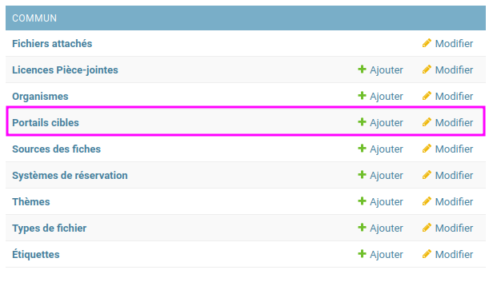

   Configuration des portails

Il est possible de choisir de publier sur un ou plusieurs portails les objets suivants : itinéraires, contenus et évènements touristiques, pages statiques. Pour cela il suffit de sélectionner la valeur souhaitée dans le champ "portail" à l'édition de l'objet.

Intégration des données SIT
===========================

Des développements ont déjà été réalisés dans Geotrek pour intégrer des données de divers SIT (Système d’Informations Touristiques), notamment APIDAE, Tourinsoft, LEI, SITLOR... si les flux sont disponibles dans des formats ouverts.

Il convient ensuite de configurer chaque flux dans Geotrek-Admin afin que ceux-ci soient synchronisé avec la plateforme touristique.

La fonctionnalité consiste à absorber le flux XML, afin de le remettre à disposition sous une forme optimisée et épurée. Les données sont alors exposées sous la forme d’une web API, au format GeoJSON.
L’obtention d’un flux de données GeoJSON (agnostique et standard) présente de nombreux avantages pour l’intégration dans les applications tierces. Ce format est compatible nativement avec Rando V3, mais également avec la plupart des bibliothèques de cartographie (web et natives mobile).

Pour configurer l'import de SIT, référez vous à cette section :ref:`Import from touristic data systems <import-from-touristic-data-systems>`

Intégration des fonds de cartes
===============================

Il est possible d'intégrer dans Geotrek différents fonds de carte comme :

* `OpenStreetMap <https://www.openstreetmap.org/#map=6/46.449/2.210>`_
* `OpenTopoMap  <https://opentopomap.org/#map=6.49.000/10.000>`_
* `ou les données IGN  <https://geoservices.ign.fr/services-geoplateforme-diffusion>`_

Pour configurer l'ajout de fonds de plan, référez vous à cette section :ref:`Map settings <map-settings>`

Intégration de pictogrammes
===========================

Les pictogrammes contribués dans Geotrek doivent être au format :

* SVG (de préférence, cela permet de conserver la qualité en cas de redimensionnement) ou PNG,
* SVG pour les thèmes (afin de permettre un changement de couleur pour les thèmes sélectionnés),

Il doivent :

* Avoir un viewport carré afin de ne pas être déformés sur le portail,
* Ne pas déborder du cercle inscrit pour les pratiques et les catégories de contenus touristiques, en prévoyant une
  marge si nécessaire.
* Avoir une dimension minimale de 56x56 pixels en ce qui concerne les PNG

Si vous utilisez Inkscape, vous devez définir une viewBox. Voir `la documentation d'Inkscape <http://wiki.inkscape.org/wiki/index.php/Tricks_and_tips#Scaling_images_to_fit_in_webpages.2FHTML>`_ 

Afin de s'intégrer au mieux dans le design standard, les couleurs suivantes sont recommandées :

* Blanc sur fond transparent pour les pratiques et les catégories de contenus touristiques,
* Gris sur fond transparent pour les thèmes,
* Blanc sur fond orange pour les types de POI.

Voici quelques ressources en ligne proposant des pictogrammes (sous licence libre) :

- `Pictogrammers <https://pictogrammers.com/library/mdi/>`_
- `The Noun Project <https://thenounproject.com/>`_
- `Map icons <http://map-icons.com/>`_
- `Opensymbols <https://www.opensymbols.org/>`_
- `SVG repo <https://www.svgrepo.com/>`_
- `Entypo <http://www.entypo.com/>`_
- `Icons Getbootstrap <https://icons.getbootstrap.com/>`_
- `Icongr <https://icongr.am/>`_
- `Cocomaterial <https://cocomaterial.com/>`_
- `Icofont <https://icofont.com/>`_
- `Fontello <https://fontello.com/>`_
- `Iconmonstr <https://iconmonstr.com/>`_
- `Fontawesome <https://fontawesome.com/icons>`_
