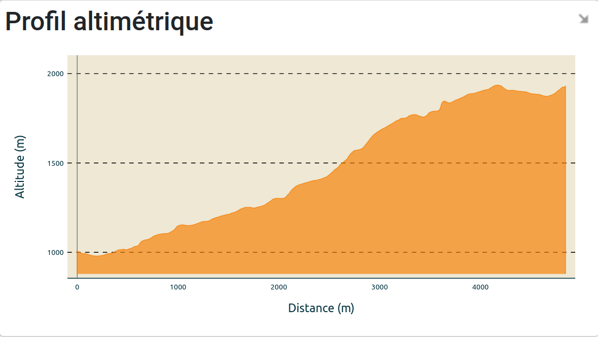
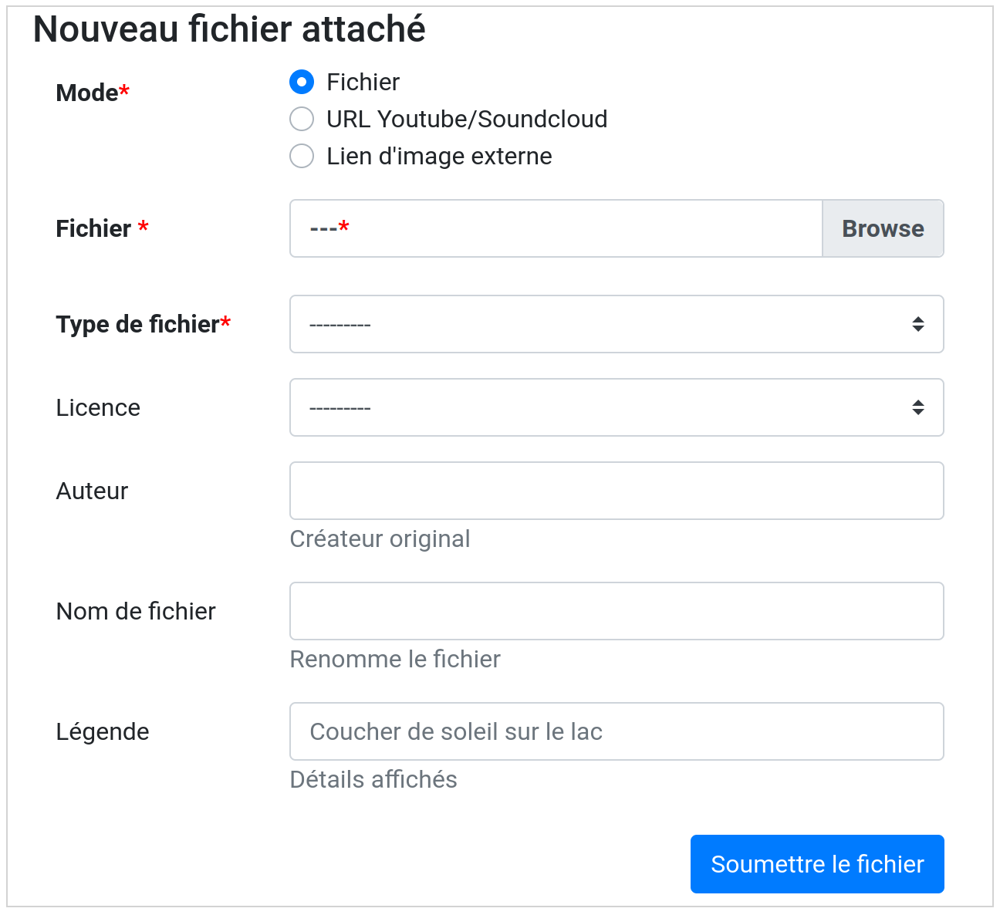
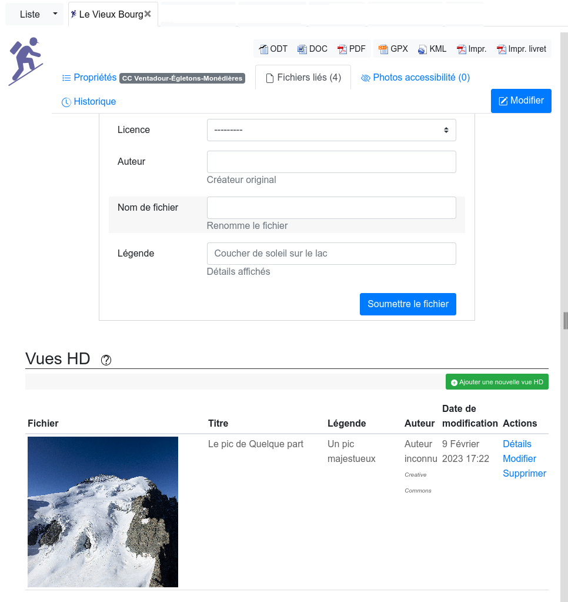
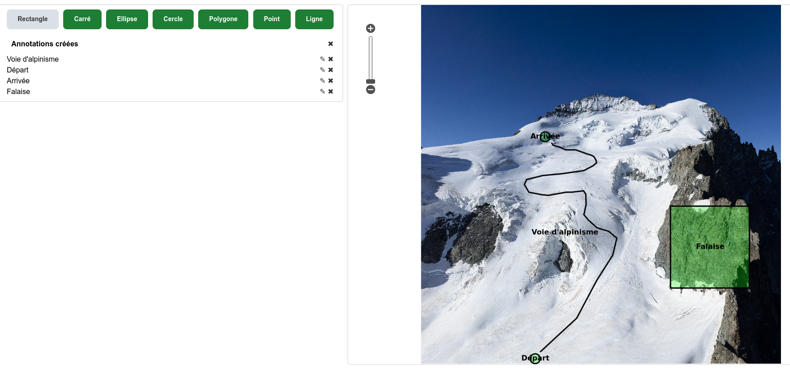
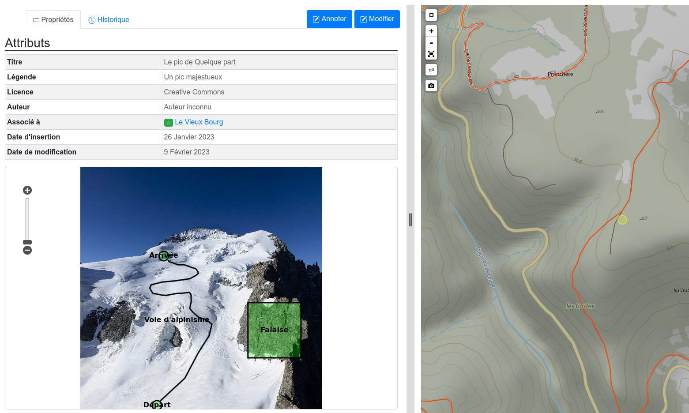
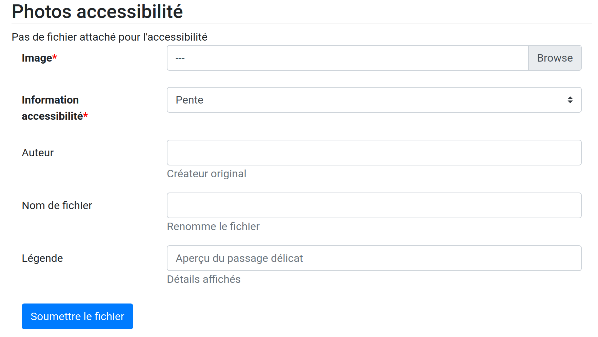
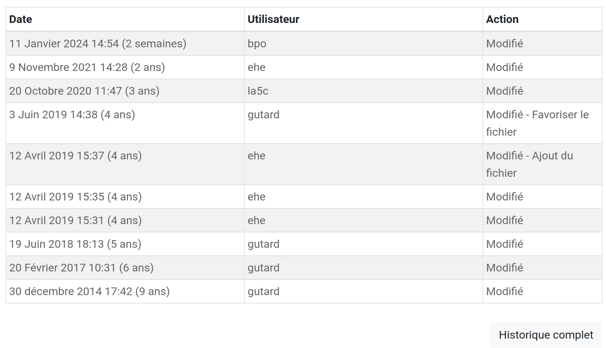

==================
Edition d'un objet
==================

Les calculs géométriques sur les objets
========================================

Informations 3D
----------------

Toutes les géométries des tronçons sont *drapées* sur un modèle numérique de terrain, lors de leur création ou mise à jour.

Tous les objets linéaires reposant sur les tronçons récupèrent leurs informations 3D à partir des tronçons associés, au lieu d'utiliser le modèle numérique de terrain.

Calcul du dénivelé
---------------------

Nous calculons le `dénivelé positif cumulé <https://fr.wikipedia.org/wiki/D%C3%A9nivel%C3%A9_positif_cumul%C3%A9>`_.

Nous échantillonnons le DEM tous les 25m par défaut (voir paramètre ``ALTIMETRIC_PROFILE_PRECISION``),
et nous ajoutons un peu de lissage pour éviter le bruit.

Pour plus de détails :

* `The smoothing explanation <https://github.com/GeotrekCE/Geotrek-admin/issues/840#issuecomment-30229813>`_

* `The piece of code to compute positive and negative accumulations <https://github.com/GeotrekCE/Geotrek-admin/blob/v0.27.2/geotrek/altimetry/sql/00_utilities.sql#L113-L132>`_

* `Draping lines with PostGIS <http://blog.mathieu-leplatre.info/drape-lines-on-a-dem-with-postgis.html>`_ (or `french version <http://makina-corpus.com/blog/metier/2013/draper-des-lignes-sur-un-mnt-avec-postgis>`_)

Lien entre les POIs et les itinéraires
---------------------------------------

Les POIs sont considérés comme des informations *éditoriales* et sont créés le long des randonnées.

Lorsqu'un POI est créé, il est rattaché à l'itinéraire le plus proche.

Un itinéraire repose sur un ou plusieurs tronçons, et certains POIs leur sont associés.

.. note::

	Il n'existe actuellement aucun moyen de contrôler manuellement l'association entre
	randonnées et les POIs.

	Si le paramètre ``TREKKING_TOPOLOGY_ENABLED`` est défini sur ``False``, aucun tronçon n'est impliqué.
	Les POIs sont ainsi liés à des treks utilisant une intersection spatiale de base, avec une
	distance définie dans le paramètre ``TREK_POI_INTERSECTION_MARGIN`` (par défaut à 500 mètres).

.. _segmentation-dynamique:

Segmentation dynamique
-----------------------

Certains objets sont saisis et stockés relativement aux tronçons, en utilisant `la segmentation dynamique <https://makina-corpus.com/sig-webmapping/la-segmentation-dynamique>`_. Il s'agit des objets suivants : sentiers, statuts, aménagements, interventions, itinéraires et POI. Tous les autres objets sont indépendants et ont leur propre géométrie.

La **segmentation dynamique** permet de saisir et stocker des informations relatives aux tronçons. Elle s'accompagne d'un ensemble de déclencheurs calculant automatiquement les géométries résultantes à la création et lors de modifications sur le réseau de tronçons. 

Cela permet de garantir une **cohérence géométrique et topologique entre les tronçons et les objets liés** (travaux, aménagements, statuts, itinéraires...), mais aussi d'associer tous les objets entre eux en vérifiant leur superposition sur le réseau.

C'est pourquoi, modifier un tronçon peut entrainer des modifications des objets qui lui sont rattachés (interventions, itinéraires, POIs...). Supprimer un tronçon, supprime les objets qui lui sont rattachés par segmentation dynamique.

Les éléments ponctuels et linéaires des différents modules sont stockés sous forme d'évènements (PKdebut, PKfin et décalage dans la table ``geotrek.core_topology``) liés à un ou plusieurs tronçons (``geotrek.core_pathaggregation``).

Un objet peut ainsi être associé à un ou plusieurs tronçons, partiellement ou entièrement.

Les objets ponctuels ne sont associés qu'à un seul tronçon, sauf dans le cas où ils sont positionnés à une intersection de tronçons.

Chaque évènement dispose néanmoins d'une géométrie calculée à partir de leur segmentation dynamique pour faciliter leur affichage dans Geotrek ou dans QGIS (voir la section :ref:`Visualiser les données dans Qgis <visualiser-les-donnees-dans-qgis>`). Il ne faut néanmoins pas modifier directement ces géométries, elles sont calculées automatiquement quand on modifie l'évènement d'un objet.

.. note::

	Des vues SQL sont disponibles pour accéder aux objets de manière plus lisible et simplifiée (``v_interventions`` par exemple).

Snapping - Aimantage - Accrochage
----------------------------------

Quand vous créez un objet, il est possible de le snapper (aimanter) aux objets existants. C'est notamment utile pour bien raccorder les tronçons entre eux. Quand vous raccrochez un tronçon à un tronçon existant, ce dernier est coupé automatiquement à la nouvelle intersection.

Les fonctions d'aimantage ne sont pas disponibles lors de la création d'un nouvel objet (linéraire ou ponctuel). Il faut commencer par le créer puis le modifier pour disposer des fonctionnalités d'aimantage, activées automatiquement lorsque l'on se rapproche d'un objet existant. Par défaut la distance d'imantage est de 30 pixels mais elle est modifiable en configuration avancée.

Informations altimétriques
---------------------------

L'édition des objets s'effectue en 2D, et leur géométrie est “drapée” automatiquement en 3D sur un Modèle Numérique de Terrain (MNT) stocké dans la base de données au format raster.

Cette information est visible à travers le profil altimétrique pour les tronçons, les itinéraires et les autres objets linéaires.

Pour importer automatiquement un MNT, se référer à la section :ref:`Import DEM (altimetry) <import-dem-altimetry>`

Attributs aditionnels sur les objets
=====================================

* `Tutoriel - ajout de photos <http://youtu.be/n96O09284ao>`_ :

.. image:: https://img.youtube.com/vi/n96O09284ao/maxresdefault.jpg

Ajout de fichiers
------------------

Fichiers liés
~~~~~~~~~~~~~~

L’ajout, la modification ou la suppression des documents, illustrations et photos s’effectuent depuis l’onglet « Fichiers liés » de la fiche détail.

Pour chaque fichier lié, l’auteur, le titre, la légende et sa catégorie sont saisis. Les fichiers liés peuvent être de tout type (photo, vidéo, dessin, PDF, tableur, fichier audio…). Pour les images, un aperçu est présenté.

Les vignettes et versions redimensionnées des photos sont créées automatiquement lors de l’ajout.
Les contenus saisis sont publiés automatiquement.

Il est possible de limiter la gestion des fichiers liés à un groupe restreint d’utilisateurs.

Représentation verticale : les vues HD
~~~~~~~~~~~~~~~~~~~~~~~~~~~~~~~~~~~~~~~

Pour aller au-delà de la localisation sur une carte dans la représentation des sites d'activité Outdoor, notamment celles verticales (escalade, via-ferrata, alpinisme...), nous avons la possibilité d'ajouter des photos très haute définition (gigapixel) sur les itinéraires, POI et sites outdoor, et d'annoter celles-ci pour les enrichir.

Le bloc "Vues HD" dans l'onglet "Fichier liés" permet d'associer une photo très haute définition (de plusieurs dizaines ou centaines de Mo) aux itinéraires, POI et sites Outdoor. Ces images sont tuilées automatiquement pour disposer de fichiers plus légers à charger dans un navigateur (en fonctionnant comme les fonds de carte tuilés). 

Une fois l'image ajoutée, un formulaire d'annotation permet d'ajouter des objets (points, lignes, polygones, cercles...) et des textes pour enrichir les photos. 

Les annotations sont stockées en GeoJSON et peuvent donc être affichées par dessus la photo tuilée dans une librairie javascript de cartographie (comme Leaflet ou GeoJS) au niveau de Geotrek-rando-v3 ou autre. Pour cela, l'APIv2 expose pour chaque Vue HD l'adresse de récupération des tuiles ainsi que les annotations GeoJSON.

La vue HD est également associée à une localisation correspondant à l'emplacement de ce que l'on voit sur l'image. 

.. note::

	Les vues HD ne sont disponibles que pour les modules Itinéraires, POIs et Outdoor.

Photos accessibilité
---------------------

Cet onglet permet d'ajouter des photos afin d'illustrer les informations liées à l'accessibilité des randonnées.

Historique
-----------

Tous les objets créés dans Geotrek-admin possèdent un historique donnant des renseignement sur la date de l'évènement, l'utilisateur à l'origine de l'évènement et l'action réalisée (modification, ajout de fichier, etc.)

