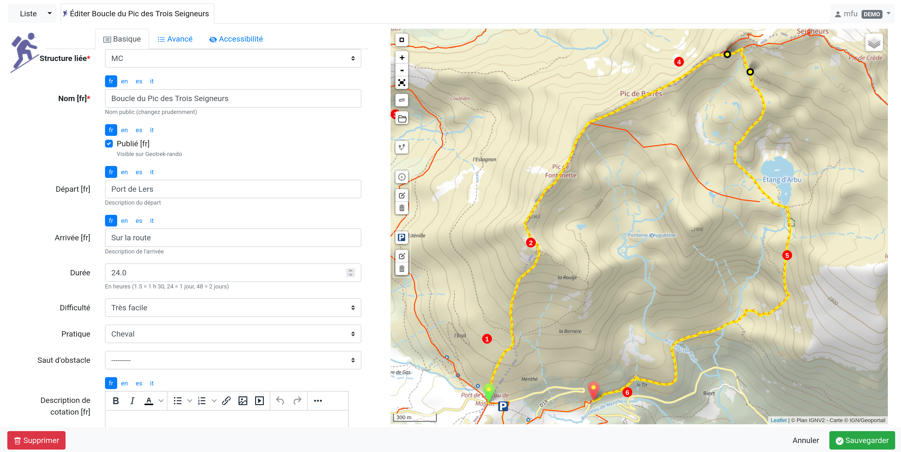
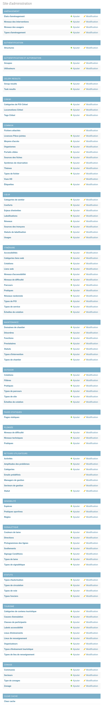

=======================================
Interface, navigation et saisie
=======================================

.. contents::
   :local:
   :depth: 2

Navigation et saisie
====================

Les résultats sont affichés sous forme de carte et liste puis on accède aux détails des objets.

Vue liste
---------

Tous les modules sont construits de la même façon :

* une liste paginée des objets du module
* la possibilité de filtrer la liste selon des attributs ou de faire une recherche libre
* la possibilité de filtrer selon l'étendue de la carte
* la sélection coordonnée (liste → carte, carte → liste)
* la possibilité d'exporter les résultats au format CSV, SHAPEFILE et en GPX
* une carte dans laquelle il est possible de naviguer (déplacer, zoomer), d'afficher en plein écran, de mesurer une longueur, d'exporter une image de la carte, de réinitialiser l'étendue, de zoomer sur une commune ou un secteur et de superposer des données des autres modules (contours communes / secteurs / physique / foncier / gestionnaires…)
* l'accès à la vue détail d'un objet au clic sur celui-ci

.. figure:: ../images/user-manual/01-liste-fr.jpg
   :alt: Vue liste avec la carte
   :align: center

   Vue liste avec la carte 

.. note::

   - Au survol d'un objet dans la liste, celui-ci est mis en surbrillance sur la carte.
   - Il est possible d'ajouter de nouveaux objets depuis chaque module.
   - Un clic sur un objet dans la liste ou la carte permet d'accéder à la fiche détaillée de celui-ci.

.. warning::

   - La liste des résultats est filtrée en fonction de l'étendue de la carte affichée.

Vue détail
----------

A partir de chaque module, il est possible d'afficher la fiche détail d'un objet en cliquant sur celui-ci dans la liste ou la carte du module. Les objets de chaque module peuvent ainsi être affichés individuellement dans une fiche détail pour en consulter tous les attributs, tous les objets des autres modules qui intersectent l'objet, les fichiers qui y sont attachés et l'historique des modifications de l'objet.

Voici les possibilités de la fiche détail :

- le récapitulatif des attributs (saisis et calculés)
- récupérer automatiquement des informations liées (communes, secteurs, POI…)
- ajouter des fichiers (redimensionnement automatique pour les photos)
- l'accès à la vue d’édition selon les droits de l’utilisateur connecté
- l'export GPX, KML, OpenDocument, Word, PDF

.. figure:: ../images/user-manual/fiche-detail.png
   :alt: Fiche détail d'un itinéraire
   :align: center

   Fiche détail d'un itinéraire

.. note::

 - Lorsque le statut de publication d'un objet est activé, celui-ci ainsi que tous ses attributs associés, sont mis en ligne.
 - À tout moment et ce sur chaque module, les informations peuvent être soit mises en ligne, soit désactivées, voire supprimées.
 - Ne sont mises en ligne que les informations choisies et disponibles. Les catégories non encore alimentées ne seront pas visibles pour le grand public. Ainsi si vous créez une nouvelle pratique "Raquettes", celle-ci ne sera pas mise ne ligne tant que vous n'aurez pas publié un premier itinéraire de raquettes.

Vue édition
------------

- Saisie des champs multilingues
- Saisie des tracés
- Possibilité de forcer des points de passage (détours, boucles, aller-retours)
- Édition WYSIWYG des champs texte
- Ajout de couches locales en superposition à partir de fichiers GPX ou KML (aide à la saisie)
- Outils de mesure

   Fiche détail d'un itinéraire en édition

Paramètres de configuration
============================

Toutes les listes de choix (thématiques, pratiques, parcours…) sont administrables depuis le module de configuration, selon les droits dont dispose l’utilisateur connecté.

   Interface complète du module de configuration

.. figure:: ../images/user-manual/django-pratique.png
   :alt: Exemple d’édition des pratiques et de leur pictogramme
   :align: center

   Exemple d’édition des pratiques et de leur pictogramme

Voir la section :ref:`Paramétrage des modules <parametrages-des-modules>`
