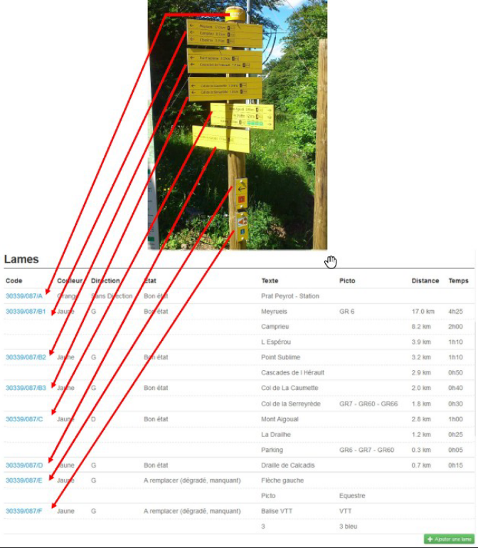

==================
Modules de gestion
==================

Geotrek-admin comporte un certain nombre de modules de gestion des sentiers (tronçons, sentiers, statuts, aménagements, signalétique, interventions et chantiers).

Les tronçons sont les éléments de base sur lesquels s'appuient l'ensemble des objets des autres modules, en utilisant la `segmentation dynamique <https://makina-corpus.com/blog/metier/2014/la-segmentation-dynamique>`_.

Les modules signalétique et aménagement ont initialement été conçus dans une logique d’inventaire avec des possibilités de description basiques et génériques. Pour tout complément, il est possible d’attacher un ou plusieurs fichiers joints à chaque objet (photos, PDF, tableurs…).

Les modules interventions et chantiers ont été conçus de façon à permettre à la fois un inventaire et un suivi des travaux (prévisionnel, administratif et financier).

Pour les territoires qui le souhaitent, sur le volet gestion, les valeurs des listes déroulantes peuvent être différenciées  par structure, afin que chaque structure travaillant sur une même instance Geotrek-admin puisse avoir des typologies différentes si nécéssaire (types de signalétique, d’aménagements, d’organismes...).

Néanmoins, pour les territoires qui souhaitent mutualiser les mêmes valeurs dans les listes sans avoir à les renseigner pour chaque structure, il est possible de partager des typologies entre les différentes structures en ne renseignant tout simplement pas ce champ.
Un compte utilisateur appartenant à une structure X n'aura accès qu'aux typologies associées à celle-ci, ainsi qu'aux typologies partagées. De même, ce compte utilisateur ne pourra pas modifier ou supprimer des objets appartenant à une autre structure (c'est-à-dire créés par un compte utilisateur appartenant à une autre structure), sauf à avoir des permissions particulières.

Lors de la saisie d'un objet sur la carte, il est possible d'afficher une couche SIG ou un relevé GPX sur la carte lors de la création d'un objet sur la carte pour pouvoir le visualiser et le localiser sur la carte (``Charger un fichier local (GPX, KML, GeoJSON)``).

.. _les-troncons:

Les tronçons
============

.. legend:: Bon à savoir

      ✨ Disponible uniquement en segmentation dynamique

      🗺️ Calcul reposant sur la segmentation dynamique lorsqu'elle est activée

C'est le socle essentiel et central de Geotrek. Un tronçon est un objet linéaire, entre deux intersections. Le mécanisme de segmentation dynamique permet de ne pas devoir le recouper pour y rattacher des informations.

Les tronçons peuvent être soit numérisés dans Geotrek-admin, soit importés directement dans l'outil via :

- la commande décrite :ref:`ici <import-paths>`, après avoir préalablement nettoyé la géométrie des lignes à l'aide du plugin GRASS dans QGIS. Cette procédure est à privilégier car elle a l'avantage de faire des vérifications topologiques sur les données.
- l'outil QGIS en suivant ce `tutoriel <https://makina-corpus.com/sig-webmapping/importer-une-couche-de-troncons-dans-geotrek>`_ pour charger des tronçons dans la base de données PostGIS Geotrek à partir d'un réseau de sentiers. Il faut s'assurer en amont que les lignes à insérer sont topologiquement propres. 

Si ils sont numérisés directement dans Geotrek-admin, il est possible d'afficher sur la carte un fichier GPX ou GeoJSON pour faciliter leur localisation.

Quand un nouveau tronçon intersecte un tronçon existant, ce dernier est découpé automatiquement à la nouvelle intersection.

En plus de leur géométrie, quelques informations peuvent être associées à chaque tronçon (nom, départ, arrivée, confort, source, enjeu d'entretien, usage et réseaux).

Comme pour les autres objets, les informations altimétriques sont calculées automatiquement grace au MNT présent dans la base de données.

Idem pour les intersections automatiques avec les zonages (communes, secteurs, zonages réglementaires) et les objets des autres modules qui sont intersectés automatiquement à chaque ajout ou modification d'un objet.

Comme pour tous les modules, il est possible d'exporter la liste des tronçons affichés (CSV, SHP ou GPX) ou bien la fiche complète d'un tronçon (ODT, DOC ou PDF).

Comme pour tous les modules, il est aussi possible d'attacher des documents à chaque tronçon depuis sa fiche détail (images, PDF, tableurs, ZIP...).

Enfin, toujours depuis la fiche détail d'un tronçon, il est possible d'en afficher l'historique des modifications.

.. _les-sentiers:

Les sentiers
============

.. task-list::
    :class: custom-task-list-style
    :custom:

    + [x] Segmentation dynamique

Il s'agit d'un ensemble linéaire composés d'un ou plusieurs tronçons (entiers ou partiels) grâce à la segmentation dynamique.

Les sentiers permettent d'avoir une vision de gestionnaire sur un linéaire plus complet que les tronçons (qui sont découpés à chaque intersection) pour en connaitre les statuts, la signalétique, les aménagements, les interventions ainsi que les itinéraires et POI. Il est d'ailleurs possible d'ajouter une intervention sur un sentier complet directement depuis la fiche détail d'un sentier.

Ils permettent également de préciser une ou plusieurs certifications ainsi que leur statut.

A ne pas confondre avec le module Itinéraires qui permet de créer des randonnées publiées sur un portail Geotrek-rando.

.. _les-statuts:

Les statuts
============

.. task-list::
    :class: custom-task-list-style
    :custom:

    + [x] Segmentation dynamique

Ils permettent de renseigner des informations sur le linéaire (type physique, statut foncier, organismes ayant la compétence sentiers, gestionnaires des travaux et de la signalétique) sans avoir à le faire tronçon par tronçon grâce à la segmentation dynamique qui permet de localiser le départ et l'arrivée sur un ou plusieurs tronçons.

.. _les-amenagements:

Les aménagements
================

.. task-list::
    :class: custom-task-list-style
    :custom:

    + [x] Segmentation dynamique

Ils permettent d'inventorier les aménagements sur les sentiers (passerelles, mains courantes, cunettes, soutènements, bancs, parkings...) en les localisant, les typant, les décrivant, renseignant leur état et leur année d'implantation.

Les types d'aménagement sont découpés en 2 catégories (Ouvrages et Equipements). Ce découpage n'est utilisé que pour filtrer les aménagements.

Il est possible de créer une intervention directement depuis la fiche détail d'un aménagement.

Comme pour les autres modules, il sont intersectés avec les autres modules pour en connaitre l'altimétrie, les zonages (communes, réglementation...), les statuts (fonciers, physique, gestionnaire), les interventions, les itinéraires...

Il est aussi possible de les exporter, de leur attacher des fichiers (images, PDF, tableurs, ZIP...) et d'en consulter l'historique des modifications.

.. seealso::

	Pour importer automatiquement des éléments d'aménagements, se référer à la section :ref:`Import Infrastructure <import-infrastructure>`

.. _la-signaletique:

La signalétique
===============

.. task-list::
    :class: custom-task-list-style
    :custom:

    + [x] Segmentation dynamique

Centralise les informations sur la signalétique d'accueil, d'information et d'orientation des randonneurs. Permet de localiser, décrire l'implantation, et gérer les fichiers concernant la signalétique (BAT, maquettes, photos, etc.).

Pour une signalétique, il est possible de définir chaque lame et chaque ligne de lame. L'image ci-dessous montre un exemple de correspondance entre une signalétique terrain et sa saisie dans Geotrek.

.. seealso::

	Pour importer automatiquement des éléments de signalétiques, se référer à la section :ref:`Import Signage <import-signage>`

.. _les-interventions:

Les interventions
=================

.. task-list::
    :class: custom-task-list-style
    :custom:

    + [x] Segmentation dynamique

Les interventions permettent d'inventorier et suivre les travaux réalisés sur les sentiers. Chaque intervention correspond à une action sur un tronçon, sentier, aménagement ou signalétique.

Les interventions peuvent être localisées directement sur le linéaire de tronçon en les positionnant grâce à la segmentation dynamique. Ou bien ils peuvent correspondre à un sentier, un aménagement ou une signalétique en les créant depuis leur fiche détail.

Une intervention peut être souhaitée (demandée par un agent), planifiée (validée mais à réaliser) ou réalisée.

Un enjeu peut être renseigné pour chaque intervention. Il est calculé automatiquement si un enjeu a été renseigné au niveau du tronçon auquel l'intervention se raccroche.

Chaque intervention correspond à un type. On peut aussi renseigner si celle-ci est sous-traitée, les désordres qui en sont la cause, la largeur et la hauteur. La longueur est calculée automatiquement si il s'agit d'une intervention linéaire mais est saisie si il s'agit d'une intervention ponctuelle.

Plusieurs interventions peuvent être rattachées à un même chantier pour avoir une vision globale de plusieurs interventions correspondant à une opération commune.

L'onglet `Avancé` du formulaire permet de renseigner des informations financières sur chaque intervention (coût direct et indirect lié au nombre de jours/agents dissocié par fonction).

.. _les-chantiers:

Les chantiers
=============

Les chantiers permettent de grouper plusieurs interventions pour en avoir une vision globale et d'y renseigner globalement des informations administratives (contraintes, financeurs, prestataires, cout global, maitrise d'ouvrage...) et éventuellement d'y attacher des documents (cahier des charges, recette, plans...).

Leur géométrie est la somme des géométries des interventions qui les composent.
