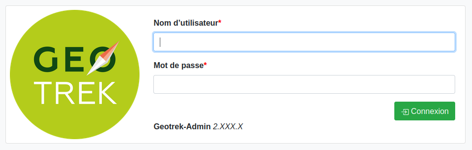

=====================
Présentation générale
=====================

Architecture
============

L’application est composée : 

* d’une **page d'authentification**, demandant la saisie d’un login et d’un mot de passe
* d’une **interface de consultation des objets de chaque module** 

    * avec la liste de sélection déroulante des modules avec compteur des résultats
    * un onglet latéral de sélection des modules
    * un accès aux paramètres de configuration
    * un bouton déconnexion de l’application

* de **paramètres d’administration** (gestion des droits, des listes déroulantes…)

Page d'authentification
=======================

   Accès à Geotrek-admin via un login et un mot de passe

Les modules de Geotrek
=======================

Geotrek-admin est composé de deux types de modules pour la gestion et la valorisation des contenus.

Modules de gestion
-------------------

.. list-table:: Modules de gestion
   :widths: 25 25 50
   :header-rows: 1

   * - Icône
     - Module
     - Description
   * - .. figure:: ../images/user-manual/modules/troncons.png
     - :ref:`Tronçon <les-troncons>`
     - | C'est l’équivalent du réseau routier : ils constituent le support des tracés
       | des objets linéaires (itinéraires, statuts, interventions, aménagements...). 
       | Leur modification est relativement rare (fermeture d’un chemin, 
       | éboulement...).
   * - .. figure:: ../images/user-manual/modules/sentier.png
     - :ref:`Sentier <les-sentiers>`
     - | Les itinéraires, non pas de randonnée, mais de gestion, correspondent au 
       | départ et à l'arrivée d'un sentier.
   * - .. figure:: ../images/user-manual/modules/statut.png
     - :ref:`Statut <les-statuts>`
     - | Gestion des organismes ayant la compétence sentiers,  
       | gestionnaires des travaux et de la signalétique.  
       | Type physique (route, piste, sente, etc.)
   * - .. figure:: ../images/user-manual/modules/amenagement.png
     - :ref:`Aménagement <les-amenagements>`
     - | Décrit et localise les ouvrages, le mobilier, les équipements.
   * - .. figure:: ../images/user-manual/modules/signaletique.png
     - :ref:`Signalétique <la-signaletique>`
     - | Reprend l'ensemble de la signalétique d'accueil, d'information et 
       | d'orientation à destination des randonneurs.
       | Gestion des fichiers associés comme les BAT, les maquettes…
   * - .. figure:: ../images/user-manual/modules/intervention.png
     - :ref:`Intervention <les-interventions>`
     - | Répertorie les travaux liés à l'entretien courant des ouvrages,
       | l'entretien sur les sentiers, la mise en place et l'entretien 
       | de la signalétique, etc...
   * - .. figure:: ../images/user-manual/modules/chantier.png
     - :ref:`Chantier <les-chantiers>`
     - | Correspond à des ensembles d'interventions. Cela permet d'avoir une 
       | approche globale de chantiers significatifs et des informations 
       | administratives associées.

Modules de valorisation
------------------------

.. list-table:: Modules de valorisation
   :widths: 25 25 50
   :header-rows: 1

   * - Icône
     - Module
     - Description
   * - .. figure:: ../images/user-manual/modules/itineraire.png
     - :ref:`Itinéraire <itineraires>`
     - | Randonnées présentées au grand public : l’itinéraire est 
       | défini selon la géométrie des tronçons empruntés. L’ajout, 
       | la modification sont fréquents. La dé-publication est fortement
       | déconseillée pour le référencement et les passerelles 
       | avec d'autres outils.
   * - .. figure:: ../images/user-manual/modules/poi.png
     - :ref:`Points d'intérêts (POI) <points-d-interets-poi>`
     - | Ponctuels à découvrir associés aux randonnées : en fonction 
       | de leur  emplacement, ils sont associés automatiquement aux 
       | randonnées. Leur catégorie détermine leur pictogramme (faune,  
       | flore, patrimoine, équipements...).
   * - .. figure:: ../images/user-manual/modules/service.png
     - :ref:`Services <services>`
     - | Informations pratiques comme les points d'eau, passages 
       | délicats... selon la typologie souhaitée. Ils n'ont pas de 
       | description ni de nom, ni de photo et sont uniquement affichés 
       | sur la carte de l'itinéraire sous forme de pictogramme. 
   * - .. figure:: ../images/user-manual/modules/contenustouristiques.png
     - :ref:`Contenus touristiques <contenus-touristiques>`
     - | Correspond aux services touristiques pouvant être importés 
       | depuis des Systèmes d'Informations Touristiques (SIT),  
       | qui permettent d'alimenter automatiquement la base de
       | données Geotrek. Celles-ci sont regroupées dans des 
       | catégories de type : hébergements, musées, restaurants, 
       | produits du terroir...
   * - .. figure:: ../images/user-manual/modules/evenementstouristiques.png
     - :ref:`Évènements touristiques <evenements-touristiques>`
     - | Correspond aux animations pouvant être importées depuis 
       | des Systèmes d'Informations Touristiques (SIT), qui permettent
       | d'alimenter automatiquement la base de données Geotrek. 
       | Celles-ci sont regroupées dans des catégories de type : 
       | conférences, expositions, sorties…
   * - .. figure:: ../images/user-manual/modules/signalements.png
     - :ref:`Signalements <signalements>`
     - | Contient les problèmes remontés par les internautes, par 
       | exemple via le formulaire dédié sur Geotrek-rando
   * - .. figure:: ../images/user-manual/modules/zonessensibles.png
     - :ref:`Zones sensibles <zones-sensibles>`
     - | Module non activé par défaut permettant de saisir et de gérer  
       | des zones de sensibilité de la faune sauvage pour les afficher 
       | sur Geotrek-rando ou les diffuser avec l'API de Geotrek-admin). 
   * - .. figure:: ../images/user-manual/modules/sitesoutdoor.png
     - :ref:`Sites outdoor <pleinenature>`
     - | Permet de définir des sites d'activités de pleine nature 
       | (sites d'escalade, rivières, aires de vol libre)
   * - .. figure:: ../images/user-manual/modules/parcoursoutdoor.png
     - :ref:`Parcours outdoor <pleinenature>`
     - | Couplé au module « site outdoor», permet de les détailler en 
       | renseignant des activités de pleine nature diverses (kayak, 
       | rafting, parapente, course d'orientation, voie d'escalade, 
       | parcours d'eau vive…etc.) 

Chaque module est accessible depuis le bandeau vertical situé à gauche de l'écran.
