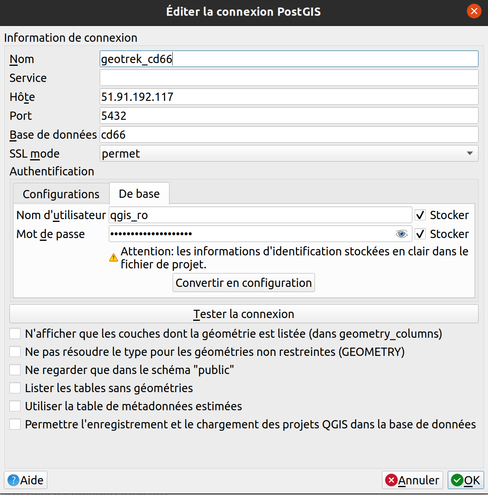

==========
Tutoriels
==========

Vidéos
=======

( **In French** )

* `Présentation de l'interface <http://youtu.be/-iVe9cwBZ50>`_ :

.. image:: https://img.youtube.com/vi/-iVe9cwBZ50/maxresdefault.jpg
    :alt: Présentation de l'interface
    :target: https://www.youtube.com/watch?v=-iVe9cwBZ50

* `Création d'un itinéraire <http://youtu.be/d37WixqDs6c>`_ :

.. image:: https://img.youtube.com/vi/d37WixqDs6c/maxresdefault.jpg
    :alt: Création d'un itinéraire
    :target: https://www.youtube.com/watch?v=d37WixqDs6c

* `Création d'un POI <http://youtu.be/PRY8y7y8WxM>`_ :

.. image:: https://img.youtube.com/vi/PRY8y7y8WxM/maxresdefault.jpg
    :alt: Création d'un POI
    :target: https://www.youtube.com/watch?v=PRY8y7y8WxM

* `Ajout de photos <http://youtu.be/n96O09284ao>`_ :

.. image:: https://img.youtube.com/vi/n96O09284ao/maxresdefault.jpg
    :alt: Ajout de photos
    :target: https://www.youtube.com/watch?v=n96O09284ao

* `Administration <http://youtu.be/P106bQCRZKk>`_ :

.. image:: https://img.youtube.com/vi/P106bQCRZKk/maxresdefault.jpg
    :alt: Administration
    :target: https://www.youtube.com/watch?v=P106bQCRZKk

.. _visualiser-les-donnees-dans-qgis:

Visualiser les données dans QGIS
=================================

.. image:: ../images/qgis/Qgis_projet.png

Création de vues SQL pour afficher des couches dans QGIS
---------------------------------------------------------

Des vues SQL ont été créées dans la base de données PostgreSQL de Geotrek-admin dans le but de les afficher dans QGIS ou autre (https://makina-corpus.com/django/creer-vues-sql-django-et-afficher-dans-un-sig). Ces vues contiennent les informations essentielles que l'on retrouve dans Geotrek-admin au niveau de chaque module.

Ces vues sont consultables en lecture seule dans QGIS sous forme de couche SIG.

Les modifications se font directement dans Geotrek-admin pour chaque projet, et elles sont répercutées instantanément dans les vues SQL.

Créer une connexion à la base de données PostgreSQL du projet
-------------------------------------------------------------

1. Ouvrir le logiciel QGIS
2. Créer une nouvelle connexion de base de données PostgreSQL

* Dans l'Explorateur > PostgreSQL > Nouvelle connexion
* Renseigner les informations suivantes :

    * Nom de la connexion 
    * Hôte 
    * Port 
    * Base de données 
    * SSL mode : permet
    * Nom d’utilisateur 
    * Mot de passe 

* Cliquer sur « Tester la connexion »
* Si la connexion est réussi, cliquer sur OK pour enregistrer la connexion

Créer un projet QGIS à partir des vues SQL
------------------------------------------

Afficher une vue SQL sous forme de couche
~~~~~~~~~~~~~~~~~~~~~~~~~~~~~~~~~~~~~~~~~

* Dans l'Explorateur > PostgreSQL > Ouvrir la connexion précédemment créé > Schéma public
* Ajouter les vues : Clic droit sur l'objet > Ajouter la couche au projet
* Correspondance couches <> vues
    * Sentiers <> `v_trails`
    * Aménagements <> `v_infrastructures`
    * Signalétiques <> `v_signages`
    * Interventions <> `v_interventions`
    * Chantiers <> `v_projects`
    * Itinéraires <> `v_treks`
    * POI's <> `v_pois`
    * Contenus touristiques <> `v_touristiccontents`
    * Évènements touristiques <> `v_touristicevents`
    * Signalement <> `v_reports`
    * Zones sensibles <> `v_sensitivearea_qgis`
    * Zones <> `v_districts`
    * Communes <> `v_cities`
* Couches supplémentaires (dépend des projets)
  * Sites outdoor <> `v_outdoor_sites`
  * Parcours outdoor <> `v_outdoor_courses`

Afficher un fond de plan OpenStreetMap
~~~~~~~~~~~~~~~~~~~~~~~~~~~~~~~~~~~~~~

* Dans l'Explorateur > XYZ Tiles > OpenStreetMap

Créer des groupes de couches
~~~~~~~~~~~~~~~~~~~~~~~~~~~~

* Dans le panneau des couches > clic droit > Ajouter un groupe

Il peut être utile de créer des groupes de couches dans le cas où certaines couches sont disponibles dans plusieurs types géométriques : exemple pour la couche Sentiers qui peut contenir des lignes et des points

.. image:: ../images/qgis/groupe_couches.png

Changer le style d'une couche
~~~~~~~~~~~~~~~~~~~~~~~~~~~~~

* Clic droit sur la couche > Propriétés > Symbologie

Selon le type géométrique de la couche (point, ligne, polygone), il est possible de changer à volonté la couleur de remplissage, la couleur de contour, la taille ou l'épaisseur.

Dimensionner les colonnes de la table attributaire
~~~~~~~~~~~~~~~~~~~~~~~~~~~~~~~~~~~~~~~~~~~~~~~~~~~

Le fait de dimensionner la taille des colonnes dans la table attributaire permet une permet lisibilité des noms de champs et des informations contenues à l'intérieur : 

* Clic droit sur la couche > Ouvrir la Table d'Attributs > clic droit sur une colonne > Taille autom pour toutes les colonnes

Certains champs texte peuvent être très larges (exemple _Description_ dans la couche **Zones sensibles**). Dans ce cas il est possible d'adapter manuellement la taille de la colonne :

* Clic droit sur la couche > Ouvrir la Table d'Attributs > clic droit sur la colonne > Largeur > Entrer une largeur de colonne (exemple : 200)

Afficher le décompte des entités d'une couche
~~~~~~~~~~~~~~~~~~~~~~~~~~~~~~~~~~~~~~~~~~~~~

* Clic droit sur la couche > Afficher le nombre d'entités

Zoomer sur l'emprise d'une couche
~~~~~~~~~~~~~~~~~~~~~~~~~~~~~~~~~

* Clic droit sur la couche > Zoomer sur la(les) couche(s)

